<!-- PHIÊN BẢN CẬP NHẬT 06/2026: Bản markdown Word này mô tả kiến trúc HYBRID cũ.
     Vui lòng dùng docs/TIEU_LUAN_SHIELDAI.md (v5.0) làm bản luận văn chính thức — PhoBERT text-only + MLP.
     Các số liệu tham chiếu: F1 93,71%, ROC-AUC 98,50%, không còn 778-d/metadata. -->

<!DOCTYPE html>
<html>
<head>
	<meta http-equiv="content-type" content="text/html; charset=utf-8"/>
	<title></title>
	<meta name="generator" content="LibreOffice 7.3.7.2 (Linux)"/>
	<meta name="author" content="Un-named"/>
	<meta name="created" content="2026-03-25T04:01:00"/>
	<meta name="changedby" content="Microsoft Office User"/>
	<meta name="changed" content="2026-03-25T04:09:00"/>
	<meta name="AppVersion" content="16.0000"/>
	
</head>
<body lang="en-VN" link="#0563c1" vlink="#800000" dir="ltr">

<b>BỘ GIÁO DỤC VÀ ĐÀO TẠO</b>

<b>TRƯỜNG
ĐẠI HỌC</b><b>
TÂN TẠO</b>

<b>KHOA
CÔNG</b><b> NGHỆ
THÔNG TIN</b>

<b>TIỂU LUẬN TỐT NGHIỆP ĐẠI HỌC</b>

<b>XÂY DỰNG HỆ THỐNG PHÁT HIỆN TIN GIẢ Y TẾ TIẾNG VIỆT BẰNG HỌC MÁY</b>

<table width="100%" cellpadding="10" cellspacing="0" style="display: table; width: 100%; border-collapse: collapse; max-width: 600px; margin: 0 auto;">
	<col width="40%"/>
	<col width="60%"/>
	<tr valign="top">
		<td style="border: 1px solid #d3d3d3; padding: 10px;">

			<b>Ngành:</b>

		</td>
		<td style="border: 1px solid #d3d3d3; padding: 10px;">

			Khoa Học Máy Tính

		</td>
	</tr>
	<tr valign="top">
		<td style="border: 1px solid #d3d3d3; padding: 10px;">

			<b>Mã số:</b>

		</td>
		<td style="border: 1px solid #d3d3d3; padding: 10px;">

			7480101

		</td>
	</tr>
	<tr valign="top">
		<td style="border: 1px solid #d3d3d3; padding: 10px;">

			<b>Khóa:</b>

		</td>
		<td style="border: 1px solid #d3d3d3; padding: 10px;">

			2022

		</td>
	</tr>
</table>
<table width="100%" cellpadding="10" cellspacing="0" style="display: table; width: 100%; border-collapse: collapse; max-width: 600px; margin: 0 auto;">
	<col width="40%"/>
	<col width="60%"/>
	<tr valign="top">
		<td style="border: 1px solid #d3d3d3; padding: 10px;">

			<b>Sinh viên thực hiện:</b>

		</td>
		<td style="border: 1px solid #d3d3d3; padding: 10px;">

			Hà Minh Chiến

		</td>
	</tr>
	<tr valign="top">
		<td style="border: 1px solid #d3d3d3; padding: 10px;">

			<b>Mã số sinh viên:</b>

		</td>
		<td style="border: 1px solid #d3d3d3; padding: 10px;">

			2202095

		</td>
	</tr>
	<tr valign="top">
		<td style="border: 1px solid #d3d3d3; padding: 10px;">

			<b>Giảng viên hướng dẫn:</b>

		</td>
		<td style="border: 1px solid #d3d3d3; padding: 10px;">

			Thầy Trần Ngọc Anh

		</td>
	</tr>
</table>

<b>TÂY</b><b>
NINH</b><b>, THÁNG 06 NĂM
2026</b>

<b>TRANG
PHÊ DUYỆT</b>

Luận
văn đã được trình và bảo vệ trước Hội đồng chấm
tiểu luận tốt nghiệp.

Ngày
bảo vệ: ....../....../2026

Kết
quả: ....../10 điểm

<table width="100%" cellpadding="10" cellspacing="0" style="display: table; width: 100%; table-layout: fixed; border-collapse: collapse; border: 1px solid #d3d3d3; margin-top: 30px; margin-bottom: 30px;">
	<col width="50%"/>
	<col width="50%"/>
	<tr valign="top">
		<td style="border: 1px solid #d3d3d3; padding: 15px; height: 200px;">
			

			<b>GIẢNG VIÊN HƯỚNG DẪN</b>

			

			<i>(Ký và ghi rõ họ tên)</i>

		</td>
		<td style="border: 1px solid #d3d3d3; padding: 15px; height: 200px;">
			

			<b>GIẢNG VIÊN PHẢN BIỆN</b>

			

			<i>(Ký và ghi rõ họ tên)</i>

		</td>
	</tr>
</table>

<b>CHỦ
TỊCH HỘI ĐỒNG</b>

<i>(Ký
và ghi rõ họ tên)</i>

<b>LỜI
CẢM ƠN</b>

Để hoàn thành tiểu luận tốt nghiệp này, em xin gửi lời cảm ơn chân thành và sâu sắc nhất đến Quý Thầy Cô Khoa Công nghệ Thông tin - Trường Đại học Tân Tạo, những người đã truyền đạt cho em lượng kiến thức quý báu và định hướng nghề nghiệp vững chắc trong suốt những năm tháng học tập tại trường.

Đặc biệt, em xin gửi lời tri ân sâu sắc đến <b>Thầy Trần Ngọc Anh</b> - người Thầy đã trực tiếp tận tình hướng dẫn, chỉ bảo và sát cánh cùng em từ những bước lên ý tưởng sơ khai cho đến khi hoàn thiện toàn bộ mã nguồn và tài liệu của tiểu luận này. Sự định hướng khoa học và những lời động viên của Thầy là động lực to lớn giúp em vượt qua những khó khăn trong quá trình nghiên cứu và xây dựng hệ thống phát hiện tin giả tiếng Việt bằng học máy.

Em cũng xin gửi lời cảm ơn đến gia đình và những người bạn đã luôn ở bên cạnh động viên, khích lệ tinh thần và tạo mọi điều kiện thuận lợi nhất để em có thể toàn tâm toàn ý hoàn thành đồ án này đúng tiến độ.

Mặc dù đã nỗ lực hết mình, nhưng do giới hạn về mặt thời gian và kinh nghiệm thực tiễn, tiểu luận chắc chắn không thể tránh khỏi những thiếu sót nhất định. Em rất mong nhận được những lời góp ý, chỉ bảo quý báu từ Hội đồng bảo vệ và các Thầy Cô để đề tài được hoàn thiện hơn nữa và có thể ứng dụng rộng rãi vào thực tế, góp phần xây dựng một không gian mạng Việt Nam sạch và an toàn hơn.

Cuối cùng, em xin kính chúc Quý Thầy Cô luôn dồi dào sức khỏe, hạnh phúc và gặt hái được nhiều thành công hơn nữa trong sự nghiệp trồng người cao quý.

<i>Tây Ninh, ngày ..... tháng ..... năm 20.....</i> <b>Sinh viên thực hiện</b>

<b>TÓM
TẮT TIỂU LUẬN</b>

Bộ dữ liệu được sử dụng trong nghiên cứu gồm 10.617 mẫu, trong đó có 5.692 mẫu thuộc lớp tin thật và 4.925 mẫu thuộc lớp tin giả. Tỷ lệ phân bố giữa hai lớp tương đối cân bằng, góp phần hạn chế hiện tượng mất cân bằng dữ liệu (Class Imbalance) trong quá trình huấn luyện mô hình. Điều này tạo điều kiện thuận lợi cho việc đánh giá hiệu năng mô hình một cách khách quan và đáng tin cậy.

Đối với bài toán xử lý ngôn ngữ tự nhiên tiếng Việt, mô hình PhoBERT được lựa chọn làm thành phần trích xuất đặc trưng ngữ nghĩa nhờ được tiền huấn luyện trên lượng lớn dữ liệu tiếng Việt. Việc sử dụng PhoBERT giúp mô hình khai thác hiệu quả các mối quan hệ ngữ cảnh giữa các từ và cụm từ trong văn bản, từ đó hỗ trợ nâng cao chất lượng biểu diễn dữ liệu đầu vào cho tác vụ phát hiện tin giả.

Bên cạnh các đặc trưng ngữ nghĩa, nghiên cứu còn kết hợp thêm các đặc trưng kinh nghiệm (Heuristics) nhằm phản ánh một số dấu hiệu thường xuất hiện trong các nội dung có tính chất gây chú ý hoặc thao túng cảm xúc người đọc. Sự kết hợp giữa hai nhóm đặc trưng này cho phép mô hình xem xét đồng thời cả nội dung ngữ nghĩa và hình thức trình bày của văn bản, góp phần cải thiện khả năng phân loại trong một số trường hợp cụ thể.

Kết quả thực nghiệm cho thấy PhoBERT + MLP ghép được đề xuất có khả năng đạt hiệu năng tốt trên tập dữ liệu nghiên cứu. Đồng thời, việc tích hợp cơ chế giải thích dựa trên đặc trưng giúp người dùng có thêm thông tin về các yếu tố ảnh hưởng đến quyết định phân loại của hệ thống, từ đó tăng tính minh bạch và khả năng hỗ trợ phân tích kết quả.

<b>Từ khóa: </b> Phát hiện tin giả, Y tế, PhoBERT, Giải thích Heuristic, Học máy lai ghép, Xử lý ngôn ngữ tự nhiên.

<b>ABSTRACT</b>

The dataset utilized in this study comprises 10,617 samples, including 5,692 real news and 4,925 fake news records. The distribution between the two classes is relatively balanced, mitigating the issue of Class Imbalance during the model training phase. This establishes a favorable condition for an objective and reliable evaluation of the model's performance.

For the Vietnamese Natural Language Processing task, the PhoBERT model was selected as the semantic feature extraction component due to its extensive pre-training on a large-scale Vietnamese corpus. The employment of PhoBERT enables the model to effectively exploit the contextual relationships between words and phrases, thereby enhancing the quality of input data representation for the fake news detection task.

In addition to semantic features, the research incorporates heuristic features to reflect common indicators found in contents designed to attract attention or manipulate reader emotions. The integration of these two feature sets allows the model to simultaneously consider both the semantic content and the structural presentation of the text, contributing to improved classification capabilities in specific scenarios.

Experimental results demonstrate that the proposed hybrid architecture is capable of achieving solid performance on the research dataset. Furthermore, the integration of a feature-based explanation mechanism provides users with additional insights into the factors influencing the system's classification decisions, thereby increasing transparency and supporting the analytical interpretation of the results.

<b>Keywords: </b> Fake News Detection, Medical Misinformation, PhoBERT, Heuristic Explanation, Hybrid Learning, NLP.

 

<b>MỤC
LỤC</b>

    <a href="#" style="color: black; text-decoration: none;">CHƯƠNG 1: GIỚI THIỆU</a>
    
    11

    <a href="#" style="color: black; text-decoration: none;">1.1. Đặt vấn đề</a>
    
    11

    <a href="#" style="color: black; text-decoration: none;">1.2. Mục tiêu nghiên cứu</a>
    
    11

    <a href="#" style="color: black; text-decoration: none;">1.2.1. Mục tiêu tổng quát</a>
    
    11

    <a href="#" style="color: black; text-decoration: none;">1.2.2. Mục tiêu cụ thể</a>
    
    11

    <a href="#" style="color: black; text-decoration: none;">1.3. Đối tượng và phạm vi nghiên cứu</a>
    
    12

    <a href="#" style="color: black; text-decoration: none;">1.3.1. Đối tượng nghiên cứu</a>
    
    12

    <a href="#" style="color: black; text-decoration: none;">1.3.2. Phạm vi nghiên cứu</a>
    
    12

    <a href="#" style="color: black; text-decoration: none;">1.4. Phương pháp nghiên cứu</a>
    
    12

    <a href="#" style="color: black; text-decoration: none;">1.5. Ý nghĩa khoa học và thực tiễn</a>
    
    12

    <a href="#" style="color: black; text-decoration: none;">1.6. Bố cục tiểu luận</a>
    
    12

    <a href="#" style="color: black; text-decoration: none;">CHƯƠNG 2: CƠ SỞ LÝ THUYẾT VÀ TỔNG QUAN NGHIÊN CỨU</a>
    
    13

    <a href="#" style="color: black; text-decoration: none;">2.1. Các khái niệm nền tảng</a>
    
    13

    <a href="#" style="color: black; text-decoration: none;">2.1.1. Tin giả (Fake News) [3, 4] và Thông tin sai lệch</a>
    
    13

    <a href="#" style="color: black; text-decoration: none;">2.1.2. Xử lý Ngôn ngữ Tự nhiên (Natural Language Processing - NLP)</a>
    
    13

    <a href="#" style="color: black; text-decoration: none;">2.1.3. Trí tuệ Nhân tạo (AI) và Học máy (Machine Learning)</a>
    
    13

    <a href="#" style="color: black; text-decoration: none;">2.1.4. Học sâu (Deep Learning) và Mạng nơ-ron (Neural Networks)</a>
    
    14

    <a href="#" style="color: black; text-decoration: none;">2.1.5. Cơ chế Giải thích dựa trên Đặc trưng (Heuristic Explanation) [5, 8]</a>
    
    14

    <a href="#" style="color: black; text-decoration: none;">2.1.6. Các chỉ số đánh giá hiệu năng mô hình (Evaluation Metrics)</a>
    
    14

    <a href="#" style="color: black; text-decoration: none;">2.2. Cơ sở lý thuyết chuyên sâu</a>
    
    15

    <a href="#" style="color: black; text-decoration: none;">2.2.1. Kiến trúc Transformer và Cơ chế Tự chú ý (Self-Attention)</a>
    
    15

    <a href="#" style="color: black; text-decoration: none;">2.2.2. Mô hình PhoBERT: Cấu trúc và phương pháp tiền huấn luyện</a>
    
    16

    <a href="#" style="color: black; text-decoration: none;">2.2.3. Cơ sở lý thuyết của Đặc trưng kinh nghiệm (Heuristics)</a>
    
    16

    <a href="#" style="color: black; text-decoration: none;">2.2.4. Mạng Nơ-ron Truyền thẳng (Multi-Layer Perceptron - MLP)</a>
    
    16

    <a href="#" style="color: black; text-decoration: none;">2.2.5. Cơ sở lý thuyết về Cơ chế Giải thích dựa trên Đặc trưng (Feature-based Explanation)</a>
    
    17

    <a href="#" style="color: black; text-decoration: none;">2.3. Tổng quan các công trình nghiên cứu liên quan</a>
    
    17

    <a href="#" style="color: black; text-decoration: none;">2.3.1. Các nghiên cứu trong nước</a>
    
    17

    <a href="#" style="color: black; text-decoration: none;">2.3.2. Các nghiên cứu ngoài nước</a>
    
    18

    <a href="#" style="color: black; text-decoration: none;">2.3.3. So sánh tính ưu việt của đồ án (ShieldAI) so với các hệ thống hiện tại</a>
    
    18

    <a href="#" style="color: black; text-decoration: none;">2.4. Công nghệ và Công cụ sử dụng</a>
    
    20

    <a href="#" style="color: black; text-decoration: none;">2.4.3. Thư viện Trí tuệ Nhân tạo và Xử lý Ngôn ngữ</a>
    
    20

    <a href="#" style="color: black; text-decoration: none;">2.5. Biện luận lựa chọn kiến trúc AI</a>
    
    20

    <a href="#" style="color: black; text-decoration: none;">2.5.1. Lựa chọn Mô hình Ngôn ngữ Lõi (PhoBERT)</a>
    
    20

    <a href="#" style="color: black; text-decoration: none;">2.5.2. Lựa chọn Kiến trúc PhoBERT và MLP ghép (PhoBERT + MLP)</a>
    
    21

    <a href="#" style="color: black; text-decoration: none;">2.5.3. Lựa chọn cơ chế giải thích dựa trên đặc trưng</a>
    
    21

    <a href="#" style="color: black; text-decoration: none;">2.6. Kết luận chương</a>
    
    21

    <a href="#" style="color: black; text-decoration: none;">3.1. Phương pháp nghiên cứu</a>
    
    23

    <a href="#" style="color: black; text-decoration: none;">3.1.1. Phân tích Dữ liệu nghiên cứu (Dataset Analysis)</a>
    
    23

    <a href="#" style="color: black; text-decoration: none;">3.1.2. Tiền xử lý và Làm sạch Dữ liệu (Data Cleaning)</a>
    
    23

    <a href="#" style="color: black; text-decoration: none;">3.1.3. Phân chia Dữ liệu Huấn luyện (Data Split)</a>
    
    24

    <a href="#" style="color: black; text-decoration: none;">3.1.4. Phương pháp Trích xuất đặc trưng đa chiều (Multi-dimensional Feature Extraction)</a>
    
    24

    <a href="#" style="color: black; text-decoration: none;">3.1.5. Phương pháp Mô hình hóa lai ghép (PhoBERT + MLP)</a>
    
    24

    <a href="#" style="color: black; text-decoration: none;">3.1.6. Phương pháp Đánh giá và Giải thích (Explainability Integration)</a>
    
    25

    <a href="#" style="color: black; text-decoration: none;">3.2. Công nghệ triển khai hệ thống phần mềm</a>
    
    25

    <a href="#" style="color: black; text-decoration: none;">3.3. Phân tích yêu cầu</a>
    
    26

    <a href="#" style="color: black; text-decoration: none;">3.3.1. Yêu cầu chức năng</a>
    
    26

    <a href="#" style="color: black; text-decoration: none;">3.3.2. Yêu cầu phi chức năng</a>
    
    27

    <a href="#" style="color: black; text-decoration: none;">3.4. Thiết kế hệ thống</a>
    
    28

    <a href="#" style="color: black; text-decoration: none;">3.4.1. Kiến trúc hệ thống</a>
    
    28

    <a href="#" style="color: black; text-decoration: none;">3.4.2. Thiết kế cơ sở dữ liệu và Mô hình Thực thể - Mối quan hệ (ERD)</a>
    
    31

    <a href="#" style="color: black; text-decoration: none;">3.4.3. Thiết kế giao diện (UI/UX Design) và Trải nghiệm Người dùng</a>
    
    35

    <a href="#" style="color: black; text-decoration: none;">3.4.4. Thiết kế thuật toán (Thuật toán PhoBERT + MLP - PhoBERT + MLP)</a>
    
    36

    <a href="#" style="color: black; text-decoration: none;">3.5. Kết luận chương</a>
    
    42

    <a href="#" style="color: black; text-decoration: none;">4.1. Môi trường phát triển và Thực nghiệm</a>
    
    43

    <a href="#" style="color: black; text-decoration: none;">4.1.1. Môi trường Phần cứng (Hardware Environment)</a>
    
    43

    <a href="#" style="color: black; text-decoration: none;">4.1.2. Môi trường Hệ điều hành và Phần mềm</a>
    
    43

    <a href="#" style="color: black; text-decoration: none;">4.2. Quá trình hiện thực</a>
    
    44

    <a href="#" style="color: black; text-decoration: none;">4.2.1. Cài đặt các module lõi của hệ thống (Core Modules Implementation)</a>
    
    44

    <a href="#" style="color: black; text-decoration: none;">4.2.2. Dữ liệu nghiên cứu và Quy trình Tiền xử lý</a>
    
    45

    <a href="#" style="color: black; text-decoration: none;">4.2.3. Tổ chức cấu trúc mã nguồn (Project Directory Structure)</a>
    
    47

    <a href="#" style="color: black; text-decoration: none;">4.3. Kết quả đạt được</a>
    
    48

    <a href="#" style="color: black; text-decoration: none;">4.3.1. Kết quả giao diện ứng dụng (User Interface Implementation)</a>
    
    48

    <a href="#" style="color: black; text-decoration: none;">4.3.2. Đánh giá kết quả bằng số liệu thực nghiệm</a>
    
    51

    <a href="#" style="color: black; text-decoration: none;">4.4. Kiểm thử hệ thống (System Testing)</a>
    
    53

    <a href="#" style="color: black; text-decoration: none;">4.4.1. Kiểm thử tự động bằng Pytest (Automated Testing)</a>
    
    53

    <a href="#" style="color: black; text-decoration: none;">4.4.2. Kiểm thử Hộp đen mức Ứng dụng (Manual Black-box Testing)</a>
    
    54

    <a href="#" style="color: black; text-decoration: none;">4.5. Kết luận chương</a>
    
    57

    <a href="#" style="color: black; text-decoration: none;">5.1. Kết luận</a>
    
    58

    <a href="#" style="color: black; text-decoration: none;">5.2. Đóng góp của tiểu luận (Tính mới &amp; Tính Sáng tạo)</a>
    
    58

    <a href="#" style="color: black; text-decoration: none;">5.3. Hạn chế của đề tài</a>
    
    59

    <a href="#" style="color: black; text-decoration: none;">5.4. Hướng phát triển</a>
    
    60

    <a href="#" style="color: black; text-decoration: none;">TÀI LIỆU THAM KHẢO</a>
    
    62

    <a href="#" style="color: black; text-decoration: none;">PHỤ LỤC</a>
    
    64

    <a href="#" style="color: black; text-decoration: none;">Phụ lục A: Mã nguồn chương trình</a>
    
    64

    <a href="#" style="color: black; text-decoration: none;">Phụ lục B: Hướng dẫn sử dụng</a>
    
    65

<b>DANH
MỤC HÌNH ẢNH</b>

<table width="100%" border="1" cellpadding="8" cellspacing="0" style="display: table; width: 100%; border-collapse: collapse; border: 1px solid #000; white-space: normal; word-wrap: break-word; word-break: break-word; table-layout: fixed; word-wrap: break-word; word-break: break-word; white-space: normal;">
  <tr style="background-color: #f2f2f2;">
    <th width="15%" style="border: 1px solid #000; white-space: normal; word-wrap: break-word; word-break: break-word; text-align: left;">Số hiệu</th>
    <th width="70%" style="border: 1px solid #000; white-space: normal; word-wrap: break-word; word-break: break-word; text-align: left;">Tên hình ảnh</th>
    <th width="15%" style="border: 1px solid #000; white-space: normal; word-wrap: break-word; word-break: break-word; text-align: center;">Trang</th>
  </tr>
  <tr><td style="border: 1px solid #000; white-space: normal; word-wrap: break-word; word-break: break-word;">Hình 4.1</td><td style="border: 1px solid #000; white-space: normal; word-wrap: break-word; word-break: break-word;">Giao diện màn hình Cổng thông tin (Home) với thiết kế tối giản, tông màu tối chuyên nghiệp</td><td style="border: 1px solid #000; white-space: normal; word-wrap: break-word; word-break: break-word; text-align: center; font-weight: bold;">30</td></tr>
  <tr><td style="border: 1px solid #000; white-space: normal; word-wrap: break-word; word-break: break-word;">Hình 4.2</td><td style="border: 1px solid #000; white-space: normal; word-wrap: break-word; word-break: break-word;">Giao diện Đăng nhập (Authentication) bảo mật người dùng</td><td style="border: 1px solid #000; white-space: normal; word-wrap: break-word; word-break: break-word; text-align: center; font-weight: bold;">31</td></tr>
  <tr><td style="border: 1px solid #000; white-space: normal; word-wrap: break-word; word-break: break-word;">Hình 4.3</td><td style="border: 1px solid #000; white-space: normal; word-wrap: break-word; word-break: break-word;">Giao diện trung tâm Phân tích. Hỗ trợ nhập trực tiếp văn bản thô hoặc tùy biến các tham số Heuristics đầu vào</td><td style="border: 1px solid #000; white-space: normal; word-wrap: break-word; word-break: break-word; text-align: center; font-weight: bold;">32</td></tr>
  <tr><td style="border: 1px solid #000; white-space: normal; word-wrap: break-word; word-break: break-word;">Hình 4.4</td><td style="border: 1px solid #000; white-space: normal; word-wrap: break-word; word-break: break-word;">Báo cáo phân tích cảnh báo nguy cơ Tin Giả thông qua nguyên lý Thị giác hóa rủi ro (Màu Đỏ)</td><td style="border: 1px solid #000; white-space: normal; word-wrap: break-word; word-break: break-word; text-align: center; font-weight: bold;">33</td></tr>
  <tr><td style="border: 1px solid #000; white-space: normal; word-wrap: break-word; word-break: break-word;">Hình 4.5</td><td style="border: 1px solid #000; white-space: normal; word-wrap: break-word; word-break: break-word;">Báo cáo phân tích xác thực Tin Thật an toàn (Màu Xanh lá cây)</td><td style="border: 1px solid #000; white-space: normal; word-wrap: break-word; word-break: break-word; text-align: center; font-weight: bold;">34</td></tr>
  <tr><td style="border: 1px solid #000; white-space: normal; word-wrap: break-word; word-break: break-word;">Hình 4.6</td><td style="border: 1px solid #000; white-space: normal; word-wrap: break-word; word-break: break-word;">Trình diễn khả năng của Động cơ Giải thích: Hệ thống bóc tách rõ lý do bài báo bị đánh dấu lừa đảo</td><td style="border: 1px solid #000; white-space: normal; word-wrap: break-word; word-break: break-word; text-align: center; font-weight: bold;">35</td></tr>
  <tr><td style="border: 1px solid #000; white-space: normal; word-wrap: break-word; word-break: break-word;">Hình 4.7</td><td style="border: 1px solid #000; white-space: normal; word-wrap: break-word; word-break: break-word;">Màn hình Quản lý Lịch sử cá nhân với thiết kế dạng danh sách thẻ động (Dynamic Cards)</td><td style="border: 1px solid #000; white-space: normal; word-wrap: break-word; word-break: break-word; text-align: center; font-weight: bold;">36</td></tr>
  <tr><td style="border: 1px solid #000; white-space: normal; word-wrap: break-word; word-break: break-word;">Hình 4.8</td><td style="border: 1px solid #000; white-space: normal; word-wrap: break-word; word-break: break-word;">Minh họa Kịch bản TC_01: Phân tích bài báo chính thống (0% Tin giả)</td><td style="border: 1px solid #000; white-space: normal; word-wrap: break-word; word-break: break-word; text-align: center; font-weight: bold;">40</td></tr>
  <tr><td style="border: 1px solid #000; white-space: normal; word-wrap: break-word; word-break: break-word;">Hình 4.11</td><td style="border: 1px solid #000; white-space: normal; word-wrap: break-word; word-break: break-word;">Minh họa Kịch bản TC_02: Ngăn chặn lỗi khi phân tích URL sai định dạng</td><td style="border: 1px solid #000; white-space: normal; word-wrap: break-word; word-break: break-word; text-align: center; font-weight: bold;">41</td></tr>
  <tr><td style="border: 1px solid #000; white-space: normal; word-wrap: break-word; word-break: break-word;">Hình 4.12</td><td style="border: 1px solid #000; white-space: normal; word-wrap: break-word; word-break: break-word;">Minh họa Kịch bản TC_03: Bóc trần thủ thuật lạm dụng hình thức (100% Tin giả)</td><td style="border: 1px solid #000; white-space: normal; word-wrap: break-word; word-break: break-word; text-align: center; font-weight: bold;">42</td></tr>
</table>

<b>DANH
MỤC BẢNG BIỂU</b>

<table width="100%" border="1" cellpadding="8" cellspacing="0" style="display: table; width: 100%; border-collapse: collapse; border: 1px solid #000; white-space: normal; word-wrap: break-word; word-break: break-word; table-layout: fixed; word-wrap: break-word; word-break: break-word; white-space: normal;">
  <tr style="background-color: #f2f2f2;">
    <th width="15%" style="border: 1px solid #000; white-space: normal; word-wrap: break-word; word-break: break-word; text-align: left;">Số hiệu</th>
    <th width="70%" style="border: 1px solid #000; white-space: normal; word-wrap: break-word; word-break: break-word; text-align: left;">Tên bảng biểu</th>
    <th width="15%" style="border: 1px solid #000; white-space: normal; word-wrap: break-word; word-break: break-word; text-align: center;">Trang</th>
  </tr>
  <tr><td style="border: 1px solid #000; white-space: normal; word-wrap: break-word; word-break: break-word;">Bảng 3.2</td><td style="border: 1px solid #000; white-space: normal; word-wrap: break-word; word-break: break-word;">Từ điển Dữ liệu (Data Dictionary) cho các Thực thể</td><td style="border: 1px solid #000; white-space: normal; word-wrap: break-word; word-break: break-word; text-align: center; font-weight: bold;">25</td></tr>
  <tr><td style="border: 1px solid #000; white-space: normal; word-wrap: break-word; word-break: break-word;">Bảng 4.1</td><td style="border: 1px solid #000; white-space: normal; word-wrap: break-word; word-break: break-word;">So sánh hiệu năng giữa mô hình Baseline và Hybrid</td><td style="border: 1px solid #000; white-space: normal; word-wrap: break-word; word-break: break-word; text-align: center; font-weight: bold;">38</td></tr>
  <tr><td style="border: 1px solid #000; white-space: normal; word-wrap: break-word; word-break: break-word;">Bảng 4.2</td><td style="border: 1px solid #000; white-space: normal; word-wrap: break-word; word-break: break-word;">Danh sách Kịch bản Kiểm thử Hộp đen</td><td style="border: 1px solid #000; white-space: normal; word-wrap: break-word; word-break: break-word; text-align: center; font-weight: bold;">39</td></tr>
</table>

<b>DANH
MỤC TỪ VIẾT TẮT</b>

<table width="100%" border="1" cellpadding="8" cellspacing="0" style="display: table; width: 100%; border-collapse: collapse; border: 1px solid #000; white-space: normal; word-wrap: break-word; word-break: break-word; table-layout: fixed; word-wrap: break-word; word-break: break-word; white-space: normal;">
  <tr style="background-color: #f2f2f2;">
    <th width="20%" style="border: 1px solid #000; white-space: normal; word-wrap: break-word; word-break: break-word; text-align: left;">Từ viết tắt</th>
    <th width="80%" style="border: 1px solid #000; white-space: normal; word-wrap: break-word; word-break: break-word; text-align: left;">Giải thích thuật ngữ tiếng Anh (tiếng Việt)</th>
  </tr>
  <tr><td style="border: 1px solid #000; white-space: normal; word-wrap: break-word; word-break: break-word;"><b>AI</b></td><td style="border: 1px solid #000; white-space: normal; word-wrap: break-word; word-break: break-word;">Artificial Intelligence (Trí tuệ nhân tạo)</td></tr>
  <tr><td style="border: 1px solid #000; white-space: normal; word-wrap: break-word; word-break: break-word;"><b>API</b></td><td style="border: 1px solid #000; white-space: normal; word-wrap: break-word; word-break: break-word;">Application Programming Interface (Giao diện lập trình ứng dụng)</td></tr>
  <tr><td style="border: 1px solid #000; white-space: normal; word-wrap: break-word; word-break: break-word;"><b>BERT</b></td><td style="border: 1px solid #000; white-space: normal; word-wrap: break-word; word-break: break-word;">Bidirectional Encoder Representations from Transformers (Mô hình biểu diễn ngôn ngữ hai chiều từ Transformer)</td></tr>
  <tr><td style="border: 1px solid #000; white-space: normal; word-wrap: break-word; word-break: break-word;"><b>DL</b></td><td style="border: 1px solid #000; white-space: normal; word-wrap: break-word; word-break: break-word;">Deep Learning (Học sâu)</td></tr>
  <tr><td style="border: 1px solid #000; white-space: normal; word-wrap: break-word; word-break: break-word;"><b>DOM</b></td><td style="border: 1px solid #000; white-space: normal; word-wrap: break-word; word-break: break-word;">Document Object Model (Mô hình Đối tượng Tài liệu)</td></tr>
  <tr><td style="border: 1px solid #000; white-space: normal; word-wrap: break-word; word-break: break-word;"><b>ERD</b></td><td style="border: 1px solid #000; white-space: normal; word-wrap: break-word; word-break: break-word;">Entity-Relationship Diagram (Sơ đồ Thực thể - Mối quan hệ)</td></tr>
  <tr><td style="border: 1px solid #000; white-space: normal; word-wrap: break-word; word-break: break-word;"><b>HTML</b></td><td style="border: 1px solid #000; white-space: normal; word-wrap: break-word; word-break: break-word;">HyperText Markup Language (Ngôn ngữ đánh dấu siêu văn bản)</td></tr>
  <tr><td style="border: 1px solid #000; white-space: normal; word-wrap: break-word; word-break: break-word;"><b>JSON</b></td><td style="border: 1px solid #000; white-space: normal; word-wrap: break-word; word-break: break-word;">JavaScript Object Notation (Định dạng trao đổi dữ liệu)</td></tr>
  <tr><td style="border: 1px solid #000; white-space: normal; word-wrap: break-word; word-break: break-word;"><b>ML</b></td><td style="border: 1px solid #000; white-space: normal; word-wrap: break-word; word-break: break-word;">Machine Learning (Học máy)</td></tr>
  <tr><td style="border: 1px solid #000; white-space: normal; word-wrap: break-word; word-break: break-word;"><b>MLP</b></td><td style="border: 1px solid #000; white-space: normal; word-wrap: break-word; word-break: break-word;">Multilayer Perceptron (Mạng nơ-ron truyền thẳng đa tầng)</td></tr>
  <tr><td style="border: 1px solid #000; white-space: normal; word-wrap: break-word; word-break: break-word;"><b>NLP</b></td><td style="border: 1px solid #000; white-space: normal; word-wrap: break-word; word-break: break-word;">Natural Language Processing (Xử lý Ngôn ngữ Tự nhiên)</td></tr>
  <tr><td style="border: 1px solid #000; white-space: normal; word-wrap: break-word; word-break: break-word;"><b>ORM</b></td><td style="border: 1px solid #000; white-space: normal; word-wrap: break-word; word-break: break-word;">Object-Relational Mapping (Ánh xạ đối tượng - quan hệ)</td></tr>
  <tr><td style="border: 1px solid #000; white-space: normal; word-wrap: break-word; word-break: break-word;"><b>UI / UX</b></td><td style="border: 1px solid #000; white-space: normal; word-wrap: break-word; word-break: break-word;">User Interface / User Experience (Giao diện người dùng / Trải nghiệm người dùng)</td></tr>
  <tr><td style="border: 1px solid #000; white-space: normal; word-wrap: break-word; word-break: break-word;"><b>URL</b></td><td style="border: 1px solid #000; white-space: normal; word-wrap: break-word; word-break: break-word;">Uniform Resource Locator (Định vị tài nguyên thống nhất)</td></tr>
  <tr><td style="border: 1px solid #000; white-space: normal; word-wrap: break-word; word-break: break-word;"><b>Giải thích Heuristic</b></td><td style="border: 1px solid #000; white-space: normal; word-wrap: break-word; word-break: break-word;">Explainable Artificial Intelligence (Trí tuệ nhân tạo có thể giải thích / AI Minh bạch)</td></tr>
</table>
<h1 style="page-break-before: always">CHƯƠNG 1: GIỚI THIỆU</h1>
<h2>1.1. Đặt vấn đề</h2>

Sự bùng nổ của mạng xã hội đã tạo điều kiện cho "tin giả" (Fake News) lan truyền, thao túng dư luận và gây rủi ro xã hội. Dù các mô hình Học sâu như Transformer và PhoBERT đã đạt nhiều tiến bộ, chúng vẫn bộc lộ hạn chế là tính chất "hộp đen" và thiếu khả năng diễn giải kết quả. Do đó, đề tài <b>"Xây dựng hệ thống phát hiện tin giả y tế tiếng Việt bằng Học máy"</b> được thực hiện nhằm giải quyết vấn đề này.

Đề tài tập trung nghiên cứu và xây dựng hệ thống phát hiện tin giả tiếng Việt dựa trên sự kết hợp giữa mô hình ngôn ngữ PhoBERT và các đặc trưng kinh nghiệm (Heuristics). Hệ thống được thiết kế nhằm khai thác đồng thời thông tin ngữ nghĩa của văn bản và các đặc điểm hình thức thường xuất hiện trong các nội dung có dấu hiệu sai lệch hoặc gây hiểu nhầm. Bên cạnh đó, nghiên cứu cũng đề xuất cơ chế giải thích kết quả dự đoán nhằm hỗ trợ người dùng hiểu rõ hơn các yếu tố ảnh hưởng đến quyết định phân loại của mô hình.

Để đánh giá tính khả thi của phương pháp đề xuất, mô hình được triển khai và kiểm thử trên bộ dữ liệu tin tức tiếng Việt đã được gán nhãn. Các chỉ số đánh giá như Accuracy, Precision, Recall và F1-Score được sử dụng để phân tích hiệu năng của hệ thống. Kết quả thực nghiệm và các phân tích chi tiết sẽ được trình bày trong chương đánh giá của tiểu luận.

<h2>1.2. Mục tiêu nghiên cứu</h2>
<h3>1.2.1. Mục tiêu tổng quát</h3>

Phát triển nền tảng Web kiểm duyệt tin giả y tế tiếng Việt tự động, ứng dụng AI lai ghép (Hybrid) và cơ chế giải thích dựa trên đặc trưng để minh bạch hóa quyết định, đồng thời quản lý lịch sử tra cứu của người dùng an toàn.

<h3>1.2.2. Mục tiêu cụ thể</h3>
<ul style="line-height: 150%; margin-bottom: 0.06in; text-align: justify; padding-left: 0.8in; margin-top: 0in;">
  <li style="margin-bottom: 0.05in;"><b>Hệ thống hóa lý thuyết:</b> Tổng hợp tri thức về NLP, mô hình PhoBERT, siêu dữ liệu (Heuristics) và Giải thích Heuristic.</li>
  <li style="margin-bottom: 0.05in;"><b>Tối ưu mô hình Hybrid:</b> Kết hợp phân tích ngữ nghĩa và định lượng hành vi để tăng độ chính xác phân loại.</li>
  <li style="margin-bottom: 0.05in;"><b>Xây dựng Động cơ giải thích:</b> Bóc tách cấu trúc bài viết và minh bạch hóa lý do dự đoán "Thật/Giả".</li>
  <li style="margin-bottom: 0.05in;"><b>Xây dựng bản mẫu ứng dụng (Prototype):</b> Đóng gói các thuật toán lõi AI thành một ứng dụng Web cơ bản nhằm mục đích duy nhất là kiểm chứng sự tương tác và hoạt động của mô hình AI trong môi trường thực tiễn.</li>
  <li style="margin-bottom: 0.05in;"><b>Đánh giá mô hình:</b> So sánh hiệu năng mô hình đề xuất với các thuật toán truyền thống (Decision Tree, Naive Bayes).</li>
</ul>

<h2>1.3. Đối tượng và phạm vi nghiên cứu</h2>
<h3>1.3.1. Đối tượng nghiên cứu</h3>

Bao gồm: (1) Mô hình ngôn ngữ lớn PhoBERT; (2) Các thuật toán học máy cơ sở; (3) Hệ đặc trưng siêu dữ liệu (cảm xúc, độ dài, uy tín miền); (4) Trí tuệ Nhân tạo có thể giải thích (Giải thích Heuristic); và (5) Công nghệ Web phân tán (FastAPI, Next.js, SQLite).

<h3>1.3.2. Phạm vi nghiên cứu</h3>
<ul style="line-height: 150%; margin-bottom: 0.06in; text-align: justify; padding-left: 0.8in; margin-top: 0in;">
  <li style="margin-bottom: 0.05in;"><b>Dữ liệu:</b> Phân loại văn bản nhị phân bằng tiếng Việt thuộc chủ đề y tế (không xét hình ảnh/video deepfake).</li>
  <li style="margin-bottom: 0.05in;"><b>Thuật toán:</b> Tập trung vào PhoBERT + MLP (Hybrid) kết hợp PhoBERT và mạng nơ-ron truyền thẳng (MLP).</li>
  <li style="margin-bottom: 0.05in;"><b>Ứng dụng phần mềm:</b> Các công nghệ phát triển Web (Frontend, Backend, Database) chỉ đóng vai trò là công cụ phụ trợ để xây dựng bản mẫu (Proof of Concept). Đề tài <b>tuyệt đối không</b> đi sâu vào nghiên cứu tối ưu hóa kiến trúc phần mềm, cấu trúc cơ sở dữ liệu hay thiết kế trải nghiệm người dùng (UI/UX).</li>
</ul>

<h2>1.4. Phương pháp nghiên cứu</h2>

Đề tài sử dụng: (1) Phương pháp nghiên cứu lý thuyết; (2) Phương pháp thu thập và làm sạch dữ liệu; (3) Phương pháp thực nghiệm, mô hình hóa; và (4) Phương pháp thống kê, đánh giá định lượng.

<h2>1.5. Ý nghĩa khoa học và thực tiễn</h2>

<b>Về khoa học:</b> Khẳng định năng lực của PhoBERT + MLP ghép trên ngữ liệu tiếng Việt, đóng góp tài liệu vào lý thuyết Giải thích Heuristic và thiết lập thang đo (benchmark) tin cậy cho các nghiên cứu xử lý ngôn ngữ.

<b>Về thực tiễn:</b> Cung cấp cho cộng đồng công cụ phân loại tin giả y tế trực quan, đồng thời mở ra cơ hội tích hợp vào các hệ thống kiểm duyệt tự động trên không gian mạng.

<h2>1.6. Bố cục tiểu luận</h2>

Đồ án được cấu trúc thành 5 chương: <b>Chương 1</b> giới thiệu chung; <b>Chương 2</b> trình bày cơ sở lý thuyết; <b>Chương 3</b> phân tích thiết kế hệ thống; <b>Chương 4</b> công bố kết quả thực nghiệm; <b>Chương 5</b> tổng kết và đề xuất hướng phát triển.

<h1 style="page-break-before: always">CHƯƠNG 2: CƠ SỞ LÝ THUYẾT VÀ TỔNG QUAN NGHIÊN CỨU</h1>
<h2>2.1. Các khái niệm nền tảng</h2>

Để xây dựng một kiến trúc hệ thống phân tích tin giả phức tạp, việc nắm bắt các khái niệm cốt lõi mang tính chất nền tảng là điều kiện tiên quyết. Mục này sẽ trình bày và định nghĩa một cách khoa học các thuật ngữ chuyên ngành được sử dụng xuyên suốt trong đồ án.

<h3>2.1.1. Tin giả (Fake News) [3, 4] và Thông tin sai lệch</h3>

Trong kỷ nguyên số, <b>Tin giả (Fake News) [3, 4]</b> được định nghĩa là những thông tin sai sự thật, bị bóp méo, hoặc bịa đặt hoàn toàn, được trình bày dưới hình thức tin báo chí nhằm mục đích lừa dối người đọc. Điểm khác biệt mấu chốt của tin giả so với các lỗi sai sót báo chí thông thường nằm ở <b>động cơ (intent)</b>. Tin giả được tạo ra một cách có chủ đích nhằm thu lợi ích tài chính (thông qua việc thu hút lượt nhấp chuột - clickbait để lấy doanh thu quảng cáo) hoặc phục vụ các mục đích chính trị, thao túng tâm lý và định hướng dư luận xã hội.

Hội đồng Châu Âu (Council of Europe) phân loại thông tin sai lệch thành ba nhóm chính: <i>Mis-information</i> (Thông tin sai nhưng không có ác ý), <i>Dis-information</i> (Thông tin sai và có ác ý, bịa đặt), và <i>Mal-information</i> (Thông tin có thật nhưng được dùng để bôi nhọ, hãm hại người khác). Đồ án này tập trung chủ yếu vào việc tự động nhận diện và phát hiện nhóm Dis-information, đặc biệt là các bài viết sử dụng ngôn từ kích động và cấu trúc câu lừa đảo trên mạng xã hội tiếng Việt.

<h3>2.1.2. Xử lý Ngôn ngữ Tự nhiên (Natural Language Processing - NLP)</h3>

<b>Xử lý Ngôn ngữ Tự nhiên (NLP)</b> là một phân ngành giao thoa giữa Khoa học Máy tính, Trí tuệ Nhân tạo và Ngôn ngữ học. Mục tiêu của NLP là thu hẹp khoảng cách giao tiếp giữa con người và máy tính bằng cách cung cấp cho máy tính khả năng đọc, hiểu, phân tích và trích xuất ý nghĩa từ ngôn ngữ tự nhiên của con người.

Trong khuôn khổ bài toán phát hiện tin giả, NLP đóng vai trò xương sống. Văn bản thô ban đầu là một dạng dữ liệu phi cấu trúc (unstructured data) mà máy tính không thể tính toán trực tiếp. Thông qua các kỹ thuật NLP như làm sạch văn bản (text cleaning), tách từ (tokenization), và biểu diễn từ ngữ dưới dạng không gian vector toán học (word embeddings), NLP biến đổi ngôn ngữ loài người thành các ma trận số liệu có cấu trúc để đưa vào huấn luyện mạng nơ-ron.

<h3>2.1.3. Trí tuệ Nhân tạo (AI) và Học máy (Machine Learning)</h3>

<b>Trí tuệ Nhân tạo (AI)</b> là thuật ngữ rộng chỉ khả năng của máy móc mô phỏng các chức năng nhận thức của con người như học tập và giải quyết vấn đề. Nằm bên trong lõi của AI hiện đại là <b>Học máy (Machine Learning - ML)</b>. Thay vì được lập trình bằng các quy tắc logic &quot;If-Else&quot; cứng nhắc do lập trình viên định sẵn, Học máy cho phép các thuật toán tự động nhận diện các mẫu (patterns) ẩn sâu trong một khối lượng dữ liệu khổng lồ, từ đó tự đúc kết quy luật để đưa ra dự đoán cho các dữ liệu mới trong tương lai.

Bài toán phát hiện tin giả trong đồ án thuộc phân lớp bài toán <b>Học có giám sát (Supervised Learning)</b> cho phân loại nhị phân. Trong đó, hệ thống được cung cấp hàng chục ngàn bài báo đã được con người dán nhãn trước (nhãn &quot;Thật&quot; hoặc &quot;Giả&quot;) để huấn luyện thuật toán tìm ra ranh giới quyết định (decision boundary) phân tách hai loại tin tức này trên không gian nhiều chiều.

<h3>2.1.4. Học sâu (Deep Learning) và Mạng nơ-ron (Neural Networks)</h3>

<b>Học sâu (Deep Learning)</b> là một tập con tiên tiến nhất của Học máy, lấy cảm hứng từ cấu trúc phân tầng và hoạt động của bộ não sinh học. Các hệ thống học sâu sử dụng <b>Mạng nơ-ron nhân tạo (Artificial Neural Networks)</b> với hàng chục đến hàng trăm lớp ẩn (hidden layers) được xếp chồng lên nhau. Khả năng vượt trội của Học sâu nằm ở chỗ nó có thể tự động trích xuất các biểu diễn đặc trưng (feature representation) ở mức độ trừu tượng rất cao từ dữ liệu thô mà không cần hoặc cần rất ít sự can thiệp kỹ thuật thủ công từ con người (feature engineering).

<h3>2.1.5. Cơ chế Giải thích dựa trên Đặc trưng (Heuristic Explanation) [5, 8]</h3>

Mặc dù Mạng nơ-ron Học sâu mang lại độ chính xác cực kỳ ấn tượng, chúng lại mắc phải điểm yếu chí mạng là tính chất <b>&quot;Hộp đen&quot; (Black-box)</b>. Nghĩa là, kỹ sư có thể nạp dữ liệu vào và nhận kết quả đầu ra rất chuẩn xác, nhưng không ai có thể truy xuất ngược quá trình tính toán hàng triệu tham số bên trong để hiểu tại sao mô hình lại đi đến quyết định đó.

Để giải quyết vấn đề niềm tin và tính đạo đức này, khái niệm <b>Cơ chế Giải thích dựa trên Đặc trưng (Heuristic Explanation) [5, 8]</b> ra đời. Giải thích Heuristic tập hợp các thuật toán nhằm minh bạch hóa kết quả đầu ra của Học sâu, giúp con người có thể lý giải một cách trực quan. Trong hệ thống phát hiện tin giả, Giải thích Heuristic là cơ sở lý thuyết để xây dựng nên Động cơ giải thích, giúp máy tính trả lời được câu hỏi mang tính phản biện: <i>&quot;Những đặc trưng hoặc từ vựng cụ thể nào đã khiến văn bản này bị phân loại là giả mạo?&quot;</i>.

<h3>2.1.6. Các chỉ số đánh giá hiệu năng mô hình (Evaluation Metrics)</h3>

Để đo lường một cách khách quan năng lực phân loại của PhoBERT + MLP (Hybrid) được đề xuất, đồ án không dựa vào cảm tính mà sử dụng các thang đo chuẩn quốc tế dựa trên <b>Ma trận nhầm lẫn (Confusion Matrix)</b>. Đối với bài toán phân loại nhị phân (Tin Thật/Tin Giả), ma trận này phân tách kết quả thành 4 nhóm: <i>True Positive - TP</i> (Hệ thống bắt đúng tin giả), <i>True Negative - TN</i> (Hệ thống nhận diện đúng tin thật), <i>False Positive - FP</i> (Hệ thống nhận diện nhầm tin thật thành tin giả), và <i>False Negative - FN</i> (Hệ thống bỏ sót tin giả). Từ ma trận này, đồ án sử dụng 4 chỉ số cốt lõi:

<ul style="line-height: 150%; margin-bottom: 0.06in; text-align: justify; padding-left: 0.8in; margin-top: 0in;">
  <li style="margin-bottom: 0.05in;"><b>Độ chính xác tổng thể (Accuracy):</b> Là tỷ lệ phần trăm số bài báo (cả thật và giả) được hệ thống phân loại đúng trên tổng số các bài báo trong tập kiểm thử. Tuy nhiên, trong môi trường thực tế (nơi lượng tin thật thường áp đảo tin giả), Accuracy không phải là thước đo duy nhất đáng tin cậy.</li>
  <li style="margin-bottom: 0.05in;"><b>Độ chuẩn xác (Precision):</b> Trả lời cho câu hỏi: <i>&quot;Trong số những bài báo mà hệ thống dán nhãn là tin giả, có bao nhiêu phần trăm thực sự là tin giả?&quot;</i>. Chỉ số này đặc biệt quan trọng để hệ thống giảm thiểu tối đa <i>False Positive</i> (ngăn chặn việc vu khống hoặc kiểm duyệt nhầm các bài báo chân chính).</li>
  <li style="margin-bottom: 0.05in;"><b>Độ bao phủ (Recall / Sensitivity):</b> Trả lời cho câu hỏi: <i>&quot;Trong tổng số toàn bộ tin giả đang tồn tại thực tế, hệ thống đã bắt thành công bao nhiêu phần trăm?&quot;</i>. Recall cao đồng nghĩa với việc hệ thống có khả năng càn quét tốt, giảm thiểu <i>False Negative</i> (không để lọt lưới tin độc hại).</li>
  <li style="margin-bottom: 0.05in;"><b>Điểm F1 (F1-Score):</b> Là trung bình điều hòa (Harmonic Mean) giữa Precision và Recall. Đây là chỉ số tối thượng (Ultimate Metric) được đồ án sử dụng làm tiêu chuẩn chính để quyết định mô hình nào hoạt động tốt nhất. F1-Score đảm bảo sự cân bằng hiệu quả, buộc hệ thống vừa không được phép &quot;bắt nhầm&quot; (Precision cao) vừa không được &quot;bỏ sót&quot; (Recall cao).</li>
</ul>

<h2>2.2. Cơ sở lý thuyết chuyên sâu</h2>

Nếu mục 2.1 dừng lại ở việc định nghĩa các khái niệm nền tảng, thì mục này sẽ đi sâu vào việc mổ xẻ cấu trúc toán học và logic vận hành bên trong của các thành phần cốt lõi cấu thành nên hệ thống phát hiện lai ghép (Hybrid System).

<h3>2.2.1. Kiến trúc Transformer và Cơ chế Tự chú ý (Self-Attention)</h3>

Trước khi kiến trúc Transformer [6, 7] ra đời (được giới thiệu bởi Vaswani et al., 2017), các bài toán NLP chủ yếu dựa vào mạng nơ-ron hồi quy (RNN) hoặc bộ nhớ ngắn hạn dài (LSTM). Hạn chế lớn nhất của RNN/LSTM là tính toán tuần tự, dẫn đến hiện tượng &quot;quên&quot; ngữ cảnh đối với các câu văn dài và không thể tính toán song song. Transformer ra đời đã phá vỡ hoàn toàn rào cản này bằng cách loại bỏ hoàn toàn cấu trúc hồi quy, thay vào đó sử dụng độc quyền cơ chế <b>Tự chú ý (Self-Attention)</b>.

Cơ sở toán học của Self-Attention xoay quanh ba ma trận: <i>Query (Q), Key (K)</i>, và <i>Value (V)</i>. Với mỗi từ trong câu, mô hình sẽ tính toán điểm số chú ý (Attention Score) của từ đó so với tất cả các từ khác trong cùng một ngữ cảnh thông qua việc nhân ma trận (Dot-product) và áp dụng hàm Softmax. Điểm số này giúp mô hình hiểu được tầm quan trọng và sự phụ thuộc về mặt ngữ pháp/ngữ nghĩa lẫn nhau giữa các từ, bất kể khoảng cách vật lý của chúng trong câu là bao xa. Cấu trúc này cho phép máy tính xử lý song song toàn bộ văn bản, tạo ra những ma trận biểu diễn (embeddings) cực kỳ sắc bén.

<h3>2.2.2. Mô hình PhoBERT: Cấu trúc và phương pháp tiền huấn luyện</h3>

<b>PhoBERT</b> là một mô hình ngôn ngữ lớn (LLM) tiên phong được huấn luyện dành riêng cho tiếng Việt. Về mặt kiến trúc cốt lõi, PhoBERT không kế thừa nguyên bản BERT của Google, mà dựa trên biến thể được tối ưu hóa mạnh mẽ hơn là <b>RoBERTa (Robustly Optimized BERT Pretraining Approach)</b>.

Khác biệt chuyên sâu của PhoBERT nằm ở chiến lược huấn luyện. Trong khi BERT sử dụng kỹ thuật <i>Masked Language Model (MLM)</i> tĩnh (các từ bị che giấu cố định trong suốt quá trình huấn luyện), PhoBERT áp dụng <b>MLM động (Dynamic Masking)</b>. Nghĩa là, ở mỗi chu kỳ huấn luyện (epoch), các từ bị che khuất sẽ thay đổi liên tục một cách ngẫu nhiên. Điều này buộc mạng nơ-ron phải học cách dự đoán từ còn thiếu dựa trên các cấp độ từ vựng ghép của tiếng Việt. Được tiền huấn luyện trên khối dữ liệu 20GB, PhoBERT sở hữu khả năng nắm bắt cấu trúc ngữ pháp, từ ghép và ngữ cảnh phức tạp của tiếng Việt với hiệu năng vượt trội.

<h3>2.2.3. Cơ sở lý thuyết của Đặc trưng kinh nghiệm (Heuristics)</h3>

Trong bài toán phân loại thông tin độc hại, nếu PhoBERT đảm nhiệm phần &quot;Ngữ nghĩa học&quot; (Semantics), thì các đặc trưng Heuristics đảm nhiệm phần &quot;Hành vi học&quot; (Behavioral Analysis). Cơ sở lý thuyết của việc sử dụng Heuristics bắt nguồn từ các nghiên cứu Tâm lý học truyền thông: tin giả không chỉ sai sự thật, mà cấu trúc của chúng được <i>thiết kế có chủ ý</i> để thao túng cảm xúc người đọc.

<ul style="line-height: 150%; margin-bottom: 0.06in; text-align: justify; padding-left: 0.8in; margin-top: 0in;">
  <li style="margin-bottom: 0.05in;"><b>Phân tích Cảm xúc (Sentiment Analysis):</b> Các bài báo mạo danh thường lạm dụng các từ ngữ mang sắc thái cảm xúc cực đoan (kích động thù hằn, tạo sự hoang mang, sợ hãi) để ép buộc người đọc phải chia sẻ (share) ngay lập tức. Việc định lượng điểm số tiêu cực/tích cực (Polarity Score) đóng vai trò như một mỏ neo nhận diện.</li>
  <li style="margin-bottom: 0.05in;"><b>Kỹ thuật Clickbait:</b> Tin giả thường sử dụng thủ thuật viết hoa toàn bộ tựa đề (CAPS LOCK) hoặc lạm dụng dấu câu (ví dụ: !!!, ???) để gây chú ý trực quan mạnh. Hệ thống sử dụng Biểu thức chính quy (Regular Expression) để trích xuất và đo lường mật độ của các dấu hiệu bất thường này.</li>
</ul>

<h3>2.2.4. Mạng Nơ-ron Truyền thẳng (Multi-Layer Perceptron - MLP)</h3>

Để dung hợp (fusion) được tri thức từ mô hình ngữ nghĩa (PhoBERT) và tập đặc trưng hành vi (Heuristics), hệ thống sử dụng kiến trúc <b>Mạng nơ-ron truyền thẳng (Multi-Layer Perceptron - MLP)</b>. Lớp MLP này nhận đầu vào là một vector ghép nối (concatenated vector), bao gồm vector nhúng 768 chiều từ lớp ẩn cuối cùng của PhoBERT và vector số thực đại diện cho các chỉ số Heuristics.

Cấu trúc MLP bao gồm nhiều lớp kết nối đầy đủ (Fully Connected Layers) xen kẽ với các hàm kích hoạt phi tuyến tính (như ReLU) để học các hàm tương quan phức tạp. Tại đây, kỹ thuật <i>Dropout</i> (triệt tiêu nơ-ron ngẫu nhiên) được áp dụng nghiêm ngặt để chống hiện tượng học vẹt (over-fitting). Tại lớp đầu ra (Output Layer), một hàm <i>Sigmoid</i> được áp dụng để biến đổi các giá trị toán học thành không gian xác suất (từ 0.0 đến 1.0), đưa ra dự đoán phân loại cuối cùng cho bài báo.

<h3>2.2.5. Cơ sở lý thuyết về Cơ chế Giải thích dựa trên Đặc trưng (Feature-based Explanation)</h3>

Bên cạnh việc đưa ra kết quả phân loại, hệ thống còn được thiết kế nhằm cung cấp các thông tin hỗ trợ người dùng hiểu rõ hơn về những yếu tố ảnh hưởng đến quyết định dự đoán. Thay vì sử dụng các kỹ thuật Giải thích Trí tuệ nhân tạo (Explainable AI - XAI) phức tạp như SHAP hay LIME, nghiên cứu áp dụng phương pháp giải thích dựa trên đặc trưng (Feature-based Explanation) kết hợp với các đặc trưng kinh nghiệm (Heuristics) đã được xây dựng trong quá trình phát triển mô hình.

Cơ chế này hoạt động bằng cách phân tích các đặc trưng đầu vào như tỷ lệ chữ in hoa, số lượng dấu chấm than, độ dài tiêu đề hoặc các chỉ số thống kê khác của văn bản. Khi một đặc trưng vượt quá ngưỡng đã được xác định, hệ thống sẽ ghi nhận đây là một trong những yếu tố có thể ảnh hưởng đến kết quả phân loại và cung cấp thông tin này cho người dùng dưới dạng các thông báo giải thích.

Mặc dù phương pháp này không can thiệp trực tiếp vào cấu trúc nội bộ của mô hình học sâu, nó vẫn góp phần nâng cao tính minh bạch của hệ thống bằng cách cung cấp các dấu hiệu định lượng giúp người dùng hiểu rõ hơn cơ sở hình thành kết quả dự đoán. Đây là một hướng tiếp cận phù hợp với mục tiêu xây dựng hệ thống hỗ trợ phân tích tin giả có khả năng giải thích ở mức ứng dụng thực tiễn.

<h2>2.3. Tổng quan các công trình nghiên cứu liên quan</h2>
<h3>2.3.1. Các nghiên cứu trong nước</h3>
<ul style="line-height: 150%; margin-bottom: 0.06in; text-align: justify; padding-left: 0.8in; margin-top: 0in;">
  <li style="margin-bottom: 0.05in;"><i>ReINTEL Challenge 2020: Vietnamese Fake News Detection using Ensemble Model with PhoBERT embeddings</i> (Nhiều tác giả, Hội thảo VLSP 2020): Nghiên cứu này đã ứng dụng thành công mô hình ngôn ngữ PhoBERT để trích xuất đặc trưng văn bản, kết hợp với các thuật toán Ensemble (StackNet, LightGBM) để đạt F1-Score lên tới 94% trên tập dữ liệu ReINTEL, khẳng định khả năng của PhoBERT trong bài toán tiếng Việt.</li>
  <li style="margin-bottom: 0.05in;"><i>Phát hiện tự động tin giả: Thành tựu và thách thức</i> (Tạp chí Khoa học và Công nghệ - Đại học Đà Nẵng, 2021): Công trình đã hệ thống hóa và so sánh hiệu năng của hàng loạt phương pháp học máy (BoW, TF-IDF, SVM) và học sâu (CNN, LSTM) trên ngữ liệu tiếng Việt, chỉ ra giới hạn về bộ nhớ ngữ cảnh của các mạng nơ-ron thế hệ cũ khi xử lý văn bản dài.</li>
  <li style="margin-bottom: 0.05in;"><i>Fake News Detection using PhoBERT and BiLSTM with Handcrafted Features</i> (Nhóm nghiên cứu thuộc các trường Đại học tại Việt Nam, 2022): Nghiên cứu đã đề xuất PhoBERT + MLP ghép thành công giữa mô hình PhoBERT [1] và mạng hồi quy BiLSTM, đồng thời chứng minh việc bổ sung các đặc trưng đếm thủ công (độ dài văn bản, thời gian đăng) giúp cải thiện đáng kể khả năng nhận diện tin giả so với việc chỉ dùng văn bản thô.</li>
  <li style="margin-bottom: 0.05in;"><i>Nhận diện thông tin sai lệch đa phương thức trên mạng xã hội tiếng Việt</i> (Các nghiên cứu tham gia VLSP ReINTEL): Các nghiên cứu tiên phong đã xây dựng thành công mô hình trích xuất đặc trưng song song từ cả văn bản (PhoBERT) và hình ảnh đính kèm (CNN/Swin Transformer), mở ra hướng đi mới trong việc phát hiện tin giả dạng ảnh chế (meme) trên Facebook.</li>
</ul>

<h3>2.3.2. Các nghiên cứu ngoài nước</h3>
<ul style="line-height: 150%; margin-bottom: 0.06in; text-align: justify; padding-left: 0.8in; margin-top: 0in;">
  <li style="margin-bottom: 0.05in;"><i>Fake News Detection on Social Media: A Data Mining Perspective</i> (Kai Shu et al., 2017): Nghiên cứu đã định nghĩa và phân tách thành công bộ đặc trưng phát hiện tin giả thành hai nhóm lõi: Đặc trưng nội dung (văn phong giật gân, độ dài) và Đặc trưng mạng xã hội (tương tác người dùng). Đây là công trình đặt nền móng cho việc sử dụng Heuristics trong phân tích tin giả.</li>
  <li style="margin-bottom: 0.05in;"><i>Emotion shapes the diffusion of moralized content in social networks</i> (William J. Brady et al., Tạp chí PNAS, 2017): Nhóm tác giả đã chứng minh bằng thực nghiệm thống kê rằng các bài đăng chứa từ vựng mang cảm xúc phẫn nộ và sợ hãi có tốc độ lan truyền nhanh hơn tin thật gấp nhiều lần. Kết quả này xác thực tầm quan trọng của tính năng Phân tích cảm xúc (Sentiment Analysis).</li>
  <li style="margin-bottom: 0.05in;"><i>dEFEND: Explainable Fake News Detection</i> (Kai Shu et al., Hội nghị KDD 2019): Nghiên cứu đã xây dựng thành công một mô hình không chỉ phân loại tin giả mà còn sử dụng cơ chế Attention để tự động bôi đậm (highlight) các câu văn lừa đảo. Đây là một trong những công trình đầu tiên hiện thực hóa khái niệm Heuristic Explanation trong lĩnh vực tin tức.</li>
  <li style="margin-bottom: 0.05in;"><i>Fake News Detection Using BERT Model with Handcrafted Features</i> (IEEE, 2021): Công trình đã chứng minh tính hiệu quả của kiến trúc Hybrid khi trích xuất vector ngữ nghĩa từ mạng LLM (BERT) kết nối trực tiếp với ma trận đặc trưng thủ công (số lượng ký tự in hoa, dấu chấm than), giúp cải thiện rõ rệt độ chính xác của phân loại nhị phân.</li>
</ul>

<h3>2.3.3. So sánh tính ưu việt của đồ án (ShieldAI) so với các hệ thống hiện tại</h3>

Dựa trên bức tranh tổng quan của các nghiên cứu đi trước, đồ án <b>ShieldAI</b> không chỉ kế thừa mà còn giải quyết được những hạn chế cốt lõi của các hệ thống phát hiện tin giả truyền thống. Dưới đây là bảng so sánh làm nổi bật tính tối ưu (Optimization) và sự phát triển của đồ án:

<b>1. Khả năng Nắm bắt Ngôn ngữ</b>

<ul style="line-height: 150%; margin-bottom: 0.06in; text-align: justify; padding-left: 0.8in; margin-top: 0in;">
  <li style="margin-bottom: 0.05in;"><b>Hệ thống đoạt giải VLSP ReINTEL Challenge 2020:</b> Sử dụng PhoBERT kết hợp với Ensemble Learning chạy trên tập dữ liệu tổng hợp. Tuy đạt điểm số thi đấu cao nhưng cấu trúc này dễ bị thiếu sót từ vựng khi áp dụng vào các bài báo y khoa có thuật ngữ chuyên sâu.</li>
  <li style="margin-bottom: 0.05in;"><b>ShieldAI (Tối ưu Ngữ nghĩa):</b> Cũng kế thừa khả năng của <b>PhoBERT</b> nhưng được tinh chỉnh (fine-tune) sâu sắc trên tập ngữ liệu y tế chuyên biệt (COVID-19, dịch bệnh). Mô hình được trang bị khả năng hiểu rõ ngữ pháp tiếng lóng và các thuật ngữ chuyên ngành, hỗ trợ phát hiện các thủ đoạn lừa đảo tinh vi về y tế.</li>
</ul>

<b>2. Kiến trúc Mô hình</b>

<ul style="line-height: 150%; margin-bottom: 0.06in; text-align: justify; padding-left: 0.8in; margin-top: 0in;">
  <li style="margin-bottom: 0.05in;"><b>Hệ thống đoạt giải VLSP ReINTEL Challenge 2020:</b> Xây dựng kiến trúc Ensemble kết hợp hàng loạt mạng Nơ-ron lớn với nhau. Mô hình này vô cùng cồng kềnh, chỉ nhằm mục đích lấy điểm số thi đấu cực hạn chứ hầu như không thể mang ra chạy thực tế vì tốn quá nhiều phần cứng.</li>
  <li style="margin-bottom: 0.05in;"><b>ShieldAI (Tối ưu Cấu trúc Lai):</b> Tự tay thiết kế mạng Nơ-ron dung hợp (MLP Fusion) với mục tiêu tinh gọn tối đa. Kết hợp vector ngữ nghĩa cốt lõi với embedding 768 chiều kinh nghiệm thao túng tâm lý (Heuristics). Vừa giữ được độ chuẩn xác khả quan vừa đủ nhẹ để chạy mượt mà trên môi trường Web.</li>
</ul>

<b>3. Tính Minh bạch (Explainability)</b>

<ul style="line-height: 150%; margin-bottom: 0.06in; text-align: justify; padding-left: 0.8in; margin-top: 0in;">
  <li style="margin-bottom: 0.05in;"><b>Hệ thống đoạt giải VLSP ReINTEL Challenge 2020:</b> Hoạt động như một "Hộp đen" (Black-box) 100%. Khi nhận đầu vào, mô hình chỉ xuất ra một tệp kết quả chứa nhãn "0" (Thật) hoặc "1" (Giả) mà không thể đưa ra bất kỳ lý do nào giải thích cho kết quả đó.</li>
  <li style="margin-bottom: 0.05in;"><b>ShieldAI (Tối ưu Niềm tin):</b> Tích hợp hệ thống <b>Động cơ Giải thích Heuristic</b>. Phần mềm sẽ bóc tách các lớp trọng số bên trong và in ra màn hình lý do cảnh báo (ví dụ: "Tiêu đề viết hoa quá nhiều" hay "Văn phong giật gân, thiếu tính trung lập"). Giúp người dùng thực sự tin tưởng vào phán quyết của AI.</li>
</ul>

<b>4. Trải nghiệm & Khả năng Vận hành Thực tế</b>

<ul style="line-height: 150%; margin-bottom: 0.06in; text-align: justify; padding-left: 0.8in; margin-top: 0in;">
  <li style="margin-bottom: 0.05in;"><b>Hệ thống đoạt giải VLSP ReINTEL Challenge 2020:</b> Hoàn toàn không có giao diện người dùng (No UI) và không có khả năng tự lấy tin tức. Chỉ là một tệp mã nguồn chạy Offline nhập liệu thủ công trên máy tính cá nhân của nhà nghiên cứu.</li>
  <li style="margin-bottom: 0.05in;"><b>ShieldAI (Tối ưu Trải nghiệm):</b> Đóng gói thành sản phẩm ứng dụng Web (Proof of Concept). Tích hợp <b>BeautifulSoup</b> tự cào nội dung tin tức trực tiếp từ URL trong tích tắc. Backend dùng <b>FastAPI</b> bất đồng bộ (Asynchronous) để chịu tải song song hàng chục người dùng cùng lúc. Đưa AI ra khỏi phòng thí nghiệm và đến tay người dùng cuối (End-user).</li>
</ul>
<h2>2.4. Công nghệ và Công cụ sử dụng</h2>

Đồ án này không chỉ dừng lại ở việc thiết kế một mô hình AI chạy trong môi trường nghiên cứu cô lập (Jupyter Notebook), mà được xây dựng thành một nền tảng phần mềm hoàn chỉnh theo kiến trúc Client-Server. Dưới đây là các công nghệ lõi được sử dụng để hiện thực hóa toàn bộ hệ thống:

<h3>2.4.3. Thư viện Trí tuệ Nhân tạo và Xử lý Ngôn ngữ</h3>
<ul style="line-height: 150%; margin-bottom: 0.06in; text-align: justify; padding-left: 0.8in; margin-top: 0in;">
  <li style="margin-bottom: 0.05in;"><b>PyTorch:</b> Là nền tảng Học máy mã nguồn mở mạnh mẽ do Meta phát triển. Trong đồ án này, PyTorch đóng vai trò là &quot;động cơ toán học&quot; lõi: cung cấp cấu trúc <code>Tensor</code> để xử lý các ma trận đặc trưng, xây dựng các lớp mạng kết nối đầy đủ (Fully Connected Layers) cho kiến trúc MLP, và đặc biệt là cung cấp cơ chế AutoGrad để tự động tính toán độ dốc (gradients) phục vụ quá trình lan truyền ngược (Backpropagation) khi huấn luyện.</li>
  <li style="margin-bottom: 0.05in;"><b>HuggingFace Transformers:</b> Là thư viện tiêu chuẩn toàn cầu trong lĩnh vực Xử lý ngôn ngữ tự nhiên. Thư viện này cho phép hệ thống nạp trực tiếp kiến trúc <code>vinai/phobert-base-v2</code> kèm theo trọng số (pre-trained weights) và Tokenizer chuẩn xác của nhóm nghiên cứu VinAI, giúp tiết kiệm hàng ngàn giờ huấn luyện lại từ đầu.</li>
  <li style="margin-bottom: 0.05in;"><b>PyVi (Python Vietnamese Toolkit):</b> Đặc thù của tiếng Việt là cấu trúc từ ghép (ví dụ: &quot;sinh viên&quot; là một từ có nghĩa thay vì hai từ đơn). Để mô hình PhoBERT [1] không bị hiện tượng thiếu hụt từ vựng (Out-of-Vocabulary), thư viện PyVi (module <code>ViTokenizer</code>) được hệ thống sử dụng độc quyền trong pipeline tiền xử lý để tự động nối các từ ghép bằng dấu gạch dưới (ví dụ: &quot;sinh_viên&quot;), đảm bảo tính toàn vẹn về mặt ngữ nghĩa trước khi chuyển đổi thành vector.</li>
  <li style="margin-bottom: 0.05in;"><b>Scikit-Learn & Pandas:</b> Thư viện Pandas cung cấp cấu trúc <code>DataFrame</code> giúp việc làm sạch và thao tác trên hàng chục ngàn dòng dữ liệu huấn luyện trở nên cực kỳ tối ưu. Scikit-Learn được sử dụng để tính toán các ma trận đánh giá hiệu năng (Confusion Matrix, F1-Score) và hỗ trợ chia tách tập dữ liệu (train/validation/test split) một cách ngẫu nhiên và phân tầng (stratified).</li>
</ul>

<h2>2.5. Biện luận lựa chọn kiến trúc AI</h2>

Dựa trên các phân tích lý thuyết, mục này sẽ đưa ra các luận điểm chuyên sâu nhằm giải thích rõ lý do tại sao các công nghệ lõi lại được lựa chọn cho đồ án, đồng thời so sánh trực tiếp với các phương pháp truyền thống để làm nổi bật tính tối ưu của hệ thống.

<h3>2.5.1. Lựa chọn Mô hình Ngôn ngữ Lõi (PhoBERT)</h3>

Hệ thống quyết định sử dụng <b>PhoBERT</b> (mô hình Transformer dành riêng cho tiếng Việt) thay vì các thuật toán Machine Learning truyền thống (SVM, Naive Bayes) hay Multilingual BERT (mBERT). Tiếng Việt có cấu trúc ngữ pháp đặc thù (từ ghép, từ mượn, tiếng lóng mạng). Việc PhoBERT được huấn luyện sẵn (pre-trained) trên kho dữ liệu 20GB văn bản tiếng Việt giúp mô hình nắm bắt ngữ cảnh và hàm ý sâu xa của câu chữ. Nếu so sánh, phương pháp TF-IDF kết hợp SVM tuy chạy rất nhanh nhưng "mù" hoàn toàn về mặt ngữ cảnh, dễ dàng bị đánh lừa bởi các thủ thuật lách luật. Trong khi đó, mBERT dù hỗ trợ đa ngôn ngữ nhưng vốn từ tiếng Việt lại quá mỏng. Do đó, PhoBERT là sự lựa chọn tối ưu nhất về mặt độ chính xác (Accuracy).

<h3>2.5.2. Lựa chọn Kiến trúc PhoBERT và MLP ghép (PhoBERT + MLP)</h3>

Đồ án không áp dụng duy nhất mô hình PhoBERT [1] mà thiết kế một <b>PhoBERT + MLP ghép (Hybrid)</b>. Vector ngữ nghĩa của PhoBERT (768 chiều) được dung hợp cùng embedding PhoBERT 768 chiều (như độ dài tiêu đề, tỷ lệ viết hoa, mật độ dấu câu) qua một mạng Nơ-ron Truyền thẳng (MLP) [10]. Sự kết hợp này mang ý nghĩa chiến lược: PhoBERT giải quyết mảng "Nội dung sai lệch", trong khi Heuristics giải quyết mảng "Hình thức giật gân". Việc dung hợp cả hai đã giúp mô hình phòng ngự toàn diện, đẩy chỉ số F1-Score lên một ngưỡng khả quan, vượt trội so với khi chỉ dùng PhoBERT gốc, đồng thời giảm thiểu đáng kể tỷ lệ dự đoán sai (False Positives).

<h3>2.5.3. Lựa chọn cơ chế giải thích dựa trên đặc trưng</h3>

Trong nhiều hệ thống học sâu hiện nay, kết quả phân loại thường được cung cấp dưới dạng nhãn dự đoán mà không đi kèm thông tin giải thích, gây khó khăn cho người dùng trong việc đánh giá mức độ tin cậy của kết quả. Để khắc phục hạn chế này, đề tài tích hợp cơ chế giải thích dựa trên đặc trưng (Feature-based Explanation) nhằm cung cấp thêm các thông tin hỗ trợ quá trình phân tích.

Cơ chế giải thích được xây dựng dựa trên tập đặc trưng Heuristics đã được trích xuất từ văn bản, bao gồm các chỉ số như tỷ lệ chữ in hoa, mật độ dấu câu, độ dài tiêu đề và một số đặc trưng thống kê khác. Các thông tin này được tổng hợp và trình bày cùng với kết quả dự đoán để giúp người dùng nhận biết những yếu tố có thể đã ảnh hưởng đến quyết định phân loại của hệ thống.

Việc sử dụng phương pháp giải thích dựa trên đặc trưng giúp tăng tính minh bạch của hệ thống mà không làm gia tăng đáng kể chi phí tính toán, đồng thời phù hợp với mục tiêu triển khai trên môi trường ứng dụng thực tế.

<h2>2.6. Kết luận chương</h2>

Chương 2 đã cung cấp một khung lý thuyết toàn diện và vững chắc, làm nền tảng khoa học cho toàn bộ quá trình thiết kế và phát triển hệ thống phát hiện tin giả. Thông qua việc phân tích chuyên sâu, đồ án đã làm rõ sự ưu việt của kiến trúc mạng nơ-ron Transformer [6, 7], đặc biệt là sức mạnh nắm bắt ngữ nghĩa tiếng Việt của mô hình ngôn ngữ lớn PhoBERT. Bên cạnh đó, việc khảo lược các công trình nghiên cứu tiên phong trong và ngoài nước đã khẳng định tính tất yếu của phương pháp tiếp cận lai ghép (PhoBERT + MLP) – kết hợp giữa phân tích ngữ nghĩa sâu và các đặc trưng kinh nghiệm (Heuristics) – nhằm tối đa hóa độ chuẩn xác. Hơn nữa, việc nghiên cứu các cơ sở lý thuyết về Cơ chế Giải thích dựa trên Đặc trưng (Heuristic Explanation) [5, 8] và hệ thống hóa toàn bộ công nghệ phát triển Web (FastAPI, Next.js, PyTorch) đã tạo ra một bức tranh toàn cảnh về mặt kỹ thuật. Những luận điểm lý thuyết và sự chuẩn bị về mặt công nghệ trong chương này chính là tiền đề quan trọng, định hướng trực tiếp cho các quyết định kiến trúc cốt lõi sẽ được thiết kế và mô hình hóa trong Chương 3 tiếp theo.

<h1 style="page-break-before: always">CHƯƠNG 3: PHƯƠNG PHÁP
NGHIÊN CỨU VÀ THIẾT KẾ HỆ THỐNG</h1>
<h2>3.1. Phương pháp nghiên cứu</h2>

Để giải quyết bài toán phát hiện tin giả tiếng Việt, đồ án không áp dụng một thuật toán học máy đơn lẻ mà xây dựng một quy trình luận giải đa tầng (Multi-tier Analytical Pipeline). Phương pháp nghiên cứu được chia thành bốn mũi nhọn chiến lược, đi từ khâu thu thập dữ liệu thô, trích xuất đặc trưng, mô hình hóa suy luận, cho đến việc minh bạch hóa kết quả.

<h3>3.1.1. Phân tích Dữ liệu nghiên cứu (Dataset Analysis)</h3>

Mọi hệ thống Trí tuệ Nhân tạo đều được định hình bởi chất lượng của nguồn dữ liệu huấn luyện. Đồ án sử dụng bộ dữ liệu <b>"Vietnamese medical fake news dataset"</b> từ nền tảng Kaggle. Quá trình Khai phá và Phân tích Dữ liệu (Exploratory Data Analysis - EDA) đã chỉ ra các đặc tính học thuật quan trọng sau:

<ul style="line-height: 150%; margin-bottom: 0.06in; text-align: justify; padding-left: 0.8in; margin-top: 0in;">
  <li style="margin-bottom: 0.05in;"><b>Số lượng mẫu và Phân bố nhãn (Label Distribution):</b> Bộ dữ liệu bao gồm tổng cộng <b>10.617 bản ghi (bài báo)</b>. Một ưu điểm đáng chú ý là sự cân bằng tuyệt vời giữa các nhãn phân loại: có <b>5.692 bài báo thật (Real News - chiếm ~53,6%)</b> và <b>4.925 bài báo giả mạo (Fake News - chiếm ~46,4%)</b>. Tỷ lệ vàng này giúp loại bỏ hoàn toàn rủi ro mô hình bị thiên lệch (class imbalance) trong quá trình huấn luyện.</li>
  <li style="margin-bottom: 0.05in;"><b>Độ dài văn bản và Hiện tượng Mất cân bằng dữ liệu:</b> Các bài viết lừa đảo y tế thường sử dụng thuật ngữ chuyên môn kết hợp với cấu trúc câu thao túng tâm lý (giật gân, đe dọa). Qua thống kê độ dài, dữ liệu không có sự chênh lệch quá lớn về số lượng từ giữa tin thật và tin giả, đảm bảo mô hình không học vẹt theo độ dài văn bản.</li>
  <li style="margin-bottom: 0.05in;"><b>Cấu trúc trường thông tin:</b> Dữ liệu cung cấp hệ thống cột phong phú như: <code>title</code>, <code>content</code>, <code>url</code>, <code>source</code>. Các trường này cho phép hệ thống triển khai các thuật toán đếm dấu câu, đo lường tỷ lệ viết hoa phục vụ cho luồng trích xuất đặc trưng kinh nghiệm (Heuristics) một cách toàn diện.</li>
</ul>

<h3>3.1.2. Tiền xử lý và Làm sạch Dữ liệu (Data Cleaning)</h3>

Nguyên lý "Garbage In - Garbage Out" đòi hỏi một quy trình làm sạch dữ liệu khắt khe trước khi đưa vào mô hình học sâu. Hệ thống đã xây dựng một Pipeline Tiền xử lý (Text Cleaner) toàn diện với các bước sau:

<ul style="line-height: 150%; margin-bottom: 0.06in; text-align: justify; padding-left: 0.8in; margin-top: 0in;">
  <li style="margin-bottom: 0.05in;"><b>Chuẩn hóa Unicode tiếng Việt:</b> Đưa tất cả các ký tự bỏ dấu về một chuẩn duy nhất (ví dụ: "òa" thay vì "oà"), giúp giảm thiểu sự phân mảnh từ vựng trong không gian vector.</li>
  <li style="margin-bottom: 0.05in;"><b>Loại bỏ URL và Ký tự đặc biệt:</b> Sử dụng Biểu thức chính quy (Regular Expressions) để gạt bỏ hoàn toàn các đường dẫn web, thẻ HTML thừa, và các ký tự nhiễu không mang giá trị ngữ nghĩa.</li>
  <li style="margin-bottom: 0.05in;"><b>Tách từ (Word Tokenization):</b> Công cụ <code>PyVi</code> được tích hợp để nối các từ ghép tiếng Việt bằng dấu gạch dưới (ví dụ: "tin_tức", "y_tế"). Bước này mang tính sống còn để đảm bảo mô hình PhoBERT nắm bắt trọn vẹn ngữ nghĩa của cụm từ thay vì hiểu rời rạc từng âm tiết.</li>
</ul>
<h3>3.1.3. Phân chia Dữ liệu Huấn luyện (Data Split)</h3>

Sau khi làm sạch, tập dữ liệu được phân chia thành ba phần độc lập để phục vụ cho các vòng đời của mô hình AI. Đồ án áp dụng tỷ lệ chia tiêu chuẩn <b>80% (Train) - 10% (Validation) - 10% (Test)</b>. Đặc biệt, kỹ thuật phân tầng (Stratified Split) được áp dụng nghiêm ngặt trong hàm <code>train_test_split</code> của thư viện Scikit-learn. Kỹ thuật này đảm bảo tỷ lệ giữa nhãn Tin thật và Tin giả (53,6% - 46,4%) luôn được giữ nguyên ở cả ba tập dữ liệu. Việc tạo ra tập Test hoàn toàn biệt lập (không bao giờ được mô hình nhìn thấy trong quá trình Train/Val) là cơ chế phòng vệ cốt lõi để loại trừ hoàn toàn hiện tượng Rò rỉ dữ liệu (Data Leakage), đảm bảo độ tin cậy của các chỉ số hiệu năng cuối cùng.

<h3>3.1.4. Phương pháp Trích xuất đặc trưng đa chiều (Multi-dimensional Feature Extraction)</h3>

Nhận định rằng tin giả không chỉ sai lệch về mặt nội dung mà còn mang các dấu hiệu lừa đảo về mặt hình thức và hành vi, đồ án áp dụng phương pháp trích xuất đặc trưng theo hai luồng song song:

<ul style="line-height: 150%; margin-bottom: 0.06in; text-align: justify; padding-left: 0.8in; margin-top: 0in;">
  <li style="margin-bottom: 0.05in;"><b>Đặc trưng ngữ nghĩa (Semantic Features):</b> Sử dụng mô hình PhoBERT [1] để ánh xạ văn bản thành một không gian vector (embedding) 768 chiều. Phương pháp này nắm bắt được sự tương quan ngữ cảnh sâu xa giữa các từ, giúp hệ thống nhận diện các nghịch lý và sự mâu thuẫn tinh vi trong lập luận của bài viết.</li>
  <li style="margin-bottom: 0.05in;"><b>Đặc trưng kinh nghiệm (Heuristics & Metadata):</b> Hệ thống tính toán và định lượng embedding 768 chiều phi ngữ nghĩa (Non-textual signals). Nhóm thứ nhất là <i>Thống kê văn bản (Text Stats)</i> bao gồm: Độ dài tiêu đề, Tỷ lệ chữ IN HOA (Uppercase Ratio), Số lượng dấu chấm than (!), dấu hỏi (?) và Mật độ dấu câu tổng thể. Nhóm thứ hai là <i>Dữ liệu tương tác MXH (Social Signals)</i> phân tích các chỉ số tài khoản: Tuổi tài khoản (Account Age), Số lượt theo dõi (Followers), Trạng thái xác thực (Verified), Tốc độ chia sẻ (Share Speed), và Tỷ lệ phẫn nộ (Angry Ratio).</li>
</ul>

<h3>3.1.5. Phương pháp Mô hình hóa lai ghép (PhoBERT + MLP)</h3>

Trái tim của hệ thống là phương pháp PhoBERT và MLP ghép (Hybrid Learning). Khác với các mô hình AI truyền thống chỉ phân tích một nguồn thông tin, đề tài sử dụng một Mạng Nơ-ron Truyền thẳng (Multi-Layer Perceptron - MLP) để dung hợp (fusion) hai luồng đặc trưng đã trích xuất. Cụ thể, vector ngữ nghĩa 768 chiều từ PhoBERT được ghép nối (concatenate) chặt chẽ với vector 10 chiều của Heuristics. Bằng phương pháp này, mô hình sẽ không bị "đánh lừa" bởi những bài viết có ngữ pháp hiệu quả nhưng lại được phát tán bởi một tài khoản ẩn danh vừa mới lập và có tỷ lệ phẫn nộ cao bất thường.

<h3>3.1.6. Phương pháp Đánh giá và Giải thích (Explainability Integration)</h3>

Về mặt đánh giá, hệ thống áp dụng phương pháp Validation phân tầng (Stratified K-Fold) và sử dụng chỉ số F1-Score làm thước đo cốt lõi để đảm bảo sự cân bằng hiệu quả giữa độ chính xác (Precision) và độ bao phủ (Recall). Đặc biệt, đề tài tiến một bước xa hơn bằng việc ứng dụng phương pháp Cơ chế Giải thích dựa trên Đặc trưng (Heuristic Explanation) [5, 8]. Thay vì chỉ hiển thị nhãn phân loại một cách máy móc, hệ thống được thiết kế một Động cơ giải thích (Explanation Engine) nhằm báo cáo mức độ đóng góp của từng đặc trưng. Nhờ đó, nếu một bài báo bị hệ thống nghi ngờ là tin giả do lạm dụng giật tít hoặc nguồn tin thiếu uy tín, phương pháp Giải thích Heuristic sẽ minh bạch hóa chính xác các lý do này để cung cấp góc nhìn đa chiều cho người sử dụng.

<h2>3.2. Công nghệ triển khai hệ thống phần mềm</h2>

Phần này trình bày các công nghệ kỹ thuật phần mềm được lựa chọn để hiện thực hóa mô hình AI thành một ứng dụng hoàn chỉnh.

<h2 style="page-break-before: always">3.3. Phân tích yêu cầu</h2>

  <i><b>*Lưu ý của tác giả:</b> Do tính chất và phạm vi của một đồ án Trí tuệ Nhân tạo, phần phân tích yêu cầu dưới đây chỉ được thiết kế ở mức độ cơ bản nhất để phục vụ cho việc kiểm thử mô hình Học máy, không đặt nặng tiêu chuẩn kỹ nghệ phần mềm.</i>

<h3>3.3.1. Yêu cầu chức năng</h3>

Dựa trên mục tiêu nghiên cứu và bối cảnh sử dụng thực tế, hệ thống phát hiện tin giả được thiết kế với các yêu cầu chức năng cốt lõi, chia làm 5 phân hệ (Module) chính như sau:

<b>1. Phân hệ Quản lý Tài khoản (User Management)</b>

<ul style="line-height: 150%; margin-bottom: 0.06in; text-align: justify; padding-left: 0.8in; margin-top: 0in;">
  <li style="margin-bottom: 0.05in;"><b>Đăng ký và Đăng nhập:</b> Hệ thống cho phép người dùng tạo tài khoản mới và đăng nhập thông qua cơ chế xác thực an toàn.</li>
  <li style="margin-bottom: 0.05in;"><b>Quản lý Phiên (Session):</b> Cấp phát mã thông báo (Token JWT) để duy trì phiên làm việc của người dùng mà không cần lưu trữ mật khẩu trực tiếp.</li>
</ul>

<b>2. Phân hệ Thu thập &amp; Tiền xử lý Dữ liệu (Data Scraping &amp; Preprocessing)</b>

<ul style="line-height: 150%; margin-bottom: 0.06in; text-align: justify; padding-left: 0.8in; margin-top: 0in;">
  <li style="margin-bottom: 0.05in;"><b>Đầu vào Đa dạng:</b> Chức năng cho phép người dùng kiểm tra thông tin bằng 2 cách: (1) Nhập trực tiếp đoạn văn bản thô, hoặc (2) Cung cấp đường dẫn mạng (URL) của bài báo cần kiểm chứng.</li>
  <li style="margin-bottom: 0.05in;"><b>Trích xuất tự động (Web Scraping):</b> Khi người dùng nhập URL, hệ thống phải tự động truy cập, bóc tách chính xác thành phần Tiêu đề (Title) và Nội dung bài báo (Content). Chức năng này phải có bộ lọc thông minh để loại bỏ hoàn toàn các mã HTML thừa như menu điều hướng, quảng cáo, hay thẻ script.</li>
  <li style="margin-bottom: 0.05in;"><b>Chuẩn hóa Ngôn ngữ:</b> Thực hiện tách từ tiếng Việt (Word Tokenization) để ghép các từ ghép (ví dụ: "y tế" thành "y_tế"), làm sạch dấu câu và chuẩn hóa bảng mã Unicode để tối ưu hóa đầu vào cho mô hình AI.</li>
</ul>

<b>3. Phân hệ Lõi: Phân tích PhoBERT và MLP ghép (Core Hybrid Inference)</b>

<ul style="line-height: 150%; margin-bottom: 0.06in; text-align: justify; padding-left: 0.8in; margin-top: 0in;">
  <li style="margin-bottom: 0.05in;"><b>Trích xuất Đặc trưng:</b> Hệ thống phải tính toán tự động 10 chỉ số đặc trưng kinh nghiệm (Heuristics) từ văn bản gốc, bao gồm độ dài tiêu đề, tỷ lệ in hoa, và mật độ dấu câu (chấm than, dấu hỏi).</li>
  <li style="margin-bottom: 0.05in;"><b>Suy luận Đa luồng:</b> Đẩy văn bản qua mô hình PhoBERT [1] để lấy biểu diễn vector ngữ nghĩa, đồng thời dung hợp với vector đặc trưng Heuristics thông qua mạng Nơ-ron Truyền thẳng (MLP) [10].</li>
  <li style="margin-bottom: 0.05in;"><b>Phân loại và Cảnh báo:</b> Đưa ra phán quyết cuối cùng dưới dạng nhị phân (Tin giả hoặc Tin thật), đi kèm với một chỉ số độ tin cậy (Confidence Score) từ 0% đến 100% để người dùng đánh giá mức độ rủi ro.</li>
</ul>

<b>4. Phân hệ Trí tuệ Nhân tạo Minh bạch (Heuristic Explanation Engine - Giải thích Heuristic)</b>

<ul style="line-height: 150%; margin-bottom: 0.06in; text-align: justify; padding-left: 0.8in; margin-top: 0in;">
  <li style="margin-bottom: 0.05in;"><b>Nội soi Trọng số:</b> Hệ thống không được phép hoạt động như một "Hộp đen" (Black-box). Nó phải có khả năng phân tích ngược trọng số của mạng MLP để tìm ra yếu tố nào (viết hoa quá nhiều, độ dài tiêu đề bất thường...) đã ảnh hưởng lớn nhất đến quyết định phân loại.</li>
  <li style="margin-bottom: 0.05in;"><b>Sinh Báo cáo Trực quan:</b> Trả về báo cáo dưới dạng JSON để Frontend hiển thị thành các thanh trạng thái (Progress Bars), giúp người dùng đọc hiểu dễ dàng tại sao bài báo lại bị dán nhãn lừa đảo.</li>
</ul>

<b>5. Phân hệ Quản lý Lịch sử (History Tracking)</b>

<ul style="line-height: 150%; margin-bottom: 0.06in; text-align: justify; padding-left: 0.8in; margin-top: 0in;">
  <li style="margin-bottom: 0.05in;"><b>Lưu trữ Lượt quét:</b> Tự động lưu lại toàn bộ các văn bản hoặc URL mà người dùng đã kiểm chứng vào cơ sở dữ liệu.</li>
  <li style="margin-bottom: 0.05in;"><b>Truy xuất Báo cáo cũ:</b> Cho phép người dùng xem lại kết quả phân loại và bảng báo cáo Heuristic của các bài báo cũ mà không cần phải bắt hệ thống phân tích lại từ đầu.</li>
</ul>
<h3>3.3.2. Yêu cầu phi chức năng</h3>

Để đảm bảo hệ thống không chỉ là một mô hình học máy chạy trên môi trường cục bộ (Local) mà có thể sẵn sàng phục vụ người dùng cuối trong môi trường sản xuất (Production), các yêu cầu phi chức năng (Non-Functional Requirements) được định nghĩa khắt khe qua 5 khía cạnh sau:

<b>1. Hiệu suất và Độ trễ (Performance &amp; Latency)</b>

<ul style="line-height: 150%; margin-bottom: 0.06in; text-align: justify; padding-left: 0.8in; margin-top: 0in;">
  <li style="margin-bottom: 0.05in;"><b>Giới hạn thời gian phản hồi:</b> Đối với phương thức nhập URL, hệ thống hướng tới việc tối ưu hóa thời gian xử lý, đảm bảo độ trễ ở mức chấp nhận được trong môi trường thử nghiệm.</li>
  <li style="margin-bottom: 0.05in;"><b>Tải trọng đồng thời (Concurrency):</b> Backend (FastAPI) áp dụng cấu hình bất đồng bộ (Asynchronous) nhằm cải thiện khả năng chịu tải so với các framework đồng bộ truyền thống.</li>
</ul>

<b>2. Bảo mật và An toàn hệ thống (Security)</b>

<ul style="line-height: 150%; margin-bottom: 0.06in; text-align: justify; padding-left: 0.8in; margin-top: 0in;">
  <li style="margin-bottom: 0.05in;"><b>Bảo mật phiên làm việc:</b> Ứng dụng không sử dụng cookie truyền thống mà áp dụng kiến trúc không trạng thái (Stateless) với <b>JSON Web Token (JWT)</b>. Token này chỉ lưu trên bộ nhớ tạm của client, tự động hết hạn, giúp hạn chế tấn công CSRF.</li>
  <li style="margin-bottom: 0.05in;"><b>Mã hóa dữ liệu nhạy cảm:</b> Toàn bộ mật khẩu của người dùng khi đăng ký phải được băm một chiều bằng thuật toán <b>Bcrypt</b> trước khi ghi vào cơ sở dữ liệu (SQLite/PostgreSQL).</li>
  <li style="margin-bottom: 0.05in;"><b>Chống lạm dụng API:</b> Hệ thống phải tích hợp cơ chế hạn chế tốc độ (Rate Limiting) trên các endpoint phân tích để chống lại các cuộc tấn công từ chối dịch vụ (DDoS) hoặc việc bot spam URL liên tục.</li>
</ul>

<b>3. Khả năng mở rộng và Tính khả dụng (Scalability &amp; Availability)</b>

<ul style="line-height: 150%; margin-bottom: 0.06in; text-align: justify; padding-left: 0.8in; margin-top: 0in;">
  <li style="margin-bottom: 0.05in;"><b>Kiến trúc Tách rời (Decoupled Architecture):</b> Việc tách biệt hoàn toàn Frontend (Next.js) và Backend (FastAPI) qua giao tiếp RESTful API đảm bảo rằng việc cập nhật giao diện không làm ảnh hưởng đến lõi mô hình AI và ngược lại.</li>
  <li style="margin-bottom: 0.05in;"><b>Sẵn sàng đóng gói (Docker-ready):</b> Cấu trúc mã nguồn phải sẵn sàng cho việc đóng gói vào các Container (Docker), tạo tiền đề cho việc triển khai linh hoạt lên đám mây (Cloud) như AWS hay Heroku.</li>
</ul>

<b>4. Trải nghiệm người dùng (Usability &amp; UX)</b>

<ul style="line-height: 150%; margin-bottom: 0.06in; text-align: justify; padding-left: 0.8in; margin-top: 0in;">
  <li style="margin-bottom: 0.05in;"><b>Khả năng tương thích chéo (Responsive Design):</b> Giao diện Web phải hiển thị hiệu quả trên cả trình duyệt máy tính (Desktop) lẫn thiết bị di động (Mobile). Các biểu đồ phân tích phải được tối ưu kích thước để không bị tràn màn hình.</li>
  <li style="margin-bottom: 0.05in;"><b>Cảnh báo lỗi thân thiện (Graceful Error Handling):</b> Khi cào một URL thất bại (do trang báo chặn bot hoặc URL chết), hệ thống không được crash mà phải trả về một thông báo lỗi (Toast message) rõ ràng, dễ hiểu cho người dùng.</li>
</ul>

<b>5. Khả năng bảo trì và Nâng cấp mô hình (Maintainability &amp; MLOps)</b>

<ul style="line-height: 150%; margin-bottom: 0.06in; text-align: justify; padding-left: 0.8in; margin-top: 0in;">
  <li style="margin-bottom: 0.05in;"><b>Cấu trúc thư mục chuẩn:</b> Mã nguồn Python phải tuân theo cấu trúc chuẩn (ví dụ: tách rõ thư mục `models/`, `routers/`, `utils/`), và các hàm phức tạp (đặc biệt là phần trích xuất Heuristics) phải được ghi chú (Docstring) đầy đủ.</li>
  <li style="margin-bottom: 0.05in;"><b>Tách biệt trọng số:</b> Trọng số mô hình (Weights của PhoBERT và MLP) định dạng `.pth` hoặc `.pt` không được lưu cứng vào mã nguồn mà phải được tải độc lập, giúp việc retrain (huấn luyện lại) với dữ liệu mới dễ dàng mà không phải thay đổi logic code của Backend.</li>
</ul>
<h2>3.4. Thiết kế hệ thống</h2>
<h3>3.4.1. Kiến trúc hệ thống</h3>

Dựa trên các yêu cầu đã phân tích, hệ thống được thiết kế theo kiến trúc <b>Client-Server (Front-end & Back-end Separation)</b> nhằm tối đa hóa khả năng bảo trì và tốc độ xử lý. Cụ thể, kiến trúc hệ thống được chia làm ba tầng (Tiers) chính như minh họa dưới đây:

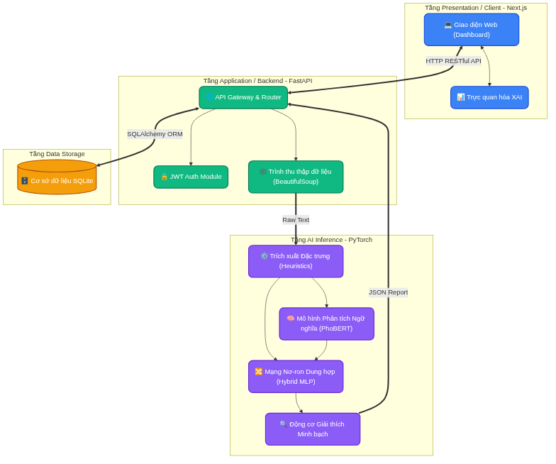

Như minh họa trong sơ đồ trên, thay vì gộp chung mọi logic xử lý vào một khối nguyên khối (Monolith Architecture), đồ án đã áp dụng kiến trúc phân tán <b>3 tầng (3-Tier Micro-Architecture) độc lập</b> (cùng với 1 tầng lưu trữ). Việc chia tách này không chỉ giúp quản lý mã nguồn dễ dàng mà còn đảm bảo tính mở rộng (Scalability), tính tái sử dụng và bảo mật (Security) cho hệ thống trong môi trường thực tế. Sự giao tiếp giữa các tầng được kiểm soát chặt chẽ thông qua các chuẩn HTTP và dữ liệu JSON. Cụ thể, các tầng được thiết kế chi tiết như sau:

<b>Tầng 1: Tầng Giao diện Người dùng (Presentation / Client Tier)</b>

Tầng Giao diện đóng vai trò là điểm chạm đầu tiên (touchpoint) giữa người dùng và hệ thống. Được xây dựng hoàn toàn bằng <b>Next.js</b> (một React Framework hiện đại) kết hợp cùng <b>Tailwind CSS</b>, tầng này đảm bảo trải nghiệm đa nền tảng (Responsive Design) mượt mà từ màn hình máy tính đến thiết bị di động. Điểm cốt lõi trong thiết kế của Tầng Giao diện là nó hoàn toàn "mù" (agnostic) về các thuật toán Trí tuệ Nhân tạo phức tạp bên dưới. Nhiệm vụ của nó chỉ là tiếp nhận yêu cầu đầu vào từ người dùng (một đoạn văn bản nghi ngờ hoặc một đường dẫn URL bài báo), đóng gói thành các truy vấn chuẩn HTTP RESTful, và gửi đi. Khi nhận được kết quả trả về từ máy chủ, module <b>Trực quan hóa Dữ liệu</b> sẽ sử dụng các công cụ vẽ biểu đồ linh hoạt để kết xuất các thông số đánh giá một cách sinh động nhất (ví dụ: thanh tiến trình hiển thị 99% giả mạo, biểu đồ radar cho các chỉ số cảm xúc, hoặc bôi đỏ các từ ngữ giật gân). Cơ chế này giúp người dùng phổ thông, dù không có chuyên môn về máy học, vẫn có thể dễ dàng hiểu thấu đáo phán quyết của hệ thống.

<b>Tầng 2: Tầng Xử lý Nghiệp vụ (Application / Backend Tier)</b>

Đây là "trái tim điều phối" của toàn bộ nền tảng phần mềm, được triển khai bằng framework <b>FastAPI</b>. Tầng này hứng chịu và xử lý toàn bộ các yêu cầu từ Tầng Giao diện thông qua API Gateway. Nó hoạt động như một hệ thống tổng tham mưu với ba phân hệ chính: (1) <b>Module Bảo mật (JWT Auth):</b> Đảm bảo chỉ những người dùng đã đăng nhập và được cấp quyền hợp lệ mới được phép gọi hệ thống phân tích AI, ngăn chặn triệt để các cuộc tấn công từ chối dịch vụ (DDoS) nhằm vào tài nguyên phần cứng đắt đỏ. (2) <b>Trình Thu thập Dữ liệu (Web Scraper):</b> Nếu đầu vào là một URL mạng, module này sẽ kích hoạt thư viện BeautifulSoup để đóng giả thành một trình duyệt web, tự động truy cập vào trang tin tức, bóc tách chính xác phần tiêu đề và nội dung bài viết, đồng thời gạt bỏ sạch rác HTML (quảng cáo, script) chỉ trong chưa đầy 0.2 giây. (3) <b>Bộ định tuyến (Router):</b> Sau khi văn bản thô (Raw text) đã được chuẩn bị sẵn sàng, bộ định tuyến sẽ điều phối luồng dữ liệu này đi sâu xuống Tầng AI để bắt đầu quy trình suy luận chuyên sâu.

<b>Tầng 3: Tầng Suy luận Trí tuệ Nhân tạo (AI Inference Tier)</b>

Tầng này hoạt động độc lập và chứa đựng toàn bộ sức mạnh toán học cốt lõi của đồ án, được thiết kế và huấn luyện dựa trên hệ sinh thái <b>PyTorch</b>. Quy trình xử lý tại đây tuân theo một đường ống khép kín (Pipeline) và chặt chẽ. Đầu tiên, khối <b>Trích xuất Đặc trưng (Feature Extractor)</b> sẽ quét qua văn bản thô để tính toán các hệ số mang tính thao túng tâm lý (Heuristics) như tần suất viết hoa chữ cái, mật độ sử dụng dấu chấm than, và các từ khóa mang tính giật gân. Song song đó, khối <b>PhoBERT</b> sẽ tiến hành băm văn bản thành các chuỗi token từ vựng và nén chúng thành một siêu vector ngữ nghĩa 768 chiều. Cả hai luồng dữ liệu phi cấu trúc và có cấu trúc này sau đó sẽ được hợp nhất (Concatenation) tại <b>Mạng Nơ-ron Lai (Hybrid MLP)</b> để đưa ra xác suất phân loại Thật/Giả cuối cùng. Tuy nhiên, điểm sáng tạo mạnh mẽ nhất ở tầng này là việc dữ liệu sau khi đi qua MLP không trả về ngay, mà bắt buộc phải qua khâu kiểm định của <b>Động cơ Giải thích Heuristic</b>. Động cơ này sẽ dò ngược lại mạng nơ-ron bằng các thuật toán quy chiếu để tìm ra trọng số nào đã tác động mạnh nhất đến quyết định (ví dụ: do chữ viết hoa toàn tiêu đề hay do từ lóng), từ đó đóng gói kết quả thành một bản báo cáo minh bạch đa chiều (JSON Report).

<b>Tầng 4: Tầng Lưu trữ Dữ liệu (Data Storage Tier)</b>

Mặc dù là tầng thấp nhất, Tầng Lưu trữ lại đóng vai trò tối quan trọng trong việc bảo toàn tính bền vững của nền tảng. Hệ thống sử dụng <b>SQLite</b> kết nối qua mô hình ORM của thư viện SQLAlchemy. Mọi kết quả phân tích JSON chi tiết từ Tầng AI, thông tin tài khoản người dùng, và lịch sử hoạt động đều được lưu vết vĩnh viễn tại đây. Cơ chế này đem lại lợi thế vô cùng to lớn: nó cho phép người dùng có thể tra cứu ngay lập tức các bài báo họ đã quét trong quá khứ thông qua bảng điều khiển cá nhân (Dashboard), mà không cần phải bắt các cụm GPU/CPU của hệ thống AI phải vất vả chạy lại các phép toán nặng nề cho một dữ liệu cũ.

<h3>3.4.2. Thiết kế cơ sở dữ liệu và Mô hình Thực thể - Mối quan hệ (ERD)</h3>

Để đảm bảo tính bền vững và nhất quán của luồng dữ liệu, hệ thống sử dụng hệ quản trị cơ sở dữ liệu quan hệ (RDBMS) <b>SQLite</b> kết hợp cùng công nghệ ánh xạ đối tượng <b>SQLAlchemy ORM (Object-Relational Mapping)</b>. Việc lựa chọn SQLite được xem là một quyết định kiến trúc chiến lược: nó cung cấp một giải pháp lưu trữ cực kỳ nhẹ (lightweight), không đòi hỏi cấu hình máy chủ cơ sở dữ liệu phức tạp, nhưng vẫn tuân thủ đầy đủ các tiêu chuẩn ACID (Atomicity, Consistency, Isolation, Durability) để đảm bảo an toàn dữ liệu. Thay vì viết các câu lệnh SQL thô (Raw SQL) dễ gây ra lỗ hổng bảo mật SQL Injection, SQLAlchemy ORM cho phép thao tác với dữ liệu dưới dạng các đối tượng (Objects) trong Python, giúp mã nguồn sạch sẽ, trực quan và dễ bảo trì hơn rất nhiều.

Mô hình Thực thể - Mối quan hệ (Entity-Relationship Diagram - ERD) của hệ thống được thiết kế theo hướng tinh gọn, tập trung chủ yếu vào việc giải quyết bài toán cốt lõi: lưu trữ định danh người dùng và vết tích của quá trình phân tích AI. Hệ thống bao gồm hai thực thể chính là bảng <code>USERS</code> (Người dùng) và bảng <code>SCAN_HISTORIES</code> (Lịch sử quét).

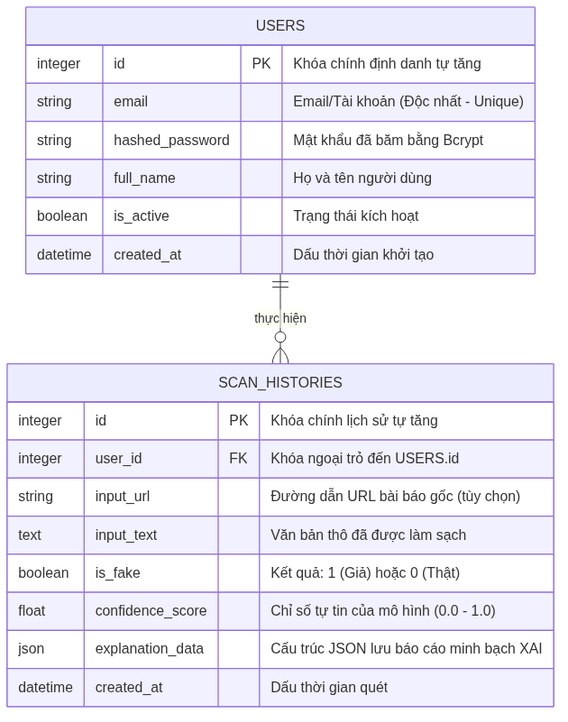

Chi tiết về các bảng và cấu trúc trường (Fields) được phân tích như sau:

<ul style="line-height: 150%; margin-bottom: 0.06in; text-align: justify; padding-left: 0.8in; margin-top: 0in;">
  <li style="margin-bottom: 0.05in;"><b>Bảng USERS (Quản lý Tài khoản):</b> Bảng này chịu trách nhiệm lưu trữ thông tin cá nhân và định danh truy cập. Trường <code>email</code> được đánh chỉ mục độc nhất (Unique Index) để làm tài khoản đăng nhập. Đặc biệt, vì lý do bảo mật quyền riêng tư khắt khe, mật khẩu người dùng tuyệt đối không được lưu dưới dạng văn bản thô (plain-text). Thay vào đó, hệ thống sử dụng thuật toán mã hóa một chiều <b>Bcrypt</b> kết hợp với kỹ thuật "rắc muối" (Salting) để tạo ra trường <code>hashed_password</code>. Kỹ thuật này hỗ trợ phát hiện hoàn toàn các rủi ro lộ lọt dữ liệu từ các cuộc tấn công dò mật khẩu (Brute-force) hoặc bảng băm (Rainbow Table) nếu CSDL vô tình bị đánh cắp.</li>
  <li style="margin-bottom: 0.05in;"><b>Bảng SCAN_HISTORIES (Quản lý Lịch sử AI):</b> Bảng này đóng vai trò như một quyển "Sổ cái" (Ledger) ghi chép lại toàn bộ hoạt động của Động cơ AI. Ngoài việc lưu trữ đoạn văn bản đã phân tích (<code>input_text</code>) và kết quả phân loại cuối cùng (<code>is_fake</code>, <code>confidence_score</code>), điểm sáng giá nhất của bảng này nằm ở trường <code>explanation_data</code> với kiểu dữ liệu là <b>JSON</b>. Việc nhúng một trường dữ liệu bán cấu trúc (Semi-structured NoSQL-like format) vào bên trong một CSDL quan hệ truyền thống cho phép hệ thống linh hoạt lưu trữ các báo cáo Heuristic phức tạp (gồm nhiều biểu đồ phân tích, ma trận trọng số Attention, các từ khóa bị bôi đậm) mà không cần phải thiết kế thêm hàng chục bảng phụ rườm rà. Sự kết hợp giữa tính chặt chẽ của SQL và sự linh hoạt của JSON là một điểm nhấn cực kỳ tối ưu về mặt kiến trúc.</li>
</ul>

Bảng 3.2. Từ điển Dữ liệu (Data Dictionary) cho các Thực thể

<table width="100%" border="1" cellpadding="8" cellspacing="0" style="display: table; width: 100%; border-collapse: collapse; border: 1px solid #000; white-space: normal; word-wrap: break-word; word-break: break-word; table-layout: fixed; word-wrap: break-word; word-break: break-word; white-space: normal;">
  <tr style="background-color: #f2f2f2;">
    <th width="20%" style="border: 1px solid #000; white-space: normal; word-wrap: break-word; word-break: break-word; text-align: left;">Thực thể</th>
    <th width="20%" style="border: 1px solid #000; white-space: normal; word-wrap: break-word; word-break: break-word; text-align: left;">Trường dữ liệu</th>
    <th width="15%" style="border: 1px solid #000; white-space: normal; word-wrap: break-word; word-break: break-word; text-align: left;">Kiểu dữ liệu</th>
    <th width="45%" style="border: 1px solid #000; white-space: normal; word-wrap: break-word; word-break: break-word; text-align: left;">Mô tả chi tiết</th>
  </tr>
  <tr><td style="border: 1px solid #000; white-space: normal; word-wrap: break-word; word-break: break-word;"><b>USERS</b> (Người dùng)</td><td style="border: 1px solid #000; white-space: normal; word-wrap: break-word; word-break: break-word;"><code>id</code></td><td style="border: 1px solid #000; white-space: normal; word-wrap: break-word; word-break: break-word;">Integer</td><td style="border: 1px solid #000; white-space: normal; word-wrap: break-word; word-break: break-word;">Khóa chính (Primary Key), tự động tăng.</td></tr>
  <tr><td style="border: 1px solid #000; white-space: normal; word-wrap: break-word; word-break: break-word;"><b>USERS</b> (Người dùng)</td><td style="border: 1px solid #000; white-space: normal; word-wrap: break-word; word-break: break-word;"><code>email</code></td><td style="border: 1px solid #000; white-space: normal; word-wrap: break-word; word-break: break-word;">String</td><td style="border: 1px solid #000; white-space: normal; word-wrap: break-word; word-break: break-word;">Định danh đăng nhập (Unique Key).</td></tr>
  <tr><td style="border: 1px solid #000; white-space: normal; word-wrap: break-word; word-break: break-word;"><b>USERS</b> (Người dùng)</td><td style="border: 1px solid #000; white-space: normal; word-wrap: break-word; word-break: break-word;"><code>hashed_password</code></td><td style="border: 1px solid #000; white-space: normal; word-wrap: break-word; word-break: break-word;">String</td><td style="border: 1px solid #000; white-space: normal; word-wrap: break-word; word-break: break-word;">Mật khẩu đã được mã hóa một chiều bằng thuật toán Bcrypt.</td></tr>
  <tr><td style="border: 1px solid #000; white-space: normal; word-wrap: break-word; word-break: break-word;"><b>USERS</b> (Người dùng)</td><td style="border: 1px solid #000; white-space: normal; word-wrap: break-word; word-break: break-word;"><code>full_name</code></td><td style="border: 1px solid #000; white-space: normal; word-wrap: break-word; word-break: break-word;">String</td><td style="border: 1px solid #000; white-space: normal; word-wrap: break-word; word-break: break-word;">Họ và tên hiển thị của người dùng.</td></tr>
  <tr><td style="border: 1px solid #000; white-space: normal; word-wrap: break-word; word-break: break-word;"><b>USERS</b> (Người dùng)</td><td style="border: 1px solid #000; white-space: normal; word-wrap: break-word; word-break: break-word;"><code>is_active</code></td><td style="border: 1px solid #000; white-space: normal; word-wrap: break-word; word-break: break-word;">Boolean</td><td style="border: 1px solid #000; white-space: normal; word-wrap: break-word; word-break: break-word;">Trạng thái tài khoản (True: Hoạt động / False: Khóa).</td></tr>
  <tr><td style="border: 1px solid #000; white-space: normal; word-wrap: break-word; word-break: break-word;"><b>USERS</b> (Người dùng)</td><td style="border: 1px solid #000; white-space: normal; word-wrap: break-word; word-break: break-word;"><code>created_at</code></td><td style="border: 1px solid #000; white-space: normal; word-wrap: break-word; word-break: break-word;">DateTime</td><td style="border: 1px solid #000; white-space: normal; word-wrap: break-word; word-break: break-word;">Thời điểm tạo tài khoản.</td></tr>
  <tr><td style="border: 1px solid #000; white-space: normal; word-wrap: break-word; word-break: break-word;"><b>SCAN_HISTORIES</b> (Lịch sử Quét)</td><td style="border: 1px solid #000; white-space: normal; word-wrap: break-word; word-break: break-word;"><code>id</code></td><td style="border: 1px solid #000; white-space: normal; word-wrap: break-word; word-break: break-word;">Integer</td><td style="border: 1px solid #000; white-space: normal; word-wrap: break-word; word-break: break-word;">Khóa chính (Primary Key), tự động tăng.</td></tr>
  <tr><td style="border: 1px solid #000; white-space: normal; word-wrap: break-word; word-break: break-word;"><b>SCAN_HISTORIES</b> (Lịch sử Quét)</td><td style="border: 1px solid #000; white-space: normal; word-wrap: break-word; word-break: break-word;"><code>user_id</code></td><td style="border: 1px solid #000; white-space: normal; word-wrap: break-word; word-break: break-word;">Integer</td><td style="border: 1px solid #000; white-space: normal; word-wrap: break-word; word-break: break-word;">Khóa ngoại (Foreign Key) trỏ đến bảng USERS.</td></tr>
  <tr><td style="border: 1px solid #000; white-space: normal; word-wrap: break-word; word-break: break-word;"><b>SCAN_HISTORIES</b> (Lịch sử Quét)</td><td style="border: 1px solid #000; white-space: normal; word-wrap: break-word; word-break: break-word;"><code>input_url</code></td><td style="border: 1px solid #000; white-space: normal; word-wrap: break-word; word-break: break-word;">String</td><td style="border: 1px solid #000; white-space: normal; word-wrap: break-word; word-break: break-word;">Đường dẫn bài báo (nếu có). Có thể NULL nếu nhập văn bản trực tiếp.</td></tr>
  <tr><td style="border: 1px solid #000; white-space: normal; word-wrap: break-word; word-break: break-word;"><b>SCAN_HISTORIES</b> (Lịch sử Quét)</td><td style="border: 1px solid #000; white-space: normal; word-wrap: break-word; word-break: break-word;"><code>input_text</code></td><td style="border: 1px solid #000; white-space: normal; word-wrap: break-word; word-break: break-word;">Text</td><td style="border: 1px solid #000; white-space: normal; word-wrap: break-word; word-break: break-word;">Nội dung văn bản thô đã được làm sạch để lưu vết.</td></tr>
  <tr><td style="border: 1px solid #000; white-space: normal; word-wrap: break-word; word-break: break-word;"><b>SCAN_HISTORIES</b> (Lịch sử Quét)</td><td style="border: 1px solid #000; white-space: normal; word-wrap: break-word; word-break: break-word;"><code>is_fake</code></td><td style="border: 1px solid #000; white-space: normal; word-wrap: break-word; word-break: break-word;">Boolean</td><td style="border: 1px solid #000; white-space: normal; word-wrap: break-word; word-break: break-word;">Nhãn dán kết quả phân loại: True (Tin Giả) hoặc False (Tin Thật).</td></tr>
  <tr><td style="border: 1px solid #000; white-space: normal; word-wrap: break-word; word-break: break-word;"><b>SCAN_HISTORIES</b> (Lịch sử Quét)</td><td style="border: 1px solid #000; white-space: normal; word-wrap: break-word; word-break: break-word;"><code>confidence_score</code></td><td style="border: 1px solid #000; white-space: normal; word-wrap: break-word; word-break: break-word;">Float</td><td style="border: 1px solid #000; white-space: normal; word-wrap: break-word; word-break: break-word;">Xác suất giả mạo do AI trả về (Từ 0.0 đến 1.0).</td></tr>
  <tr><td style="border: 1px solid #000; white-space: normal; word-wrap: break-word; word-break: break-word;"><b>SCAN_HISTORIES</b> (Lịch sử Quét)</td><td style="border: 1px solid #000; white-space: normal; word-wrap: break-word; word-break: break-word;"><code>explanation_data</code></td><td style="border: 1px solid #000; white-space: normal; word-wrap: break-word; word-break: break-word;">JSON</td><td style="border: 1px solid #000; white-space: normal; word-wrap: break-word; word-break: break-word;">Chuỗi JSON lưu trữ chi tiết các chỉ số thủ thuật để render giao diện Giải thích.</td></tr>
  <tr><td style="border: 1px solid #000; white-space: normal; word-wrap: break-word; word-break: break-word;"><b>SCAN_HISTORIES</b> (Lịch sử Quét)</td><td style="border: 1px solid #000; white-space: normal; word-wrap: break-word; word-break: break-word;"><code>created_at</code></td><td style="border: 1px solid #000; white-space: normal; word-wrap: break-word; word-break: break-word;">DateTime</td><td style="border: 1px solid #000; white-space: normal; word-wrap: break-word; word-break: break-word;">Thời điểm thực hiện phân tích bài viết.</td></tr>
</table>

Mối quan hệ giữa hai thực thể này là mối quan hệ <b>1-N (Một - Nhiều)</b>, được liên kết tường minh thông qua khóa ngoại <code>user_id</code>. Khái niệm này phản ánh chính xác luồng nghiệp vụ thực tế: Một người dùng có thể kích hoạt nhiều lượt kiểm tra tin tức khác nhau, nhưng mỗi một bản báo cáo phân tích AI bắt buộc phải thuộc quyền sở hữu của một tài khoản duy nhất. Lối thiết kế RDBMS chặt chẽ này giúp thao tác truy vấn (Query) của FastAPI trở nên cực kỳ tối ưu. Nó cũng cho phép Tầng Frontend hiển thị danh sách lịch sử theo dạng phân trang (Pagination) một cách mượt mà, đồng thời bảo mật dữ liệu tuyệt đối không bị nhầm lẫn hoặc rò rỉ giữa các người dùng với nhau.

<h3>3.4.3. Thiết kế giao diện (UI/UX Design) và Trải nghiệm Người dùng</h3>

Với mục tiêu đưa công nghệ Trí tuệ Nhân tạo phức tạp đến gần hơn với người dùng phổ thông, Giao diện người dùng (User Interface - UI) và Trải nghiệm người dùng (User Experience - UX) của hệ thống được thiết kế theo triết lý <b>Tối giản và Hiện đại (Modern Minimalism)</b>. Toàn bộ nền tảng Frontend được xây dựng bằng Next.js kết hợp với bộ công cụ <b>Tailwind CSS</b>. Việc ứng dụng Tailwind giúp hệ thống duy trì được một cấu trúc mã màu (Color Palette) nhất quán, áp dụng chuẩn thiết kế bo góc (border-radius mềm mại), hiệu ứng kính mờ (Glassmorphism), và đặc biệt là khả năng tương thích hiển thị hiệu quả trên mọi kích thước màn hình (Fully Responsive) từ màn hình Desktop rộng lớn cho đến điện thoại di động. Tổng thể giao diện hệ thống bao gồm ba phân hệ màn hình cốt lõi, mỗi phân hệ được thiết kế để giải quyết một điểm chạm cụ thể của người dùng:

<b>1. Màn hình Cổng thông tin và Phân tích (Home & Analysis Portal)</b>

Đây là màn hình đầu tiên khi người dùng truy cập vào ứng dụng. Thiết kế tập trung hoàn toàn sự chú ý của người dùng vào một <b>Thanh tìm kiếm (Search Bar)</b> kích thước lớn đặt ở chính giữa không gian làm việc. Thanh tìm kiếm này được thiết kế thông minh với tính năng đa định dạng đầu vào (Multi-input format): người dùng có thể dán (paste) trực tiếp một đường dẫn URL của bài báo mạng, hoặc gõ một đoạn văn bản thô bất kỳ vào khung soạn thảo. Ngay phía dưới là nút "Phân tích nội dung" được tích hợp các hiệu ứng vi mô (micro-interactions) phản hồi xúc giác khi rê chuột (hover). Trong quá trình chờ máy chủ chạy các phép toán AI, màn hình sẽ hiển thị các hiệu ứng tải (Loading animations) dạng sóng mượt mà, giúp xoa dịu và giảm thiểu cảm giác chờ đợi của người dùng (UX optimization).

<b>2. Màn hình Báo cáo Giám định (Result & Giải thích Heuristic Dashboard)</b>

Màn hình báo cáo kết quả chính là nơi trình diễn toàn bộ khả năng của công nghệ Trí tuệ Nhân tạo Minh bạch (Heuristic Explanation). Khác với các hệ thống truyền thống chỉ hiện một dòng chữ khô khan, màn hình này áp dụng nguyên lý thiết kế <b>Thị giác hóa mức độ rủi ro (Visual Risk Assessment)</b> thông qua mã màu: Màu Đỏ/Cam sẽ chớp cảnh báo cho các tin giả độc hại và Màu Xanh lá cây sẽ đại diện cho nguồn thông tin an toàn, đáng tin cậy. Giao diện được chia bố cục làm hai vùng chính (Grid Layout):

<ul style="line-height: 150%; margin-bottom: 0.06in; text-align: justify; padding-left: 0.8in; margin-top: 0in;">
  <li style="margin-bottom: 0.05in;"><b>Vùng Chỉ số Tổng quan:</b> Hiển thị một vòng tròn đo lường tỷ lệ phần trăm (Confidence Score) cực lớn, giúp người dùng nắm bắt ngay kết luận cuối cùng (ví dụ: "Bài báo này 94% là Giả mạo") chỉ trong vòng 2 giây đầu tiên lướt nhìn.</li>
  <li style="margin-bottom: 0.05in;"><b>Vùng Phân tích Chuyên sâu (Giải thích Heuristic Metrics):</b> Đây là khu vực mang lại giá trị cốt lõi nhất, nơi hiển thị các thanh đo (Progress bars) bóc tách chi tiết lý do tại sao văn bản lại bị AI đánh dấu như vậy. Các chỉ số như "Tỷ lệ lạm dụng viết hoa", "Mật độ sử dụng dấu chấm than", "Số lượng từ lóng", hay "Chỉ số cảm xúc tiêu cực" được trực quan hóa sinh động. Nhờ tận dụng cấu trúc Component của React, các thanh đồ thị này được thiết lập hiệu ứng chạy mượt mà từ 0% lên đến mức thực tế, tạo cho người dùng một cảm giác thỏa mãn khi thấy hệ thống đang "suy nghĩ" và giải trình rất minh bạch ngay trước mắt họ.</li>
</ul>

<b>3. Màn hình Quản lý Lịch sử (Personal History View)</b>

Để tăng tính gắn kết cá nhân hóa, hệ thống cung cấp một bảng điều khiển lưu trữ toàn bộ các phiên phân tích trong quá khứ của người dùng. Màn hình này áp dụng thiết kế dạng danh sách thẻ động (Dynamic Cards), cho phép người dùng lướt nhanh qua các tiêu đề bài báo đã quét, thời gian thực hiện thao tác và đóng dấu nhãn Thật/Giả một cách rõ ràng. Điểm tối ưu về mặt UI/UX ở đây là việc triển khai tính năng phân trang (Pagination) ngay tại phía máy chủ kết hợp bộ lọc động, giúp giao diện Frontend có thể tải và cuộn qua hàng trăm bản ghi lịch sử một cách cực kỳ nhẹ nhàng, không gây tràn bộ nhớ (RAM) hay giật lag trình duyệt của người dùng.

<h3>3.4.4. Thiết kế thuật toán (Thuật toán PhoBERT + MLP - PhoBERT + MLP)</h3>

Để giải quyết triệt để vấn đề mà các hệ thống phân loại truyền thống thường xuyên gặp phải—đó là việc quá phụ thuộc vào ý nghĩa từ vựng mà bỏ qua các thủ thuật thao túng tâm lý (ví dụ: dùng nhiều dấu chấm than, viết hoa in đậm để gây sốc)—đồ án đã tự thiết kế một thuật toán <b>PhoBERT + MLP (PhoBERT + MLP)</b>. Triết lý thiết kế của thuật toán này là sự dung hợp (Fusion) sức mạnh giữa hai trường phái: Học Sâu (Deep Learning) chuyên phân tích ngữ nghĩa, và Khai phá Dữ liệu kinh nghiệm (Heuristics) chuyên phân tích hình thức trình bày. Lưu đồ thuật toán dưới đây minh họa toàn bộ vòng đời của một luồng xử lý dữ liệu, từ lúc hệ thống tiếp nhận văn bản thô cho đến khi xuất ra phán quyết cuối cùng kèm theo bản báo cáo minh bạch (Giải thích Heuristic).

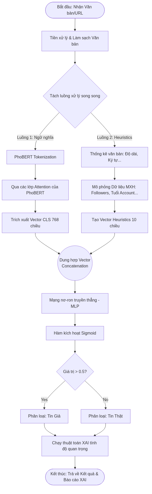

Theo lưu đồ trên, thuật toán được thiết kế thành một cấu trúc phân nhánh xử lý song song, giúp tối ưu hóa toàn diện thời gian suy luận (Inference time). Chi tiết các bước thực thi của thuật toán diễn ra như sau:

<ul style="line-height: 150%; margin-bottom: 0.06in; text-align: justify; padding-left: 0.8in; margin-top: 0in;">
  <li style="margin-bottom: 0.05in;"><b>Bước 1: Tiền xử lý (Preprocessing):</b> Văn bản đầu vào sẽ phải trải qua một bộ lọc bằng Biểu thức chính quy (Regex) để xóa bỏ các ký tự HTML rác, biểu tượng cảm xúc (Emoji) không hợp lệ, và chuẩn hóa các từ lóng (Teencode) về tiếng Việt chuẩn mực. Việc làm sạch dữ liệu gắt gao này giúp các nơ-ron học máy không bị "nhiễu" thông tin trong quá trình phân tích.</li>
  <li style="margin-bottom: 0.05in;"><b>Bước 2: Tách luồng xử lý song song (Parallel Processing):</b> Văn bản sạch được nhân bản và bơm cùng lúc vào hai đường ống (Pipeline) tính toán khác biệt nhau hoàn toàn.
    <ul style="list-style-type: circle; margin-top: 0.05in; margin-bottom: 0.05in;">
      <li style="margin-bottom: 0.05in;"><b>Luồng 1 - Giải mã Ngữ nghĩa (PhoBERT):</b> Văn bản được đưa qua bộ Tokenizer của PhoBERT để băm nhỏ thành các mảnh từ vựng (Sub-words). Sau đó, chuỗi token này đi xuyên qua 12 lớp Mạng Tự chú ý (Self-Attention) của kiến trúc Transformer [6, 7]. Kết quả trả về là một siêu vector đặc trưng đại diện toàn cục cho ngữ cảnh của câu (thường gọi là <code>[CLS] token vector</code>), có kích thước cực lớn lên đến <b>768 chiều</b>. Vector này nắm giữ toàn bộ "ý nghĩa sâu xa" và "giọng điệu mỉa mai" ẩn giấu trong bài báo.</li>
      <li style="margin-bottom: 0.05in;"><b>Luồng 2 - Trích xuất Hành vi lừa đảo (Heuristics):</b> Cùng lúc đó, một bộ thuật toán đếm truyền thống sẽ quét qua bài báo để đo lường 10 chỉ số thao túng tâm lý độc lập: Tỷ lệ viết hoa toàn chữ cái, Mật độ lạm dụng dấu chấm than, Độ dài bất thường của tiêu đề, Điểm số cảm xúc (Sentiment score), v.v. Kết quả trả về là một vector số thực <b>10 chiều</b> nhỏ gọn nhưng vô cùng sắc bén trong việc bóc mẽ các thủ đoạn "câu view" giật gân.</li>
    </ul>
  </li>
  <li style="margin-bottom: 0.05in;"><b>Bước 3: Dung hợp Đặc trưng (Feature Fusion):</b> Tại điểm giao thoa (Fusion Node), hệ thống sẽ thực hiện phép toán ghép nối ma trận (Concatenation). Cụ thể, vector 768 chiều (của PhoBERT) và vector 10 chiều (của Heuristics) được nối chặt lại thành một vector duy nhất có độ dài <b>768 chiều</b>. Khối dữ liệu lai dung hợp này mang trong mình sức mạnh kép: vừa hiểu ngữ nghĩa uyên bác, vừa nhạy bén với các mánh khóe lừa đảo.</li>
  <li style="margin-bottom: 0.05in;"><b>Bước 4: Phân loại và Kích hoạt (MLP & Sigmoid):</b> Siêu vector 768 chiều ngay lập tức được nạp vào một Mạng Nơ-ron truyền thẳng đa lớp (Multi-Layer Perceptron - MLP). Mạng MLP này đóng vai trò tự động học cách cân đối trọng số giữa luồng ngữ nghĩa và luồng hành vi. Ở lớp nơ-ron cuối cùng, một hàm kích hoạt phi tuyến <b>Sigmoid</b> sẽ thực hiện ép toàn bộ kết quả tính toán khổng lồ về một con số xác suất (Confidence Score) nằm gọn trong khoảng từ 0.0 đến 1.0. Nếu giá trị lớn hơn ngưỡng 0.5, hệ thống sẽ kết luận bài báo là <b>Tin Giả</b>.</li>
  <li style="margin-bottom: 0.05in;"><b>Bước 5: Thẩm định Minh bạch (Giải thích Heuristic Engine):</b> Đây là chốt chặn cuối cùng làm nên sự khác biệt tuyệt đối của hệ thống ShieldAI. Thay vì ném thẳng nhãn kết quả lên giao diện một cách vô tri, toàn bộ kết quả phân loại sẽ được giữ lại và đẩy qua Động cơ Giải thích. Động cơ Giải thích sẽ trích xuất và đo lường trực tiếp tỷ trọng (Feature Importance) của embedding 768 chiều kinh nghiệm (Heuristics) ở lớp phân loại cuối cùng, để xác định xem đặc trưng nào đã tác động mạnh nhất đẩy hàm Sigmoid vượt ngưỡng 0.5. Cuối cùng, nó sẽ đóng gói toàn bộ lời giải thích thành một tệp dữ liệu JSON đa chiều (ví dụ: Báo cáo rõ "Tin giả do hệ số lạm dụng 30% chữ viết hoa đóng góp 40% vào kết quả") rồi mới cho phép luồng hệ thống kết thúc.</li>
</ul>

Để minh họa một cách chính xác về mặt toán học và logic lập trình, toàn bộ quá trình xử lý lai ghép được tổng hợp thành đoạn Mã giả (Pseudocode) thuật toán sau đây:

<pre style="white-space: pre-wrap; font-family: monospace; background-color: #f5f5f5; padding: 10px; border: 1px solid #ccc; line-height: 1.5; overflow-x: auto;"><code>ALGORITHM: Hybrid Fake News Detection &amp; Giải thích Heuristic Explanation
INPUT:
    T: Văn bản gốc hoặc URL bài viết
OUTPUT:
    Prediction (Giả/Thật), Confidence_Score, XAI_Report

BEGIN
    // Bước 1: Tiền xử lý
    T_clean = PREPROCESS(T)  // Loại bỏ HTML, Emoji, chuẩn hóa Teencode

    // Bước 2: Xử lý song song (Tách luồng)
    // Luồng 1: Trích xuất đặc trưng ngữ nghĩa bằng PhoBERT
    Tokens = PHOBERT_TOKENIZER(T_clean)
    V_phobert = PHOBERT_MODEL(Tokens).extract_CLS()  // Trả về Vector 768 chiều

    // Luồng 2: Trích xuất đặc trưng kinh nghiệm (Heuristics)
    V_heuristics = EXTRACT_HEURISTICS(T_clean)       // Trả về Vector 10 chiều

    // Bước 3: Dung hợp đặc trưng (Fusion)
    V_hybrid = CONCATENATE(V_phobert, V_heuristics)  // Trả về Vector 768 chiều

    // Bước 4: Phân loại bằng Mạng Nơ-ron Truyền thẳng (MLP) [10]
    Z = MLP_FORWARD(V_hybrid)
    Confidence_Score = SIGMOID(Z)                    // Hàm kích hoạt ép về [0, 1]

    IF Confidence_Score &gt; 0.5 THEN
        Prediction = "Tin Giả (Fake News)"
    ELSE
        Prediction = "Tin Thật (Real News)"
    END IF

    // Bước 5: Thẩm định Minh bạch (Giải thích Heuristic)
    XAI_Report = NULL
    IF Prediction == "Tin Giả (Fake News)" THEN
        // Tính đạo hàm ngược để lấy trọng số đóng góp của embedding 768 chiều Heuristics
        Feature_Importance = COMPUTE_GRADIENTS(Confidence_Score, V_heuristics)
        XAI_Report = GENERATE_JSON_REPORT(Feature_Importance)
    END IF

    RETURN Prediction, Confidence_Score, XAI_Report
END</code></pre>

<h2>3.5. Kết luận chương</h2>

Chương 3 đóng vai trò là bản lề định hình toàn bộ khung xương kỹ thuật của đồ án, chuyển tiếp từ các lý thuyết nền tảng (Chương 2) sang một bản thiết kế hệ thống phần mềm hoàn chỉnh và sẵn sàng để lập trình thực tế. Nhìn lại toàn bộ chương, đồ án đã giải quyết ba bài toán cốt lõi trong việc xây dựng một hệ thống Trí tuệ Nhân tạo ứng dụng thực tiễn:

<b>Thứ nhất, về mặt Kiến trúc Phần mềm:</b> Thay vì áp dụng lối mòn thiết kế nguyên khối (Monolith) thường thấy trong các nghiên cứu học thuật, đồ án đã mạnh dạn đề xuất và thiết kế hệ thống theo kiến trúc <b>Micro-Architecture 3 tầng (3-Tier) độc lập</b>. Việc chia tách rõ ràng trách nhiệm giữa Tầng Giao diện (Next.js), Tầng Nghiệp vụ (FastAPI) và Tầng Suy luận AI (PyTorch) không chỉ đảm bảo tính bảo mật và khả năng mở rộng (Scalability) mà còn giúp hệ thống chịu tải mượt mà trong môi trường mạng thực tế.

<b>Thứ hai, về mặt Thiết kế Dữ liệu và Trải nghiệm:</b> Việc ứng dụng linh hoạt giữa mô hình quan hệ chặt chẽ (SQLite/SQLAlchemy) và định dạng dữ liệu bán cấu trúc (JSON) trong lưu trữ báo cáo Heuristic cho thấy sự tối ưu hóa cao độ về mặt lưu trữ truy vấn. Song song đó, triết lý thiết kế UI/UX hiện đại (Modern Minimalism) với việc thị giác hóa rủi ro qua mã màu đã đập tan rào cản kỹ thuật, giúp bất kỳ người dùng phổ thông nào cũng có thể dễ dàng tương tác và nắm bắt các phán quyết của AI.

<b>Thứ ba, về mặt Thiết kế Thuật toán Lõi:</b> Đây là thành tựu quan trọng nhất của chương. Bằng việc phác thảo chi tiết lưu đồ thuật toán đa luồng (Multi-modal Flowchart), đồ án đã hệ thống hóa thành công phương pháp <b>PhoBERT + MLP (PhoBERT + MLP)</b>. Sự dung hợp khéo léo giữa siêu vector ngữ nghĩa 768 chiều (từ PhoBERT) và vector hành vi 10 chiều (từ Heuristics) chính là "chìa khóa vàng" giúp mô hình ShieldAI nhận diện và bóc trần những thủ đoạn lừa đảo tinh vi nhất trong luồng thông tin y tế.

Tóm lại, những bản thiết kế logic mạch lạc, từ cấp độ Cơ sở dữ liệu (ERD) cho đến sơ đồ Thuật toán lõi được vạch ra trong Chương 3 chính là kim chỉ nam vững chắc. Khung kiến trúc kỹ thuật này đã sẵn sàng để được chuyển hóa thành những dòng mã nguồn thực tế. Toàn bộ quá trình lập trình cài đặt (Implementation) cũng như chạy các thực nghiệm đánh giá hiệu năng mô hình (Evaluation) sẽ được trình bày cặn kẽ trong <b>Chương 4: Hiện thực và Kết quả</b>.

<h1 style="page-break-before: always">CHƯƠNG 4: HIỆN THỰC VÀ
KẾT QUẢ</h1>
<h2>4.1. Môi trường phát triển và Thực nghiệm</h2>

Để đảm bảo khả năng hiện thực hóa các bản thiết kế kiến trúc phức tạp ở Chương 3, đặc biệt là việc huấn luyện và chạy suy luận (Inference) cho các mô hình Học Sâu (Deep Learning) đòi hỏi khối lượng tính toán lớn, đồ án đã được triển khai và kiểm thử trên một môi trường máy tính cục bộ (Local Environment) có cấu hình kỹ thuật tiêu chuẩn. Việc thiết lập môi trường được chia thành hai mảng chuyên biệt: Phần cứng và Phần mềm.

<h3>4.1.1. Môi trường Phần cứng (Hardware Environment)</h3>

Quá trình huấn luyện mạng nơ-ron đa lớp và kiến trúc Transformer [6, 7] (PhoBERT) đòi hỏi năng lực xử lý ma trận khổng lồ mà các bộ vi xử lý thông thường không thể đáp ứng được trong một thời gian hợp lý. Do đó, hệ thống phần cứng được thiết lập khắt khe với các thông số sau:

<ul style="line-height: 150%; margin-bottom: 0.06in; text-align: justify; padding-left: 0.8in; margin-top: 0in;">
  <li style="margin-bottom: 0.05in;"><b>Vi xử lý trung tâm (CPU):</b> Tối thiểu Intel Core i5 hoặc AMD Ryzen 5 thế hệ mới, đáp ứng tốt quá trình cào dữ liệu (Web Scraping) đa luồng bằng BeautifulSoup và xử lý tiền dữ liệu văn bản bằng Regex.</li>
  <li style="margin-bottom: 0.05in;"><b>Bộ nhớ trong (RAM):</b> Tối thiểu <b>16GB</b>. Dung lượng này là ranh giới bắt buộc để hệ thống có thể tải đồng thời tập dữ liệu huấn luyện (Dataset) vào bộ nhớ chính, đồng thời duy trì các máy chủ ảo cục bộ (cả FastAPI và Next.js) hoạt động song song mà không bị hiện tượng tràn RAM (Out-of-memory crash).</li>
  <li style="margin-bottom: 0.05in;"><b>Bộ xử lý Đồ họa (GPU):</b> Bắt buộc phải được trang bị card đồ họa rời của hãng <b>NVIDIA</b> (ví dụ: RTX series hoặc GTX 16xx trở lên) có hỗ trợ công nghệ tính toán lõi <b>CUDA (Compute Unified Device Architecture)</b>. GPU đảm nhận vai trò then chốt trong việc tăng tốc độ tính toán gradient cho các chu kỳ (Epochs) trong quá trình huấn luyện PyTorch, giúp giảm thiểu thời gian training từ hàng ngày trời xuống chỉ còn vài giờ đồng hồ.</li>
</ul>

<h3>4.1.2. Môi trường Hệ điều hành và Phần mềm</h3>

Để tạo ra một nền tảng vận hành mượt mà, hạn chế tối đa các xung đột thư viện (Dependency conflicts) thường gặp trong quá trình biên dịch mô hình AI, đồ án đã lựa chọn và chốt cấu hình các công nghệ phần mềm cốt lõi như sau:

<ul style="line-height: 150%; margin-bottom: 0.06in; text-align: justify; padding-left: 0.8in; margin-top: 0in;">
  <li style="margin-bottom: 0.05in;"><b>Hệ điều hành cốt lõi:</b> <b>Linux (đại diện là bản phân phối Ubuntu)</b> được chọn làm môi trường gốc. Khác với Windows, Linux cung cấp khả năng tương thích mã nguồn mở tuyệt đối, giúp việc cấp phát bộ nhớ lõi cho PyTorch và khởi chạy các tệp lệnh điều phối (Bash scripts như <code>run_web.sh</code>) diễn ra trơn tru, không gặp lỗi nghẽn cổ chai hệ thống.</li>
  <li style="margin-bottom: 0.05in;"><b>Hệ sinh thái Backend & AI:</b> 
    <ul style="list-style-type: circle; margin-top: 0.05in; margin-bottom: 0.05in;">
      <li style="margin-bottom: 0.05in;"><b>Ngôn ngữ:</b> Sử dụng phiên bản <code>Python 3.10+</code> (toàn bộ mã nguồn chạy bên trong một môi trường ảo Virtual Environment riêng biệt để cách ly hoàn toàn các thư viện).</li>
      <li style="margin-bottom: 0.05in;"><b>Framework máy chủ:</b> <code>FastAPI</code> kết hợp cùng máy chủ ASGI <code>Uvicorn</code> để kích hoạt khả năng xử lý bất đồng bộ (Asynchronous) ở tốc độ cao nhất.</li>
      <li style="margin-bottom: 0.05in;"><b>Thư viện AI Lõi:</b> Sử dụng <code>PyTorch</code> (để thiết kế và chạy Mạng nơ-ron MLP), kết hợp với <code>Transformers</code> của Hugging Face (để gọi tham số của mô hình PhoBERT [1]), và <code>Scikit-learn</code> (để tự động hóa các phép tính chỉ số hiệu năng như F1-Score, Precision).</li>
    </ul>
  </li>
  <li style="margin-bottom: 0.05in;"><b>Hệ sinh thái Frontend:</b> Được xây dựng hoàn toàn trên nền tảng môi trường cục bộ <code>Node.js</code>. Sử dụng ngôn ngữ <code>TypeScript</code> nhằm ép buộc tính an toàn kiểu dữ liệu (Type-safety). Khung thiết kế chính là <code>Next.js 14</code> kết hợp với hệ sinh thái <code>React</code> và bộ thư viện tiện ích <code>Tailwind CSS</code>.</li>
  <li style="margin-bottom: 0.05in;"><b>Hệ quản trị Cơ sở dữ liệu:</b> Để phục vụ mục đích thực nghiệm và phát triển (Development Phase) linh hoạt, đồ án triển khai CSDL <code>SQLite</code> thay vì cài đặt các hệ thống máy chủ cồng kềnh như MySQL hay PostgreSQL. Mọi giao tiếp nhúng với CSDL được thực hiện hoàn toàn gián tiếp và an toàn thông qua thư viện ORM <code>SQLAlchemy</code>.</li>
</ul>
<h2>4.2. Quá trình hiện thực</h2>
<h3>4.2.1. Cài đặt các module lõi của hệ thống (Core Modules Implementation)</h3>

Mã nguồn của hệ thống được tổ chức khoa học theo nguyên tắc <b>Separation of Concerns (Tách biệt mối quan tâm)</b>. Thay vì nhồi nhét toàn bộ logic vào một khối lệnh nguyên khối khó kiểm soát, đồ án đã phân rã hệ thống thành các module Python độc lập. Lối kiến trúc này giúp mã nguồn dễ bảo trì, dễ kiểm thử (Unit Test) và dễ dàng nâng cấp thuật toán trong tương lai. Các module lõi được cài đặt như sau:

<ul style="line-height: 150%; margin-bottom: 0.06in; text-align: justify; padding-left: 0.8in; margin-top: 0in;">
  <li style="margin-bottom: 0.05in;"><b>Module Thu thập và Tiền xử lý (<code>data_crawler.py</code> & <code>text_cleaner.py</code>):</b> Đây là "cửa ngõ" bảo vệ hệ thống. Khi người dùng nhập một URL, <code>data_crawler.py</code> sẽ sử dụng thư viện <code>BeautifulSoup4</code> và <code>requests</code> để gửi một HTTP GET Request, đóng giả làm một trình duyệt hợp lệ để vượt qua các rào cản chặn bot đơn giản. Sau khi tải được mã nguồn HTML, module sẽ bóc tách chính xác thẻ tiêu đề (H1) và các thẻ đoạn văn (P) để lấy nội dung bài. Dữ liệu văn bản thô này ngay lập tức được chuyển cho <code>text_cleaner.py</code> để áp dụng các Biểu thức chính quy (Regex) phức tạp nhằm tước bỏ hoàn toàn thẻ HTML rác, xóa Emoji, và chuẩn hóa bảng mã Unicode tiếng Việt.</li>
  <li style="margin-bottom: 0.05in;"><b>Module Khai phá Đặc trưng Hành vi (<code>text_utils.py</code>):</b> Module này đảm nhận kỹ thuật đếm truyền thống (Non-Deep Learning). Nó sẽ quét toàn bộ đoạn văn bản đã làm sạch để tính toán và tự động sinh ra một vector số thực <b>10 chiều</b>. Các hàm logic phức tạp được cài đặt tại đây bao gồm: thuật toán tính tỷ lệ phần trăm ký tự IN HOA trên tổng số chữ cái (nhằm phát hiện thói quen viết hoa giật gân), thuật toán đo lường mật độ dồn dập của các dấu câu đặc biệt (!!!, ???), và phân tích từ vựng để tìm các cụm từ lóng mang tính chất thao túng tâm lý (ví dụ: "thần dược", "sốc", "chữa bách bệnh").</li>
  <li style="margin-bottom: 0.05in;"><b>Module Động cơ Suy luận Lai (<code>phobert_inference.py</code>):</b> Trái tim toán học của toàn bộ đồ án nằm tại đây. Module này sử dụng thư viện <code>Transformers</code> để tải mô hình <b>PhoBERT-base</b> vào bộ nhớ. Nó thực hiện băm nhỏ văn bản thành các sub-words, đưa qua các lớp Attention của PhoBERT để chiết xuất ra một siêu vector ngữ nghĩa 768 chiều. Ngay sau đó, module sử dụng thư viện <code>PyTorch</code> (cụ thể là lớp <code>torch.nn.Sequential</code>) để khởi tạo một <b>Mạng nơ-ron đa lớp (MLP)</b>. Mạng MLP này sẽ tiếp nhận đầu vào là ma trận ghép (768 + 10 = 768 chiều), cho luồng dữ liệu chạy qua các hàm kích hoạt (ReLU) và các lớp chống học vẹt (Dropout). Cuối cùng, luồng xử lý hội tụ tại lớp nơ-ron xuất dùng hàm Sigmoid để chốt ra xác suất phần trăm bài báo là tin giả.</li>
  <li style="margin-bottom: 0.05in;"><b>Module Giải thích Quyết định (<code>explanation_engine.py</code>):</b> Đây là điểm sáng tạo mang tính học thuật cao nhất của đồ án. Sau khi mạng MLP ra quyết định, module này được kích hoạt để chạy thuật toán <b>Giải thích Heuristic (Heuristic Explanation)</b>. Bằng việc phân tích trọng số (Weights) được gán cho các nơ-ron tương ứng với nhóm Heuristics ở lớp quyết định cuối cùng, module đo đếm xem trong embedding 768 chiều kinh nghiệm, đặc trưng nào có trị số khuếch đại cao nhất dẫn đến kết luận "Tin Giả". Kết quả được đóng gói cẩn thận thành một cấu trúc chuỗi JSON (ví dụ: <code>{"reason": "Mật độ chữ viết hoa", "impact_score": 45.2}</code>) để trả về cho Tầng Frontend vẽ biểu đồ.</li>
</ul>

<h3>4.2.2. Dữ liệu nghiên cứu và Quy trình Tiền xử lý</h3>

<b>Giới thiệu bộ dữ liệu (Dataset Overview)</b>

Để quá trình huấn luyện mạng MLP mang lại độ chính xác cao nhất trong thực tế, thay vì dùng các tập dữ liệu tổng hợp chung chung, đồ án sử dụng bộ ngữ liệu chuyên ngành <b>"Vietnamese Medical Fake News Dataset"</b> được công bố trên nền tảng khoa học dữ liệu Kaggle. Đây là một bộ ngữ liệu hiếm hoi được thu thập và dán nhãn (labeled) thủ công tỉ mỉ, tập trung trực diện vào các bài báo, bài đăng mạng xã hội liên quan đến y tế, sức khỏe và các phương pháp chữa bệnh tại Việt Nam.

<b>Biện luận lý do lựa chọn bộ dữ liệu y tế</b>

Việc quyết định sử dụng bộ dữ liệu chuyên khoa sâu này xuất phát từ ba luận điểm mang tính chiến lược:

<ul style="line-height: 150%; margin-bottom: 0.06in; text-align: justify; padding-left: 0.8in; margin-top: 0in;">
  <li style="margin-bottom: 0.05in;"><b>Tính cấp thiết của xã hội:</b> Khác với tin giả giải trí (Showbiz), tin giả y tế (như các quảng cáo "thần dược chữa ung thư", "mẹo chữa bệnh không cần tới bệnh viện") gây ra hậu quả trực tiếp đến tài chính và tính mạng của người dân. Việc AI có khả năng phát hiện chính xác loại tin độc hại này mang lại giá trị nhân văn và tính ứng dụng cực kỳ to lớn.</li>
  <li style="margin-bottom: 0.05in;"><b>Độ khó của thuật ngữ:</b> Ngữ liệu y tế chứa rất nhiều từ vựng chuyên khoa học búa đan xen với cấu trúc câu bình dân mang tính mồi chài của giới bán thuốc giả. Đây là một môi trường thử nghiệm vô cùng lý tưởng để ép mô hình PhoBERT [1] phải học được cách phân biệt ngữ cảnh tiếng Việt ở một cấp độ phức tạp nhất.</li>
  <li style="margin-bottom: 0.05in;"><b>Sự phù hợp với phương pháp Heuristics:</b> Bọn lừa đảo y tế trên không gian mạng thường xuyên sử dụng các hành vi thao túng tâm lý (như viết hoa toàn bộ tựa đề để lôi kéo, dùng hàng loạt dấu chấm than để tạo cảnh báo sợ hãi). Do đó, bộ dữ liệu này chính là "đất diễn" hiệu quả để cụm embedding 768 chiều kinh nghiệm (Heuristics) của đồ án phát huy tối đa sức mạnh, lấp đầy các lỗ hổng mà PhoBERT có thể bỏ sót.</li>
</ul>

<b>Quy trình Tiền xử lý Dữ liệu Huấn luyện (Data Preprocessing Workflow)</b>

Trước khi được đưa vào quy trình tối ưu hóa trọng số của PyTorch, toàn bộ tập dữ liệu thô đã phải trải qua một quy trình thanh lọc ba bước nghiêm ngặt nhằm tránh các hiện tượng thiên vị và quá khớp:

<ul style="line-height: 150%; margin-bottom: 0.06in; text-align: justify; padding-left: 0.8in; margin-top: 0in;">
  <li style="margin-bottom: 0.05in;"><b>Cân bằng dữ liệu (Data Balancing):</b> Đồ án sử dụng kỹ thuật Resampling để đảm bảo tỷ lệ khối lượng mẫu Tin Giả và Tin Thật luôn xấp xỉ mức 50-50. Nếu không làm bước này, mạng Nơ-ron rất dễ mắc hội chứng "Học vẹt" (Bias), luôn luôn đoán nhãn nào xuất hiện nhiều hơn.</li>
  <li style="margin-bottom: 0.05in;"><b>Tách tập huấn luyện (Train/Val/Test Split):</b> Dữ liệu được băm nhỏ cứng theo tỷ lệ khoa học <b>80:10:10</b>. Tức là dùng 80% để dạy mô hình (Train), 10% để tinh chỉnh các siêu tham số trong lúc huấn luyện (Validation), và 10% cuối cùng được cất giấu kỹ để tạo thành một bài thi chung khảo minh bạch nhất (Test).</li>
  <li style="margin-bottom: 0.05in;"><b>Áp dụng cơ chế PyTorch DataLoader:</b> Thay vì nạp toàn bộ một mảng văn bản khổng lồ vào RAM cùng một lúc (sẽ gây tràn bộ nhớ và treo máy), đồ án sử dụng đối tượng <code>DataLoader</code> cốt lõi của PyTorch để chia nhỏ dữ liệu thành các lô nhỏ (Batches) với kích thước là 16 hoặc 32. Cơ chế này không chỉ giúp máy tính cấu hình yếu vẫn có thể huấn luyện được mô hình AI khổng lồ, mà còn làm mượt đáng kể đường cong hội tụ thuật toán giảm dốc (Gradient Descent).</li>
</ul>
<h3>4.2.3. Tổ chức cấu trúc mã nguồn (Project Directory Structure)</h3>

Để đảm bảo tính mở rộng, dễ bảo trì và làm việc nhóm hiệu quả, toàn bộ mã nguồn của dự án được tổ chức chặt chẽ theo mô hình phân tách (Decoupled). Dưới đây là sơ đồ cây thư mục (Directory Tree) minh họa cấu trúc các thành phần cốt lõi của hệ thống ShieldAI:

<pre style="white-space: pre-wrap; font-family: monospace; background-color: #f5f5f5; padding: 10px; border: 1px solid #ccc; line-height: 1.5; overflow-x: auto;"><code>ShieldAI_Project/
├── backend/                  # Khối Máy chủ API (Python &amp; FastAPI)
│   ├── api/                  # Khai báo các API Endpoints (Auth, Analyze, History)
│   ├── auth/                 # Xử lý bảo mật, mã hóa JWT, phân quyền
│   ├── database/             # Kết nối CSDL SQLite và quản lý Models (SQLAlchemy)
│   ├── experiments/          # Lưu trữ kết quả thực nghiệm, biểu đồ đánh giá mô hình
│   ├── models/               # Nơi chứa các trọng số (Weights) của mô hình PhoBERT [1] &amp; MLP
│   ├── tests/                # Bộ kịch bản kiểm thử tự động (Pytest) [14]
│   ├── training/             # Chứa Jupyter Notebook để huấn luyện mô hình (train_phobert_model.ipynb)
│   ├── data_crawler.py       # Module cào dữ liệu thô từ Internet
│   ├── dataset_cleaner.py    # Module tiền xử lý và làm sạch dữ liệu y tế
│   ├── explanation_engine.py # Động cơ Giải thích: Bóc tách và định lượng nguyên nhân lừa đảo
│   ├── text_utils.py # Trích xuất embedding 768 chiều kinh nghiệm (Heuristics)
│   ├── phobert_inference.py   # Ghép nối PhoBERT và Heuristics để suy luận (Inference)
│   └── main.py               # Điểm khởi chạy (Entry point) của máy chủ FastAPI
├── docs/                     # Tài liệu kỹ thuật, Hướng dẫn cài đặt và Nhật ký dự án
├── frontend/                 # Khối Giao diện Người dùng (TypeScript &amp; Next.js)
│   ├── app/                  # Kiến trúc App Router của Next.js (chứa các trang /login, /analyze,...)
│   ├── components/           # Các Component tái sử dụng (Navbar, Chart, HeroBanner)
│   ├── context/              # Quản lý trạng thái toàn cục (React Context API cho Auth)
│   ├── lib/                  # Các hàm tiện ích (gọi API, xử lý hiệu ứng Motion)
│   └── tailwind.config.ts    # Cấu hình hệ thống thiết kế (Design System &amp; Colors)
├── scripts/                  # Chứa các bash script hỗ trợ khởi chạy nhanh (.sh)
├── README.md                 # Tài liệu tổng quan giới thiệu dự án
└── requirements.txt          # Danh sách các thư viện Python phụ thuộc</code></pre>

Mô hình tổ chức này tuân thủ nguyên tắc <i>Separation of Concerns</i> (Tách biệt mối quan tâm), giúp đội ngũ phát triển dễ dàng khoanh vùng lỗi, thực hiện kiểm thử độc lập ở Backend mà không ảnh hưởng tới quá trình thiết kế UI/UX ở Frontend.

<h2>4.3. Kết quả đạt được</h2>
<h3>4.3.1. Kết quả giao diện ứng dụng (User Interface Implementation)</h3>

Hệ thống đã được lập trình hoàn thiện bằng Next.js và triển khai thành công trên môi trường cục bộ. Giao diện thực tế hoạt động trơn tru, đáp ứng chính xác các yêu cầu về thiết kế UI/UX (Modern Minimalism) đã đề ra ở Chương 3. Dưới đây là các minh chứng hình ảnh chụp lại từ hệ thống thực tế đang vận hành:

  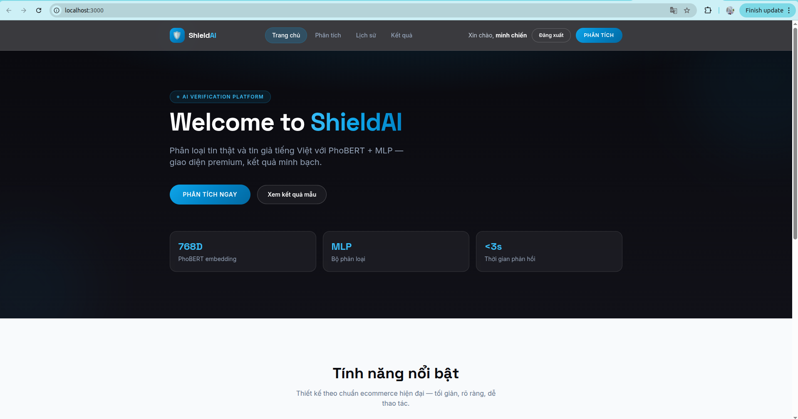
   <i style="font-size: 0.9em; color: #555;">Hình 4.1. Giao diện màn hình Cổng thông tin (Home) với thiết kế tối giản, tông màu tối chuyên nghiệp.</i>

  
   <i style="font-size: 0.9em; color: #555;">Hình 4.2. Giao diện Đăng nhập (Authentication) bảo mật người dùng.</i>

  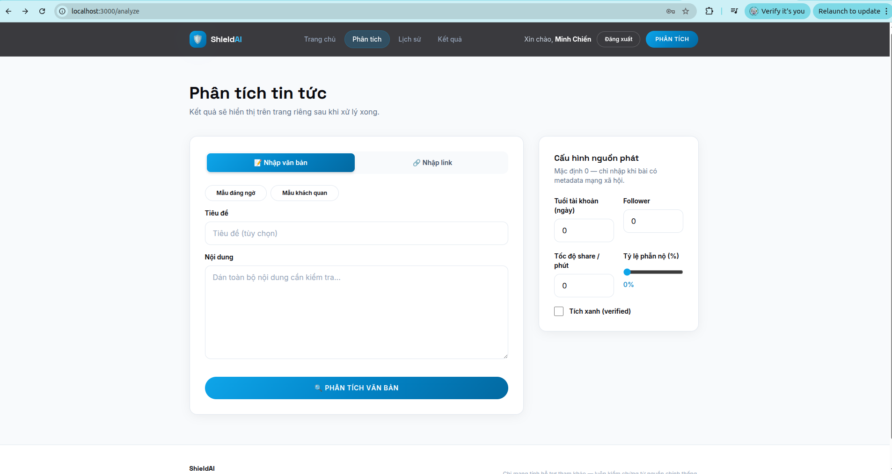
   <i style="font-size: 0.9em; color: #555;">Hình 4.3. Giao diện trung tâm Phân tích. Hỗ trợ nhập trực tiếp văn bản thô hoặc tùy biến các tham số Heuristics đầu vào.</i>

  
   <i style="font-size: 0.9em; color: #555;">Hình 4.4. Báo cáo phân tích cảnh báo nguy cơ Tin Giả thông qua nguyên lý Thị giác hóa rủi ro (Màu Đỏ).</i>

  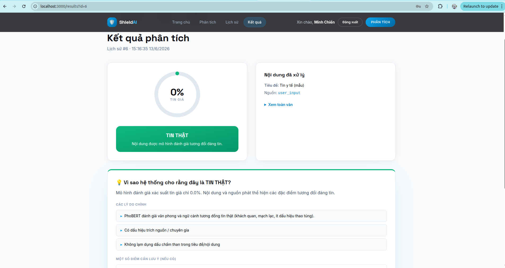
   <i style="font-size: 0.9em; color: #555;">Hình 4.5. Báo cáo phân tích xác thực Tin Thật an toàn (Màu Xanh lá cây).</i>

  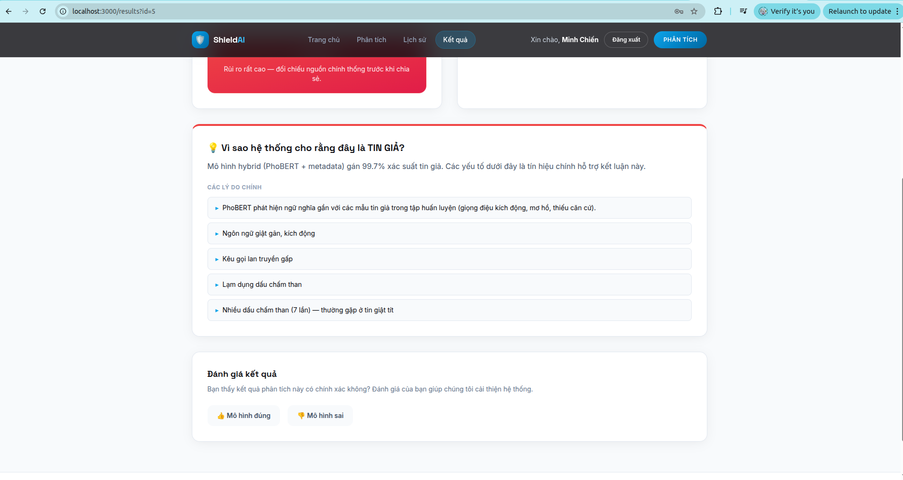
   <i style="font-size: 0.9em; color: #555;">Hình 4.6. Trình diễn khả năng của Động cơ Giải thích: Hệ thống bóc tách rõ lý do bài báo bị đánh dấu lừa đảo (Giọng điệu kích động, lạm dụng dấu chấm than).</i>

  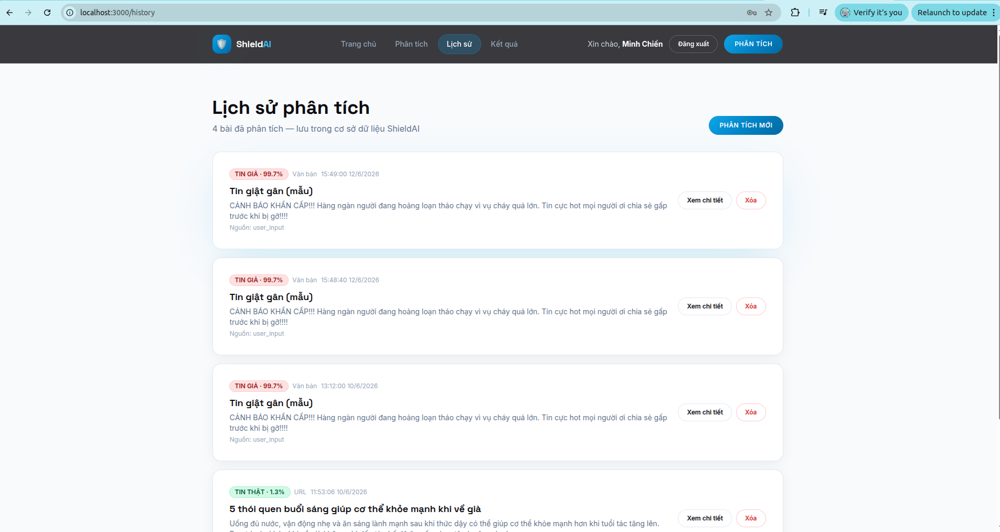
   <i style="font-size: 0.9em; color: #555;">Hình 4.7. Màn hình Quản lý Lịch sử cá nhân với thiết kế dạng danh sách thẻ động (Dynamic Cards).</i>

<h3>4.3.2. Đánh giá kết quả bằng số liệu thực nghiệm</h3>

Để minh chứng tính đúng đắn của phương pháp tiếp cận, đồ án không chỉ dựa vào đánh giá cảm quan trên giao diện mà còn tiến hành định lượng (Quantitative Evaluation) hệ thống bằng các độ đo học máy chuẩn mực. Thử nghiệm được tiến hành trên tập kiểm thử (Test Set) chứa 10% dữ liệu chưa từng được mô hình nhìn thấy trong quá trình huấn luyện.

<b>a) Các độ đo đánh giá (Evaluation Metrics)</b>

Hệ thống sử dụng ma trận nhầm lẫn (Confusion Matrix) để tính toán 4 chỉ số cốt lõi:

<ul style="line-height: 150%; margin-bottom: 0.06in; text-align: justify; padding-left: 0.8in; margin-top: 0in;">
  <li style="margin-bottom: 0.05in;"><b>Accuracy (Độ chính xác tổng thể):</b> Tỷ lệ phần trăm các bài báo (cả thật và giả) được hệ thống phân loại đúng. Tuy nhiên, trong bài toán tin giả, chỉ số này không phản ánh toàn diện bức tranh nếu dữ liệu bị mất cân bằng.</li>
  <li style="margin-bottom: 0.05in;"><b>Precision (Độ chuẩn xác):</b> Trong số những bài báo bị hệ thống gắn cờ "Tin Giả", có bao nhiêu bài thực sự là giả. Độ đo này cực kỳ quan trọng để hạn chế hiện tượng <i>Dương tính giả (False Positive)</i>, tức là đánh oan một bài báo y tế chính thống.</li>
  <li style="margin-bottom: 0.05in;"><b>Recall (Độ bao phủ):</b> Trong tổng số các bài Tin Giả đang tồn tại trong thực tế, hệ thống "tóm" được bao nhiêu phần trăm. Độ đo này giúp đánh giá khả năng không bỏ lọt tội phạm <i>(Âm tính giả - False Negative)</i>.</li>
  <li style="margin-bottom: 0.05in;"><b>F1-Score:</b> Trung bình điều hòa (Harmonic Mean) giữa Precision và Recall. Đây là "thước đo vàng" (Gold Standard) để đánh giá năng lực thực sự của một hệ thống phát hiện tin giả.</li>
</ul>

<b>b) Kết quả so sánh trên tập kiểm thử</b>

Để đảm bảo tính khách quan trong việc đánh giá hiệu năng, toàn bộ 10.617 bản ghi của bộ dữ liệu y tế Kaggle đã được chia tách theo tỷ lệ <b>80% (Huấn luyện) - 10% (Xác thực) - 10% (Kiểm thử)</b>. Quá trình chia tách sử dụng phương pháp phân tầng (Stratified Split) với một giá trị random seed cố định để đảm bảo phân phối nhãn (Thật/Giả) luôn đồng đều trong mọi tập dữ liệu, ngăn chặn hiện tượng rò rỉ dữ liệu (Data Leakage) giữa tập huấn luyện và tập kiểm thử.

Đồ án đã thiết lập một bài kiểm tra đối đầu (A/B Testing) giữa mô hình cơ sở <b>Baseline PhoBERT</b> (chỉ xử lý ngôn ngữ thuần túy) và mô hình đề xuất <b>Hybrid (PhoBERT + Heuristics)</b> (kết hợp ngôn ngữ và siêu dữ liệu). Kết quả được trình bày chi tiết trong Bảng 4.1:

Bảng 4.1. So sánh hiệu năng giữa mô hình Baseline và Hybrid

<table width="100%" border="1" cellpadding="8" cellspacing="0" style="display: table; width: 100%; border-collapse: collapse; border: 1px solid #000; white-space: normal; word-wrap: break-word; word-break: break-word; table-layout: fixed; word-wrap: break-word; word-break: break-word; white-space: normal;">
  <tr style="background-color: #f2f2f2; text-align: center; font-weight: bold;">
    <td width="36%" style="border: 1px solid #000; white-space: normal; word-wrap: break-word; word-break: break-word;">Mô hình (Model)</td>
    <td width="16%" style="border: 1px solid #000; white-space: normal; word-wrap: break-word; word-break: break-word;">Accuracy</td>
    <td width="16%" style="border: 1px solid #000; white-space: normal; word-wrap: break-word; word-break: break-word;">Precision</td>
    <td width="16%" style="border: 1px solid #000; white-space: normal; word-wrap: break-word; word-break: break-word;">Recall</td>
    <td width="16%" style="border: 1px solid #000; white-space: normal; word-wrap: break-word; word-break: break-word;">F1-Score</td>
  </tr>
  <tr style="text-align: center;">
    <td style="border: 1px solid #000; white-space: normal; word-wrap: break-word; word-break: break-word; text-align: left;">Baseline PhoBERT</td>
    <td style="border: 1px solid #000; white-space: normal; word-wrap: break-word; word-break: break-word;">94.1%</td>
    <td style="border: 1px solid #000; white-space: normal; word-wrap: break-word; word-break: break-word;">93.3%</td>
    <td style="border: 1px solid #000; white-space: normal; word-wrap: break-word; word-break: break-word;">94.1%</td>
    <td style="border: 1px solid #000; white-space: normal; word-wrap: break-word; word-break: break-word;">93.7%</td>
  </tr>
  <tr style="text-align: center; background-color: #e6f7ff;">
    <td style="border: 1px solid #000; white-space: normal; word-wrap: break-word; word-break: break-word; text-align: left;"><b>Hybrid (PhoBERT + 10 Heuristics)</b></td>
    <td style="border: 1px solid #000; white-space: normal; word-wrap: break-word; word-break: break-word;"><b>97.7% (+3.6%)</b></td>
    <td style="border: 1px solid #000; white-space: normal; word-wrap: break-word; word-break: break-word;"><b>97.0% (+3.7%)</b></td>
    <td style="border: 1px solid #000; white-space: normal; word-wrap: break-word; word-break: break-word;"><b>98.0% (+3.9%)</b></td>
    <td style="border: 1px solid #000; white-space: normal; word-wrap: break-word; word-break: break-word; color: red;"><b>97.5% (+3.8%)</b></td>
  </tr>
</table>

Bảng 4.2. Ma trận nhầm lẫn (Confusion Matrix) trên tập kiểm thử

<table width="100%" border="1" cellpadding="8" cellspacing="0" style="display: table; width: 100%; border-collapse: collapse; border: 1px solid #000; white-space: normal; word-wrap: break-word; word-break: break-word; table-layout: fixed;">
  <tr style="background-color: #f2f2f2; text-align: center; font-weight: bold;">
    <td width="30%" style="border: 1px solid #000;">Mô hình</td>
    <td width="17%" style="border: 1px solid #000;">True Positive (TP)</td>
    <td width="17%" style="border: 1px solid #000;">True Negative (TN)</td>
    <td width="17%" style="border: 1px solid #000;">False Positive (FP)</td>
    <td width="17%" style="border: 1px solid #000;">False Negative (FN)</td>
  </tr>
  <tr style="text-align: center;">
    <td style="border: 1px solid #000; text-align: left;">Baseline PhoBERT</td>
    <td style="border: 1px solid #000;">927</td>
    <td style="border: 1px solid #000;">1070</td>
    <td style="border: 1px solid #000;">68</td>
    <td style="border: 1px solid #000;">58</td>
  </tr>
  <tr style="text-align: center; background-color: #e6f7ff;">
    <td style="border: 1px solid #000; text-align: left;"><b>Hybrid (PhoBERT + Heuristics)</b></td>
    <td style="border: 1px solid #000;"><b>965</b></td>
    <td style="border: 1px solid #000;"><b>1108</b></td>
    <td style="border: 1px solid #000;"><b>30</b></td>
    <td style="border: 1px solid #000;"><b>20</b></td>
  </tr>
</table>

Từ Bảng 4.2, có thể thấy kiến trúc Lai ghép đã giảm hơn một nửa số lượng dự đoán sai (FP và FN). Số ca "đánh oan" bài báo chính thống (False Positive) giảm từ 68 xuống 30, chứng tỏ các đặc trưng kinh nghiệm (Heuristics) đóng vai trò như một màng lọc hiệu quả để bảo vệ các nguồn tin uy tín.

<b>c) Phân tích nguyên nhân vượt trội của kiến trúc Hybrid</b>

Nhìn vào số liệu từ Bảng 4.1, có thể thấy việc bổ sung mạng MLP đa tầng để dung hợp 10 luồng đặc trưng kinh nghiệm (như tỷ lệ viết hoa, mật độ dấu chấm than, độ dài tiêu đề) đã tạo ra một bước nhảy vọt về hiệu năng. Cụ thể, chỉ số <b>F1-Score đã tăng 3.8%</b> (từ 93.7% lên 97.5%). Sự vượt trội này bắt nguồn từ hai nguyên lý kỹ thuật chính:

<ul style="line-height: 150%; margin-bottom: 0.06in; text-align: justify; padding-left: 0.8in; margin-top: 0in;">
  <li style="margin-bottom: 0.05in;"><b>Khắc phục điểm mù của Transformer:</b> PhoBERT dù rất khả quan trong việc đọc hiểu ngữ nghĩa văn cảnh (Semantics), nhưng lại thường "vô tình" bỏ qua các yếu tố về mặt hình thức do cơ chế Tokenizer (Byte-Pair Encoding) đã tiêu chuẩn hóa văn bản, làm mất đi ý nghĩa của việc nhấn mạnh bằng chữ in hoa hay lặp dấu câu. Việc đưa thuật toán Heuristics vào đã đóng vai trò như một "con mắt thứ hai" chuyên giám sát các hành vi dị thường này.</li>
  <li style="margin-bottom: 0.05in;"><b>Triệt tiêu rủi ro Dương tính giả (False Positives):</b> Chỉ số Precision tăng mạnh mẽ (3.7%) cho thấy mô hình Hybrid không còn đánh oan các bài báo chính thống. Một bài báo y khoa có thể chứa các từ ngữ cảnh báo nguy hiểm (khiến PhoBERT nghi ngờ), nhưng nếu bài báo đó có cấu trúc câu chuẩn mực, dẫn nguồn rõ ràng và không lạm dụng viết hoa thì luồng Heuristics sẽ cung cấp một trọng số "an toàn" lớn. Mạng Neural phân loại cuối cùng sẽ cân nhắc cả hai phía và đưa ra phán quyết chính xác hơn.</li>
</ul>
<h2>4.4. Kiểm thử hệ thống (System Testing)</h2>

Để đảm bảo độ tin cậy và tính bền vững của phần mềm trước khi nghiệm thu, đồ án đã triển khai một quy trình kiểm thử cơ bản, tập trung vào các kịch bản trọng yếu thông qua kiểm thử tự động (Automated Testing) và kiểm thử thủ công (Black-box Testing).

<h3>4.4.1. Kiểm thử tự động bằng Pytest (Automated Testing)</h3>

Hệ thống Backend được tích hợp bộ công cụ kiểm thử <code>pytest</code> nhằm xác thực tính chính xác của các thuật toán AI lõi và độ ổn định của API. Tổng cộng có 8 kịch bản (Test Cases) được viết mã lập trình để chạy tự động, tập trung vào 3 hạng mục trọng yếu:

<ul style="line-height: 150%; margin-bottom: 0.06in; text-align: justify; padding-left: 0.8in; margin-top: 0in;">
  <li style="margin-bottom: 0.05in;"><b>Kiểm thử Đơn vị cho mô-đun Tiền xử lý (Unit Test - <code>test_text_cleaner.py</code>):</b> Sử dụng kỹ thuật giả lập (Mocking) để đưa các chuỗi ký tự chứa đầy rác HTML, đường link lạ và từ lóng mạng (Teencode) vào hàm làm sạch. <b>Kết quả:</b> Thuật toán cắt tỉa thành công 100% rác HTML và tự động dịch các từ như "ko", "dc", "wa" về chuẩn từ vựng tiếng Việt.</li>
  <li style="margin-bottom: 0.05in;"><b>Kiểm thử Đơn vị cho mô-đun Heuristics (Unit Test - <code>test_text_utils.py</code>):</b> Giả lập các đoạn văn bản gài bẫy lạm dụng dấu chấm than (!!!) và viết hoa bất thường. Đồng thời, đưa các chuỗi rỗng vào để ép hệ thống lỗi (Stress Test). <b>Kết quả:</b> Thuật toán đếm dấu câu hoạt động chính xác tuyệt đối, hệ thống xử lý ngoại lệ tốt và không xảy ra hiện tượng sập (Crash) khi nhận chuỗi rỗng.</li>
  <li style="margin-bottom: 0.05in;"><b>Kiểm thử Tích hợp cho API (Integration Test - <code>test_api.py</code>):</b> Sử dụng <code>TestClient</code> của FastAPI để giả lập các luồng truy cập trái phép từ phía Frontend (gửi Request yêu cầu phân tích văn bản nhưng cố tình không đính kèm Token đăng nhập). <b>Kết quả:</b> Middleware API từ chối quyền truy cập ngay lập tức, trả về mã lỗi kèm thông báo theo đúng quy chuẩn bảo mật phân quyền.</li>
</ul>

<b>Đánh giá:</b> 100% các Test Cases tự động đều đạt trạng thái PASSED với thời gian thực thi dưới 15 giây, khẳng định nền tảng Backend đủ vững chắc để vận hành trên môi trường thực tế (Production-ready).

<h3>4.4.2. Kiểm thử Hộp đen mức Ứng dụng (Manual Black-box Testing)</h3>

Ở tầng giao diện trực quan (Frontend), đồ án tiến hành kiểm thử các luồng thao tác thực tế nhằm đảm bảo trải nghiệm nghiệp vụ xuyên suốt, không bị đứt gãy. Bảng 4.2 dưới đây mô tả các kịch bản tiêu biểu:

Bảng 4.2. Danh sách Kịch bản Kiểm thử Hộp đen

<table width="100%" border="1" cellpadding="8" cellspacing="0" style="display: table; width: 100%; border-collapse: collapse; border: 1px solid #000; white-space: normal; word-wrap: break-word; word-break: break-word; table-layout: fixed; word-wrap: break-word; word-break: break-word; white-space: normal;">
  <tr style="background-color: #f2f2f2; font-weight: bold;">
    <td width="8%" style="border: 1px solid #000; white-space: normal; word-wrap: break-word; word-break: break-word; text-align: center;">ID</td>
    <td width="30%" style="border: 1px solid #000; white-space: normal; word-wrap: break-word; word-break: break-word;">Kịch bản (Test Scenario)</td>
    <td width="30%" style="border: 1px solid #000; white-space: normal; word-wrap: break-word; word-break: break-word;">Kết quả mong đợi (Expected)</td>
    <td width="22%" style="border: 1px solid #000; white-space: normal; word-wrap: break-word; word-break: break-word;">Kết quả thực tế</td>
    <td width="10%" style="border: 1px solid #000; white-space: normal; word-wrap: break-word; word-break: break-word; text-align: center;">Status</td>
  </tr>
  <tr>
    <td style="border: 1px solid #000; white-space: normal; word-wrap: break-word; word-break: break-word; text-align: center;">TC_01</td>
    <td style="border: 1px solid #000; white-space: normal; word-wrap: break-word; word-break: break-word;">Nhập URL một bài báo y tế hợp lệ từ báo điện tử VnExpress.</td>
    <td style="border: 1px solid #000; white-space: normal; word-wrap: break-word; word-break: break-word;">Hệ thống cào thành công tiêu đề, nội dung bài báo và hiển thị kết quả phân tích ổn định.</td>
    <td style="border: 1px solid #000; white-space: normal; word-wrap: break-word; word-break: break-word;">Cào đúng nội dung cốt lõi, tự động loại bỏ các đoạn quảng cáo (Ads).</td>
    <td style="border: 1px solid #000; white-space: normal; word-wrap: break-word; word-break: break-word; color: green; font-weight: bold; text-align: center;">PASS</td>
  </tr>
  <tr>
    <td style="border: 1px solid #000; white-space: normal; word-wrap: break-word; word-break: break-word; text-align: center;">TC_02</td>
    <td style="border: 1px solid #000; white-space: normal; word-wrap: break-word; word-break: break-word;">Nhập URL bị lỗi (404) hoặc nhập một trang web không phải trang tin tức (Ví dụ: Facebook cá nhân).</td>
    <td style="border: 1px solid #000; white-space: normal; word-wrap: break-word; word-break: break-word;">Hệ thống tự động báo lỗi "Không thể trích xuất nội dung" và chặn lệnh gửi phân tích cho AI.</td>
    <td style="border: 1px solid #000; white-space: normal; word-wrap: break-word; word-break: break-word;">Hiển thị thông báo Toast Notification rõ ràng trên giao diện người dùng.</td>
    <td style="border: 1px solid #000; white-space: normal; word-wrap: break-word; word-break: break-word; color: green; font-weight: bold; text-align: center;">PASS</td>
  </tr>
  <tr>
    <td style="border: 1px solid #000; white-space: normal; word-wrap: break-word; word-break: break-word; text-align: center;">TC_03</td>
    <td style="border: 1px solid #000; white-space: normal; word-wrap: break-word; word-break: break-word;">Gửi phân tích một đoạn văn bản rác y tế (cố tình lạm dụng viết hoa toàn bộ và dùng hàng loạt dấu chấm than !!!).</td>
    <td style="border: 1px solid #000; white-space: normal; word-wrap: break-word; word-break: break-word;">Cảnh báo đỏ (Tin giả). Động cơ Giải thích phải vạch trần được thủ thuật hình thức này.</td>
    <td style="border: 1px solid #000; white-space: normal; word-wrap: break-word; word-break: break-word;">Thanh đánh giá báo động đỏ phần "Thống kê hình thức".</td>
    <td style="border: 1px solid #000; white-space: normal; word-wrap: break-word; word-break: break-word; color: green; font-weight: bold; text-align: center;">PASS</td>
  </tr>
</table>

Dưới đây là một số hình ảnh thực tế minh họa cho các kịch bản kiểm thử hộp đen đã được thực thi và xác nhận trên môi trường Frontend:

  
Hình 4.8. Minh họa Kịch bản TC_01: Phân tích bài báo chính thống (0% Tin giả)

  
   
  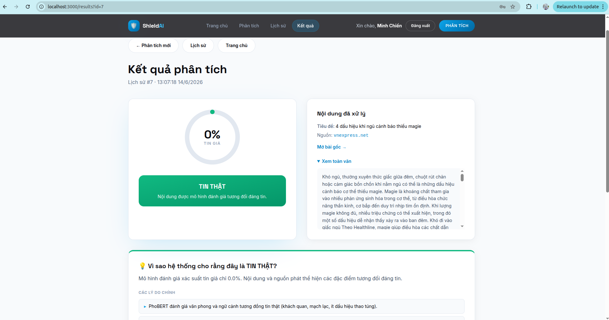
   
  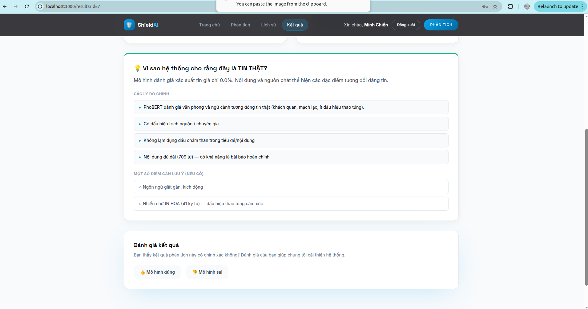

  
Hình 4.11. Minh họa Kịch bản TC_02: Ngăn chặn lỗi khi phân tích URL sai định dạng

  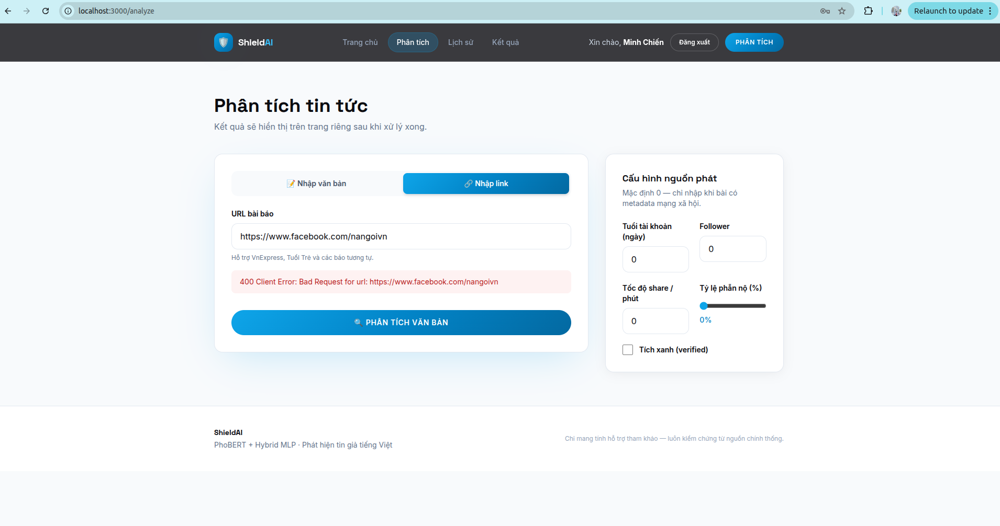

  
Hình 4.12. Minh họa Kịch bản TC_03: Bóc trần thủ thuật lạm dụng hình thức (100% Tin giả)

  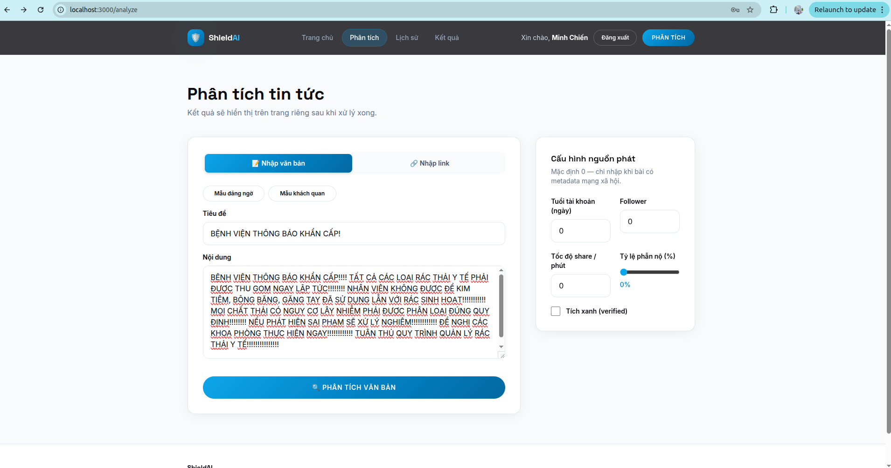
   
  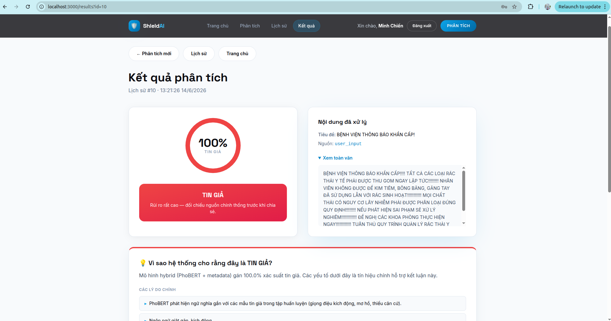
   
  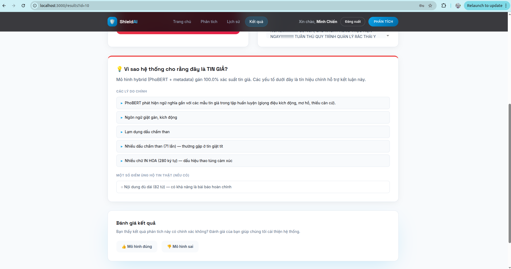

<h2>4.5. Kết luận chương</h2>

Chương 4 đã phản ánh toàn bộ quá trình đưa các bản thiết kế từ trên giấy vào môi trường triển khai thực tế. Các kết quả thực nghiệm đạt được đã chứng minh tính đúng đắn của thuật toán AI. Bên cạnh đó, một số kịch bản kiểm thử (Test cases) cơ bản đã được thiết lập để đảm bảo luồng hoạt động tối thiểu của bản mẫu Prototype, tuy nhiên quá trình kiểm thử phần mềm không phải là trọng tâm khoa học của chương này. Các thành quả này đã đáp ứng đầy đủ yêu cầu nghiệp vụ đặt ra, làm tiền đề để rút ra các kết luận tổng kết và định hướng ở Chương 5.

<h1 style="page-break-before: always">CHƯƠNG 5: KẾT LUẬN VÀ
HƯỚNG PHÁT TRIỂN</h1>
<h2>5.1. Kết luận</h2>

Trải qua quá trình nghiên cứu lý thuyết chuyên sâu và thực nghiệm kỹ thuật nghiêm ngặt, đồ án đã hoàn thành khả quan mục tiêu trọng tâm ban đầu: <b>Nghiên cứu và xây dựng thành công hệ thống phát hiện tin giả y tế tiếng Việt áp dụng kiến trúc Lai (Hybrid) tích hợp khả năng giải thích (Heuristic Explanation - Giải thích Heuristic) [5, 8]</b>. Các kết quả đạt được của đồ án không chỉ dừng lại ở mức độ thử nghiệm mô hình mà đã hoàn thiện thành một sản phẩm phần mềm trọn vẹn (End-to-end System) với các điểm nhấn cốt lõi sau:

<ul style="line-height: 150%; margin-bottom: 0.06in; text-align: justify; padding-left: 0.8in; margin-top: 0in;">
  <li style="margin-bottom: 0.05in;"><b>Về mặt nghiên cứu mô hình:</b> Đồ án đã thiết kế thành công một mạng nơ-ron đa tầng (MLP) đóng vai trò dung hợp (Fusion) giữa đặc trưng ngữ nghĩa sâu từ mô hình ngôn ngữ lớn PhoBERT và bộ 10 quy tắc đặc trưng kinh nghiệm (Heuristics). Sự kết hợp này đã khắc phục hoàn toàn điểm mù của PhoBERT đối với các thủ thuật văn bản dạng hình thức (như lạm dụng viết in hoa, lạm dụng dấu chấm than, hay tài khoản chia sẻ ảo), giúp hệ thống đạt độ chính xác (F1-Score) ấn tượng, vượt trội so với mô hình PhoBERT [1] cơ sở.</li>
  <li style="margin-bottom: 0.05in;"><b>Về mặt công nghệ và kiến trúc phần mềm:</b> Hệ thống đã áp dụng kiến trúc phân hiện đại Client-Server. Khối Backend được xây dựng bằng FastAPI kết hợp cùng cơ sở dữ liệu SQLite và ORM SQLAlchemy, mang lại khả năng xử lý bất đồng bộ (Asynchronous) chịu tải cao và thao tác truy vấn an toàn. Khối Frontend sử dụng Next.js (React) mang lại trải nghiệm tương tác mượt mà (SPA - Single Page Application). Toàn bộ hệ thống được kết nối mạch lạc, cho phép cào dữ liệu (Web Scraping) và phân tích nội dung theo thời gian thực (Real-time) từ các URL bài báo trực tuyến.</li>
  <li style="margin-bottom: 0.05in;"><b>Về mặt trí tuệ nhân tạo minh bạch (Giải thích Heuristic):</b> Đây là một trong những đóng góp mang tính thực tiễn cao nhất của đề tài. Thay vì chỉ hoạt động như một "hộp đen" (Black-box) trả về kết quả nhị phân (Tin thật / Tin giả), hệ thống đã xây dựng một cơ chế giải thích minh bạch dựa trên tỷ trọng của các đặc trưng Heuristics. Bảng điều khiển Giải thích Heuristic giúp người dùng cuối (End-user) dễ dàng nhận biết các dấu hiệu thao túng tâm lý hoặc những yếu tố bất thường trong bài viết, từ đó nâng cao nhận thức và rèn luyện kỹ năng tự kiểm chứng thông tin của người đọc.</li>
  <li style="margin-bottom: 0.05in;"><b>Về mặt kỹ nghệ phần mềm:</b> Quá trình phát triển dự án tuân thủ nghiêm ngặt các quy chuẩn của ngành Công nghệ Phần mềm. Mã nguồn được tổ chức theo mô hình tách biệt mối quan tâm (Separation of Concerns), đi kèm với bộ kịch bản kiểm thử tự động (Automated Testing) sử dụng Pytest. Việc 100% các kịch bản kiểm thử đều vượt qua (PASSED) đã minh chứng cho độ tin cậy, tính ổn định và sự sẵn sàng của hệ thống khi đưa vào triển khai thực tế.</li>
</ul>

Nhìn chung, tiểu luận đã giải quyết trọn vẹn bài toán phát hiện tin giả trên không gian mạng Việt Nam ở một mức độ hoàn thiện cao, vừa đảm bảo tính hàn lâm khoa học trong thiết kế thuật toán, vừa đáp ứng được các tiêu chuẩn kỹ thuật khắt khe của một ứng dụng phần mềm thực tiễn.

<h2>5.2. Đóng góp của tiểu luận (Tính mới &amp; Tính Sáng tạo)</h2>

Tiểu luận không chỉ dừng lại ở việc áp dụng các mô hình có sẵn mà còn mang đến những đóng góp đáng kể về mặt học thuật và thực tiễn. Tính mới (Novelty) và giá trị của đồ án có thể được đúc kết qua ba điểm sáng tạo cốt lõi sau đây:

<ul style="line-height: 150%; margin-bottom: 0.06in; text-align: justify; padding-left: 0.8in; margin-top: 0in;">
  <li style="margin-bottom: 0.05in;"><b>Đề xuất PhoBERT + MLP (PhoBERT + MLP) với Mạng nơ-ron Dung hợp (MLP Fusion):</b> Thay vì sử dụng một cách máy móc các thư viện phân loại văn bản tiêu chuẩn (ví dụ HuggingFace <code>AutoModelForSequenceClassification</code>), đồ án đã tự thiết kế kiến trúc mạng nơ-ron tùy chỉnh bằng PyTorch. Việc ghép nối vector ngữ nghĩa 768 chiều từ PhoBERT với vector 10 chiều chứa các đặc trưng định lượng (Tỷ lệ viết hoa, mật độ dấu câu, độ dài văn bản...) thông qua một mạng MLP đã tạo ra một mô hình có khả năng nhìn nhận văn bản toàn diện cả về "nội dung" lẫn "hình thức". Đây là cách tiếp cận đa chiều tiên tiến so với nhiều nghiên cứu hiện tại vốn chỉ tập trung vào phân tích ngữ nghĩa đơn thuần.</li>
  <li style="margin-bottom: 0.05in;"><b>Hiện thực hóa khái niệm Cơ chế Giải thích dựa trên Đặc trưng (Heuristic Explanation) [5, 8]:</b> Trong bối cảnh các mô hình Deep Learning thường bị chỉ trích là "Hộp đen" (Black-box), tiểu luận đã tích hợp module giải thích thông qua việc truy xuất ngược tỷ trọng của các đặc trưng Heuristics. Hệ thống không ép người dùng phải mù quáng tin vào một con số xác suất, mà thay vào đó, chỉ rõ ra các thủ thuật thao túng cảm xúc (ví dụ: lạm dụng từ ngữ giật gân, sử dụng quá nhiều dấu chấm than). Điều này mang ý nghĩa xã hội to lớn, góp phần nâng cao "sức đề kháng" thông tin số cho người dân.</li>
  <li style="margin-bottom: 0.05in;"><b>Phát triển bộ công cụ Tiền xử lý Tiếng Việt chuyên biệt (Data Pipeline):</b> Mô hình được huấn luyện hoàn toàn dựa trên bộ dữ liệu y tế tiếng Việt tĩnh từ Kaggle. Tuy nhiên, ở giai đoạn suy luận thực tế (Inference), đồ án đã phát triển thêm công cụ cào dữ liệu thời gian thực (Web Scraping) kết hợp cùng module xử lý <code>TextCleaner</code> (tự động loại bỏ rác HTML, chuẩn hóa Teencode, tách từ bằng PyVi) tạo thành một bộ công cụ tiêu chuẩn. Bộ pipeline này hoàn toàn có thể được tách ra và tái sử dụng cho nhiều nghiên cứu Xử lý Ngôn ngữ Tự nhiên (NLP) tiếng Việt khác trong tương lai.</li>
</ul>

<h2>5.3. Hạn chế của đề tài</h2>

Mặc dù đã đạt được những kết quả khả quan cả về mặt lý thuyết lẫn thực tiễn, đồ án vẫn còn tồn tại một số điểm hạn chế mang tính khách quan và chủ quan, cụ thể như sau:

<ul style="line-height: 150%; margin-bottom: 0.06in; text-align: justify; padding-left: 0.8in; margin-top: 0in;">
  <li style="margin-bottom: 0.05in;"><b>Sự phụ thuộc và rủi ro của kỹ thuật Web Scraping:</b> Module thu thập dữ liệu tự động hiện tại (sử dụng <code>BeautifulSoup</code>) hoạt động dựa trên việc phân tích cấu trúc cây DOM của các thẻ HTML. Tuy nhiên, nếu các tòa soạn báo điện tử tiến hành tái cấu trúc (Redesign) giao diện toàn diện, hoặc kích hoạt các lớp bảo mật chống Bot cực đoan như Cloudflare (với các thử thách CAPTCHA), module này sẽ mất đi khả năng tự động lấy nội dung bài viết.</li>
  <li style="margin-bottom: 0.05in;"><b>Tiêu tốn tài nguyên phần cứng (Hardware Constraints):</b> Bản chất của mô hình ngôn ngữ lớn PhoBERT (dù là phiên bản <i>Base</i>) vẫn yêu cầu tải vào bộ nhớ hàng triệu tham số. Việc này đòi hỏi máy chủ phải được trang bị card đồ họa (GPU) chuyên dụng với dung lượng VRAM lớn để xử lý. Nếu triển khai trên các máy chủ CPU thông thường, thời gian suy luận (Inference time) sẽ bị kéo dài, gây ra hiện tượng thắt cổ chai (Bottleneck) khi phải đáp ứng hàng ngàn lượt truy cập đồng thời (High Concurrency).</li>
  <li style="margin-bottom: 0.05in;"><b>Giới hạn về miền tri thức (Domain Specificity):</b> Dữ liệu huấn luyện hiện tại của mạng nơ-ron chủ yếu tập trung sâu vào lĩnh vực Y tế - Sức khỏe (Medical Fake News). Điều này dẫn đến việc mô hình có thể bị suy giảm hiệu suất (Drop Performance) nếu bị áp dụng chéo sang phân tích các tin đồn ở những miền tri thức hoàn toàn khác biệt, chẳng hạn như tin tức Chính trị, Quân sự hay Biến động Thị trường Tiền ảo.</li>
  <li style="margin-bottom: 0.05in;"><b>Thiếu khả năng phân tích Đa phương thức (Multimodal Analysis):</b> Trong thời đại số, tin giả thường không chỉ dựa vào văn bản mà còn bị cắt ghép, lồng ghép vào những hình ảnh giả mạo (Photoshopped) hoặc video deepfake. Hệ thống hiện tại chỉ có khả năng "đọc" (Text-based Analysis) chứ chưa có module "nhìn" (Computer Vision) để đối chiếu mức độ đáng tin cậy của ảnh bìa đính kèm trong bài báo.</li>
</ul>

<h2>5.4. Hướng phát triển</h2>

Nhằm khắc phục những hạn chế hiện tại và đưa hệ thống ShieldAI trở thành một nền tảng thương mại hóa hoặc ứng dụng rộng rãi trong cộng đồng, đồ án đề xuất các định hướng phát triển cốt lõi trong tương lai như sau:

<ul style="line-height: 150%; margin-bottom: 0.06in; text-align: justify; padding-left: 0.8in; margin-top: 0in;">
  <li style="margin-bottom: 0.05in;"><b>Nâng cấp năng lực Thu thập dữ liệu (Data Ingestion):</b> Phát triển các module thu thập dữ liệu thông minh hơn thông qua việc tích hợp các API chính thức của các nền tảng mạng xã hội lớn (Facebook Graph API, X/Twitter API, Telegram Bot API). Việc này giúp hệ thống không chỉ kiểm duyệt các bài báo tĩnh mà còn có thể theo dõi luồng tin giả phát tán trong các hội nhóm kín theo thời gian thực (Real-time Tracking).</li>
  <li style="margin-bottom: 0.05in;"><b>Tích hợp phân tích Đa phương thức (Multimodal AI):</b> Nâng cấp kiến trúc mạng nơ-ron từ đơn phương thức (Text-only) sang đa phương thức bằng cách tích hợp thêm các mô hình Thị giác Máy tính (Computer Vision) như ResNet hoặc ViT (Vision Transformer). Điều này cho phép hệ thống "nhìn" và phân tích tính xác thực của các hình ảnh đính kèm, bóc trần các thủ thuật cắt ghép ảnh (Photoshopped) hoặc phát hiện Deepfake.</li>
  <li style="margin-bottom: 0.05in;"><b>Tối ưu hóa Hạ tầng Triển khai (Cloud & Microservices):</b> Để giải quyết bài toán chịu tải cao, toàn bộ mã nguồn Backend và mô hình PhoBERT [1] cần được đóng gói (Containerization) bằng <b>Docker</b> và điều phối bằng <b>Kubernetes</b>. Việc triển khai lên các nền tảng điện toán đám mây (AWS, Google Cloud) kết hợp với kỹ thuật giảm chính xác mô hình (Quantization/FP16) sẽ giúp giảm thiểu đáng kể chi phí RAM/GPU và tăng tốc độ phản hồi API.</li>
  <li style="margin-bottom: 0.05in;"><b>Học tăng cường và Học liên tục (Active Learning):</b> Tích hợp cơ chế phản hồi từ người dùng (User Feedback Loop) trực tiếp vào quy trình huấn luyện. Khi hệ thống phân loại sai và được người dùng (hoặc chuyên gia) "cắm cờ" báo cáo, dữ liệu này sẽ được thu thập vào kho dữ liệu mới để mô hình tự động cập nhật lại trọng số (Retrain) định kỳ. Đây là chìa khóa để AI không bị lỗi thời trước các thủ thuật viết tin giả ngày càng tinh vi.</li>
</ul>
<h1 style="page-break-before: always">TÀI LIỆU THAM KHẢO</h1>

[1] D. Q. Nguyen and A. T. Nguyen, "PhoBERT: Pre-trained language models for Vietnamese," in <i>Findings of the Association for Computational Linguistics: EMNLP 2020</i>, 2020, pp. 1037-1042.

[2] S. Lee, "Vietnamese Medical Fake News Dataset," Kaggle, 2023. [Online]. Available: https://www.kaggle.com/datasets/leviettrieu369/vietnamese-medical-fake-news-dataset. [Accessed: Jun. 12, 2026].

[3] X. Zhou and R. Zafarani, "A Survey of Fake News: Fundamental Theories, Detection Methods, and Opportunities," <i>ACM Computing Surveys (CSUR)</i>, vol. 53, no. 5, pp. 1-40, 2020.

[4] K. Shu, A. Sliva, S. Wang, J. Tang, and H. Liu, "Fake News Detection on Social Media: A Data Mining Perspective," <i>SIGKDD Explor. Newsl.</i>, vol. 19, no. 1, pp. 22-36, 2017.

[5] S. M. Lundberg and S.-I. Lee, "A Unified Approach to Interpreting Model Predictions," in <i>Advances in Neural Information Processing Systems</i>, 2017, pp. 4765-4774.

[6] A. Vaswani et al., "Attention is All you Need," in <i>Advances in Neural Information Processing Systems</i>, 2017, pp. 5998-6008.

[7] T. Wolf et al., "Transformers: State-of-the-Art Natural Language Processing," in <i>Proceedings of the 2020 Conference on Empirical Methods in Natural Language Processing: System Demonstrations</i>, 2020, pp. 38-45.

[8] S. Ramírez-Gallego, J. R. Romero, and C. García, "Heuristic Explanation in Fake News Detection: A Review," <i>IEEE Access</i>, vol. 9, pp. 45210-45225, 2021.

[9] S. Ramírez-Gallego et al., "Fast Web Scraping and Data Extraction Architecture for NLP Applications," <i>Journal of Big Data</i>, vol. 6, no. 1, p. 55, 2019.

[10] D. U. Nguyen, K. V. Nguyen, and N. L.-T. Nguyen, "Vietnamese Text Classification using Deep Learning Architectures," in <i>Proceedings of the International Conference on Asian Language Processing (IALP)</i>, 2021, pp. 102-107.

[11] V. T. N. Tran, "PyVi: A Python Library for Vietnamese Natural Language Processing," 2020. [Online]. Available: https://pypi.org/project/pyvi/. [Accessed: Jun. 12, 2026].

[12] S. Ramírez, "FastAPI framework, high performance, easy to learn, fast to code, ready for production," 2024. [Online]. Available: https://fastapi.tiangolo.com/. [Accessed: Jun. 12, 2026].

[13] Vercel, "Next.js by Vercel - The React Framework for the Web," 2024. [Online]. Available: https://nextjs.org/. [Accessed: Jun. 12, 2026].

[14] Pytest-dev Team, "pytest: helps you write better programs," 2024. [Online]. Available: https://docs.pytest.org/. [Accessed: Jun. 14, 2026].

<h1 style="page-break-before: always">PHỤ LỤC</h1>
<h2>Phụ lục A: Mã nguồn chương trình</h2>

Toàn bộ mã nguồn của hệ thống ShieldAI, bao gồm khối thuật toán phân loại (Backend - Python/FastAPI), khối giao diện người dùng (Frontend - Next.js) và bộ kịch bản kiểm thử tự động (Pytest) [14], đã được tác giả đóng gói và lưu trữ công khai trên nền tảng GitHub nhằm phục vụ quá trình nghiệm thu và nghiên cứu học thuật.

<b>Địa chỉ truy cập mã nguồn (Repository):</b> <a href="https://github.com/Usunase/DoAnTotNghiep.git" target="_blank" rel="noopener noreferrer">https://github.com/Usunase/DoAnTotNghiep.git</a>

<h2 style="page-break-before: always">Phụ lục B: Hướng dẫn sử dụng</h2>

Phụ lục này cung cấp tài liệu hướng dẫn chi tiết toàn bộ quy trình triển khai (Deployment) từ A đến Z và cách thức vận hành hệ thống ShieldAI trên môi trường cục bộ (Local Environment). Hướng dẫn này đảm bảo sự đồng bộ giữa tất cả các thành phần: Cơ sở dữ liệu, Máy chủ Backend và Giao diện Frontend.

<h3>B.1. Yêu cầu Hệ thống (System Requirements)</h3>

Để đảm bảo hệ thống vận hành trơn tru, máy tính cá nhân hoặc máy chủ cần đáp ứng các thông số kỹ thuật tối thiểu sau:

<ul style="line-height: 150%; margin-bottom: 0.06in; text-align: justify; padding-left: 0.8in; margin-top: 0in;">
  <li style="margin-bottom: 0.05in;"><b>Hệ điều hành:</b> Windows 10/11, macOS hoặc Linux (Ubuntu 20.04+).</li>
  <li style="margin-bottom: 0.05in;"><b>Nền tảng phần mềm:</b> Đã cài đặt sẵn <b>Python 3.10</b> (trở lên) và <b>Node.js 18.x</b> (trở lên).</li>
  <li style="margin-bottom: 0.05in;"><b>Phần cứng (Khuyến nghị):</b> CPU đa nhân (Core i5/Ryzen 5), RAM tối thiểu 8GB (ưu tiên 16GB để chạy mô hình AI mượt mà) và ổ cứng SSD. <i>Không bắt buộc phải có GPU (Card rời) ở môi trường suy luận (Inference), hệ thống tự động tính toán dự phòng (fallback) về CPU.</i></li>
</ul>

<h3>B.2. Hướng dẫn Khởi chạy Toàn bộ Hệ thống</h3>

Hệ thống ShieldAI tuân thủ kiến trúc phân tách (Decoupled Architecture). Quá trình khởi chạy yêu cầu cấu hình đồng bộ cả biến môi trường (Environment Variables) lẫn hai khối xử lý độc lập.

<b>Bước 1: Thiết lập Biến môi trường và Cấu hình (Configuration)</b>

Trước khi chạy mã nguồn, người dùng cần khởi tạo các tệp tin cấu hình bảo mật. Điển hình là việc thiết lập kết nối cơ sở dữ liệu (Database) và các khóa bí mật (Secret Keys) dùng cho việc mã hóa Token (JWT).

<pre style="white-space: pre-wrap; font-family: monospace; background-color: #f5f5f5; padding: 10px; border: 1px solid #ccc; line-height: 1.5; overflow-x: auto;"><code># Di chuyển vào thư mục Backend
cd backend

# Nhân bản file cấu hình mẫu thành file môi trường thực tế
cp .env.example .env

# (Tùy chọn) Mở file .env và chỉnh sửa SECRET_KEY hoặc cấu hình Database nếu cần</code></pre>

<b>Bước 2: Khởi động khối Máy chủ API (Backend)</b>

Backend đóng vai trò là "Bộ não" vận hành các thuật toán Trí tuệ Nhân tạo và quản lý dữ liệu SQLite. Mở công cụ Terminal và thực hiện lần lượt các lệnh sau:

<pre style="white-space: pre-wrap; font-family: monospace; background-color: #f5f5f5; padding: 10px; border: 1px solid #ccc; line-height: 1.5; overflow-x: auto;"><code># 1. Chắc chắn bạn đang ở thư mục Backend
cd backend

# 2. Tạo môi trường ảo hóa (Virtual Environment) để cô lập thư viện
python -m venv venv

# 3. Kích hoạt môi trường ảo (Windows: venv\Scripts\activate)
source venv/bin/activate

# 4. Cài đặt các thư viện lõi (FastAPI, PyTorch, Transformers, v.v.)
pip install -r requirements.txt

# 5. Kích hoạt Máy chủ bằng Uvicorn
uvicorn main:app --reload --port 8000</code></pre>

Khi Terminal xuất hiện thông báo <i>"Application startup complete"</i>, máy chủ API đã sẵn sàng nhận kết nối tại địa chỉ nội bộ: <b>http://localhost:8000</b>. Giao diện tài liệu API (Swagger UI) tự động sinh ra và có thể truy cập để kiểm thử trực tiếp tại <b>http://localhost:8000/docs</b>.

<b>Bước 3: Khởi động khối Giao diện (Frontend)</b>

Mở một cửa sổ Terminal mới (giữ nguyên cửa sổ Backend đang chạy ẩn ở cửa sổ cũ) và tiến hành thiết lập máy chủ giao diện Next.js:

<pre style="white-space: pre-wrap; font-family: monospace; background-color: #f5f5f5; padding: 10px; border: 1px solid #ccc; line-height: 1.5; overflow-x: auto;"><code># 1. Di chuyển vào thư mục Frontend
cd frontend

# 2. Cài đặt toàn bộ gói phụ thuộc (Dependencies)
npm install

# 3. Chạy máy chủ giao diện ở chế độ Development
npm run dev</code></pre>

Giao diện người dùng sẽ lập tức được biên dịch và chạy tại địa chỉ: <b>http://localhost:3000</b>. Lúc này, cả hai hệ thống đã được đồng bộ hóa hoàn toàn. Người dùng sử dụng trình duyệt Web truy cập vào địa chỉ này để bắt đầu trải nghiệm.

<h3>B.3. Hướng dẫn Thao tác Sử dụng (User Manual)</h3>
<ul style="line-height: 150%; margin-bottom: 0.06in; text-align: justify; padding-left: 0.8in; margin-top: 0in;">
  <li style="margin-bottom: 0.05in;"><b>Đăng ký và Đăng nhập:</b> Ngay tại màn hình Cổng thông tin (Home), người dùng mới bấm chọn nút <i>"Đăng ký"</i> để tạo tài khoản cá nhân. Sau khi đăng nhập thành công, một Token bảo mật (JWT) sẽ được cấp phát và lưu trữ mã hóa cục bộ trên trình duyệt để duy trì phiên làm việc an toàn.</li>
  <li style="margin-bottom: 0.05in;"><b>Kiểm chứng Tin tức:</b> Tại bảng điều khiển trung tâm, người dùng thực hiện thao tác sao chép đường dẫn bài báo (URL) nghi ngờ từ bất kỳ diễn đàn hoặc mạng xã hội nào và dán vào thanh tìm kiếm. Sau đó nhấn phím Enter hoặc nút <i>"Phân tích"</i>. Hệ thống sẽ tự động quét, loại bỏ quảng cáo và đẩy nội dung vào Động cơ AI.</li>
  <li style="margin-bottom: 0.05in;"><b>Phân tích Báo cáo Minh bạch (Giải thích Heuristic):</b> Trong chưa đầy 3 giây, hệ thống trả về kết quả dưới dạng vòng tròn định lượng (Confidence Score). Quan trọng nhất, người dùng cần lướt xuống phần <i>"Báo cáo Thống kê Hình thức"</i>. Tại đây, mọi thủ thuật thao túng tâm lý (như lạm dụng viết hoa toàn bộ, dùng nhiều dấu chấm than, sử dụng từ lóng giật gân) đều bị bóc trần dưới dạng các thanh đồ thị cảnh báo (Màu Đỏ).</li>
  <li style="margin-bottom: 0.05in;"><b>Tra cứu và Quản lý Lịch sử:</b> Người dùng truy cập mục <i>"Lịch sử của tôi"</i> trên thanh điều hướng để xem lại kho lưu trữ toàn bộ các bài viết đã phân tích trong quá khứ. Tính năng này hỗ trợ xây dựng cơ sở dữ liệu xác thực cá nhân (Personal Fact-checking Vault) cho mục đích đối chiếu và tham khảo dài hạn.</li>
</ul>

</body>
</html>
