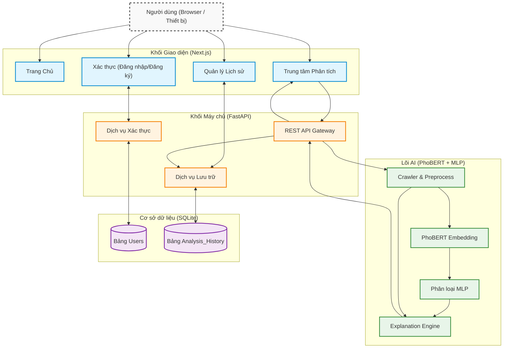

# Sơ đồ Kiến trúc Hệ thống ShieldAI

Đây là sơ đồ minh họa toàn bộ các thành phần của hệ thống ShieldAI. Bạn có thể dùng trình đọc Markdown (như VS Code Preview) để xem sơ đồ này.

```mermaid
graph TD
    classDef user fill:#f9f9f9,stroke:#333,stroke-width:2px,stroke-dasharray: 5 5;
    classDef frontend fill:#e1f5fe,stroke:#0288d1,stroke-width:2px;
    classDef backend fill:#fff3e0,stroke:#f57c00,stroke-width:2px;
    classDef ai fill:#e8f5e9,stroke:#388e3c,stroke-width:2px;
    classDef db fill:#f3e5f5,stroke:#7b1fa2,stroke-width:2px;

    User["Người dùng (Browser / Thiết bị)"]:::user

    subgraph Frontend ["Khối Giao diện (Next.js)"]
        UI_Home["Trang Chủ"]:::frontend
        UI_Auth["Xác thực (Đăng nhập/Đăng ký)"]:::frontend
        UI_Analyze["Trung tâm Phân tích"]:::frontend
        UI_History["Quản lý Lịch sử"]:::frontend
    end

    subgraph Backend ["Khối Máy chủ (FastAPI)"]
        API_Gateway["REST API Gateway"]:::backend
        Auth_Service["Dịch vụ Xác thực"]:::backend
        History_Service["Dịch vụ Lưu trữ"]:::backend
    end

    subgraph AIPipeline ["Lõi AI (PhoBERT + MLP)"]
        Mod1_Crawler["Crawler & Preprocess"]:::ai
        Mod2_PhoBERT["PhoBERT Embedding"]:::ai
        Mod3_MLP["Phân loại MLP"]:::ai
        Mod4_XAI["Explanation Engine"]:::ai
    end

    subgraph Database ["Cơ sở dữ liệu (SQLite)"]
        DB_Users[("Bảng Users")]:::db
        DB_History[("Bảng Analysis_History")]:::db
    end

    User --> UI_Home
    User --> UI_Analyze
    User --> UI_Auth
    User --> UI_History
    
    UI_Auth <--> Auth_Service
    UI_Analyze --> API_Gateway
    UI_History <--> History_Service
    
    API_Gateway --> Mod1_Crawler
    
    Mod1_Crawler --> Mod2_PhoBERT
    Mod2_PhoBERT --> Mod3_MLP
    Mod3_MLP --> Mod4_XAI
    Mod1_Crawler --> Mod4_XAI
    
    Mod4_XAI --> API_Gateway
    API_Gateway --> UI_Analyze
    API_Gateway --> History_Service
    
    Auth_Service <--> DB_Users
    History_Service <--> DB_History
```
