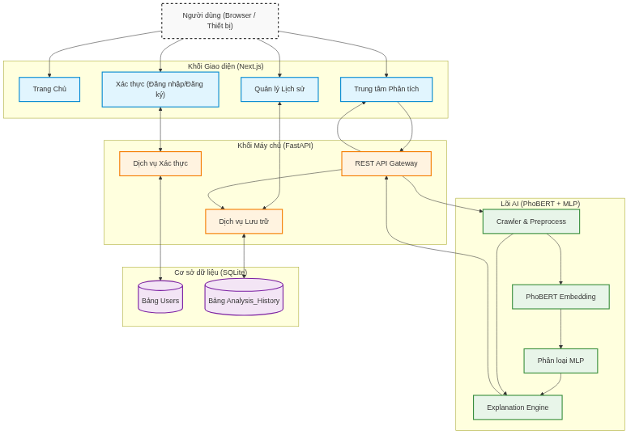
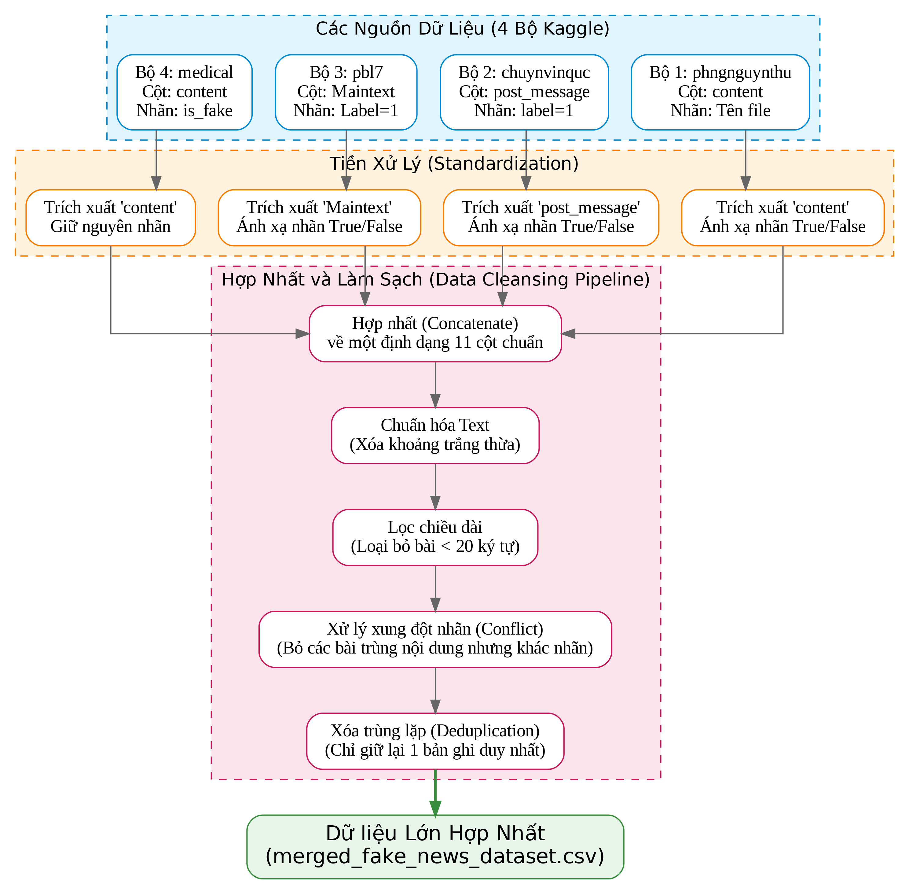
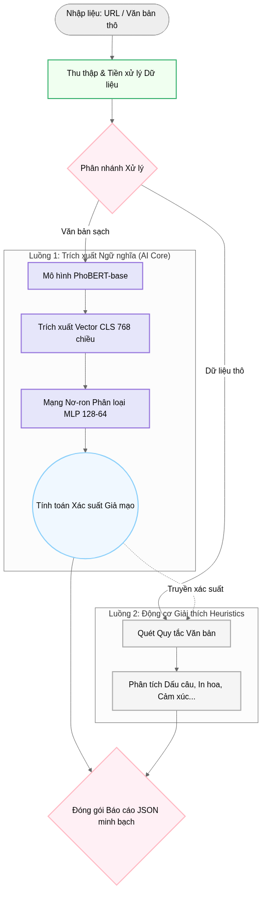
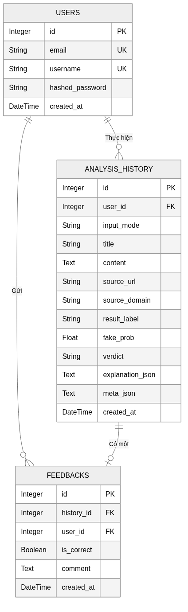
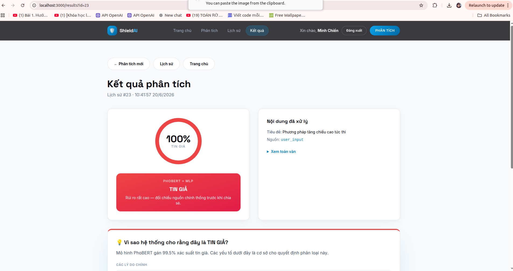
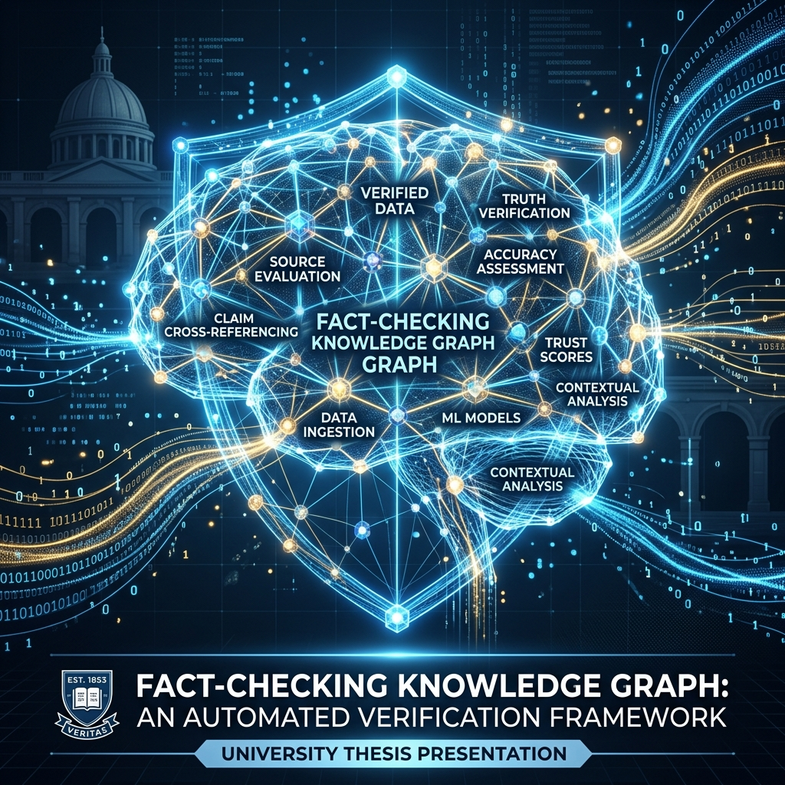

<!-- _class: lead -->
# Xây dựng hệ thống phát hiện tin giả tiếng Việt (ShieldAI)
**Bảo vệ Luận văn Tốt nghiệp - Khoa Công nghệ Thông tin**
**Sinh viên:** Hà Minh Chiến

---

## 1. Bối cảnh và lý do chọn đề tài

- **Tin giả (Fake News):** Thông tin sai lệch, được cố ý ngụy tạo nhằm lừa dối người đọc hoặc trục lợi.
- Mạng xã hội thúc đẩy tin giả lan truyền với tốc độ chóng mặt, gây hoang mang dư luận.
- Nhu cầu cấp thiết về công cụ hỗ trợ người dùng tự kiểm chứng thông tin.
- Hệ thống ShieldAI được đề xuất nhằm tự động hóa quy trình phát hiện tin giả.

---

## 2. Mục tiêu nghiên cứu và Đối tượng sử dụng

**Mục tiêu cốt lõi:**
- Xây dựng mô hình phân loại tin giả tiếng Việt có độ chính xác cao.
- Phát triển cơ chế giải thích kết quả dự đoán (minh bạch hóa AI).
- Thiết kế ứng dụng Web hoàn chỉnh phục vụ thực tiễn.

**Đối tượng sử dụng:**
- **Người dùng phổ thông:** Công cụ trực quan để tự kiểm chứng thông tin hàng ngày.
- **Cơ quan báo chí:** Bộ lọc sơ bộ để đối chiếu chéo các nguồn tin lạ.
- **Quản trị viên cộng đồng:** Sử dụng API để rà soát, kiểm duyệt tự động trên diện rộng.

---

## 3. Bài toán nghiên cứu

- Phân loại văn bản tin tức tiếng Việt thành các mức độ tin cậy.
- Bài toán cốt lõi: Phân loại chuỗi (Sequence Classification).
- Thách thức 1: Tính đa dạng và phức tạp của ngữ pháp tiếng Việt.
- Thách thức 2: Thiếu tính minh bạch trong các mô hình học sâu (hộp đen).

---

## 4. Tổng quan các nghiên cứu liên quan

- Phương pháp học máy truyền thống: Logistic Regression, SVM (đặc trưng TF-IDF).
- Mạng nơ-ron hồi quy: BiLSTM, GRU (đặc trưng Word2Vec).
- Kiến trúc Transformer: PhoBERT, mBERT (nắm bắt ngữ cảnh hai chiều).

---

## 5. Khoảng trống nghiên cứu

- Tập trung vào độ chính xác, bỏ qua khả năng diễn giải (Explainability).
- Các thuật toán giải thích (SHAP, LIME) đòi hỏi chi phí tính toán lớn.
- Khó tích hợp các thuật toán XAI phức tạp vào API yêu cầu thời gian thực.
- Thiếu các nền tảng ứng dụng khép kín hỗ trợ người dùng cuối.

---

## 6. Đề xuất hệ thống ShieldAI (Các điểm tối ưu)

- **Tối ưu tính thực tiễn (End-to-End):** Hệ thống Web khép kín, tích hợp cào dữ liệu báo chí tự động.
- **Tối ưu độ phân giải nhãn:** Cảnh báo linh hoạt với 3 mức độ (Tin thật, Đáng ngờ, Tin giả).
- **Tối ưu tốc độ giải thích (XAI):** Cơ chế *Heuristic Explanation* độc lập, giải thích chi tiết với tốc độ phản hồi dưới 1 giây (khắc phục nhược điểm chậm của SHAP/LIME).
- **Lõi xử lý mạnh mẽ:** Ứng dụng PhoBERT Fine-tuning cho tác vụ phân loại chuỗi.

---

## 7. Kiến trúc tổng thể hệ thống

- Trình bày kiến trúc Client-Server đa tầng độc lập.
- Frontend: Tương tác người dùng (Web Application).
- Backend: Cào dữ liệu, xử lý nghiệp vụ và quản trị cơ sở dữ liệu.
- AI Model: Khối suy luận xử lý ngôn ngữ tự nhiên.

---

## 8. Mô hình PhoBERT và lý do lựa chọn

- PhoBERT là mô hình ngôn ngữ dựa trên kiến trúc Transformers.
- Được tiền huấn luyện độc quyền trên 20GB ngữ liệu tiếng Việt.
- Tối ưu hóa việc nắm bắt cú pháp và ngữ nghĩa đặc thù của tiếng Việt.
- Thư viện Transformers và PyTorch hỗ trợ tích hợp linh hoạt.

---

## 9. Quy trình xử lý dữ liệu

- Tổng hợp hơn 22.000 bài báo tiếng Việt đã gán nhãn.
- Làm sạch (Data Cleaning): Loại bỏ HTML, liên kết, ký tự nhiễu.
- Tách từ (Word Segmentation) bằng công cụ PyVi.
- Phân tầng dữ liệu (Stratified Split) với tỷ lệ 76-12-12.

---

## 10. Luồng thuật toán & Cơ chế Heuristic

- Đây là cơ chế giải thích hậu xử lý (Post-hoc Explanation).
- Hoạt động độc lập, không tác động vào trọng số mô hình PhoBERT.
- Cung cấp bằng chứng: Từ ngữ giật gân, Cảm xúc, Mật độ in hoa.
- Giải quyết vấn đề XAI mà không yêu cầu chi phí tính toán lớn.

---

## 11. Cơ sở dữ liệu & Triển khai hệ thống

- Database: Tích hợp cơ sở dữ liệu SQLite (Lưu trữ lịch sử quét).
- Backend: Sử dụng khung làm việc FastAPI xử lý bất đồng bộ.
- Frontend: Xây dựng giao diện tương tác bằng Next.js.
- Web Crawler: Trích xuất nội dung bài báo tự động theo thời gian thực.

---

## 12. Giao diện trực quan của hệ thống

- Người dùng chỉ cần sao chép và **dán URL bài báo**.
- Hệ thống tự động bóc tách và phân tích.
- Hiển thị trực quan:
  - Điểm số tin cậy (Confidence Score).
  - Nhãn cảnh báo (Tin thật / Đáng ngờ / Tin giả).
  - Chi tiết các nguyên nhân (Heuristic Explanations).

---

## 13. Kết quả thực nghiệm

- Kết quả trên tập kiểm thử nội bộ (Khoảng 2.716 mẫu).
- Accuracy đạt 96.32% (so với SVM 85.34%, BiLSTM 89.67%).
- F1-Score đạt 93.42% đảm bảo cân bằng giữa Precision và Recall.
- Kết quả External Test (kiểm thử ngoại lai) đạt Accuracy 91.5%.

---

## 14. Phân tích và đánh giá kết quả

- Accuracy 96.32% chứng tỏ mô hình bao quát tốt cả hai nhãn.
- F1-Score 93.42% phản ánh sự ổn định trên dữ liệu không cân bằng.
- Tỷ lệ bỏ lọt tin giả (False Negative) được kiểm soát ở mức rất thấp.
- Cơ chế giải thích hoạt động ổn định với thời gian trễ dưới 1 giây.

---

## 15. Hạn chế

- Mô hình nhầm lẫn đối với các bài báo hình sự có văn phong giật gân.
- Bỏ lọt các văn bản lừa đảo bắt chước hoàn hảo văn phong hành chính nhà nước.
- Dễ bị biến thiên độ tin cậy khi độ dài văn bản quá ngắn (dưới 3 câu).
- Chưa có khả năng kiểm chứng chéo sự kiện với thế giới thực.

---

## 16. Kết luận và hướng phát triển

- Tích hợp thành công PhoBERT vào ứng dụng thực tiễn.
- Cơ chế Heuristics giải quyết hiệu quả bài toán giải thích hậu xử lý.
- Hướng phát triển 1: Tích hợp Tri thức đồ thị (Knowledge Graph) để kiểm chứng.
- Hướng phát triển 2: Áp dụng RAG truy xuất báo chí chính thống thời gian thực.

---

<!-- _class: lead -->
# Xin chân thành cảm ơn!
## Phần Hỏi đáp (Q&A)

---

## Slide Dự phòng (Backup 1) - Tại sao không dùng SHAP/LIME?

- SHAP/LIME đòi hỏi chi phí tính toán (Computational Cost) rất lớn.
- Phải sinh nhiễu và chạy lại mô hình hàng nghìn lần cho mỗi văn bản.
- Gây độ trễ (Latency) không thể chấp nhận được trên môi trường Web API.
- Heuristic đáp ứng tốc độ phản hồi cực thấp (dưới 1s) với chi phí $O(N)$.

---

## Slide Dự phòng (Backup 2) - Phân biệt Accuracy và F1-Score

- Accuracy đo tỷ lệ dự đoán đúng chung trên toàn bộ tập dữ liệu.
- Trong dữ liệu mất cân bằng, Accuracy có thể gây ngộ nhận về hiệu năng.
- F1-Score kết hợp Precision (độ chuẩn xác) và Recall (độ bao phủ).
- F1-Score đánh giá khách quan hơn sự ổn định của hệ thống phòng vệ.
